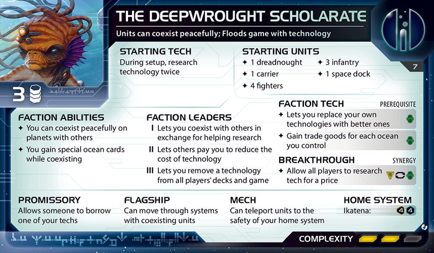
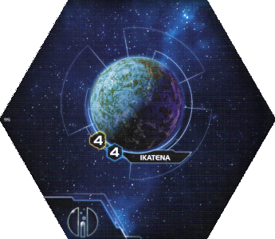
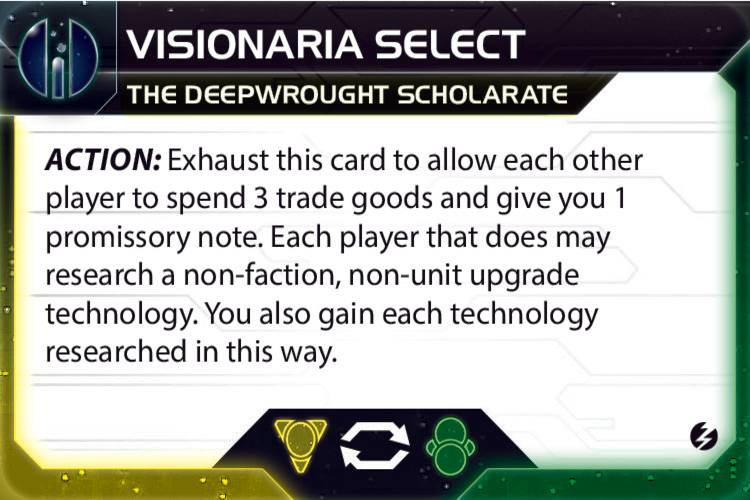
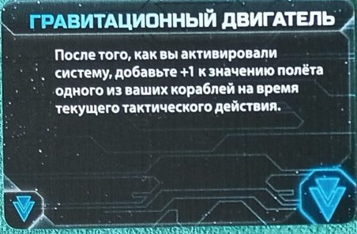
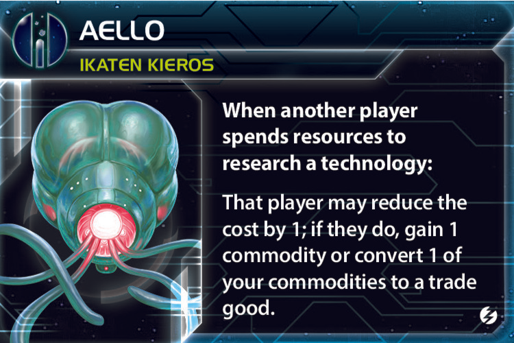
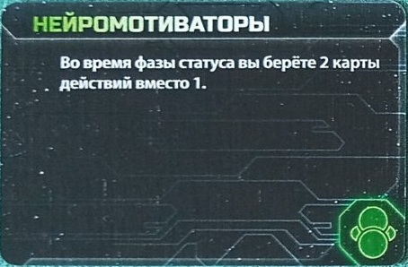
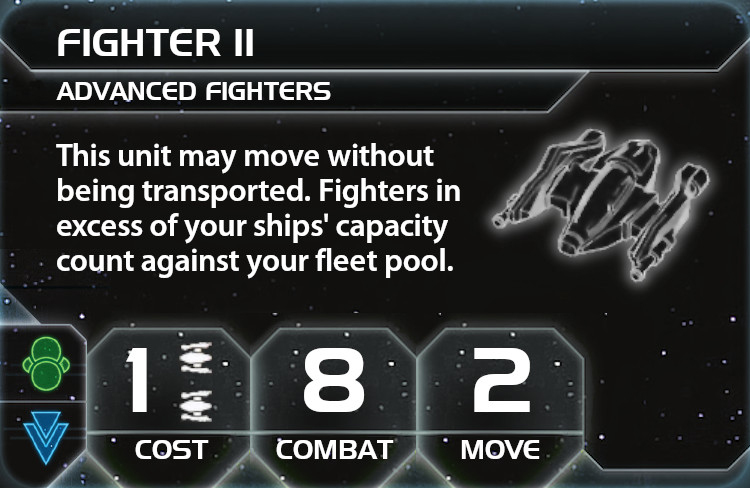
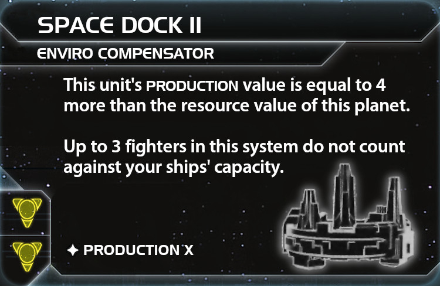
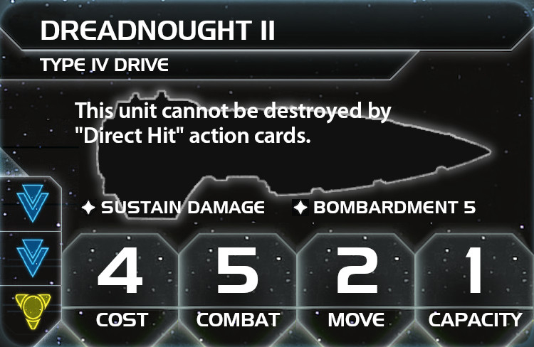
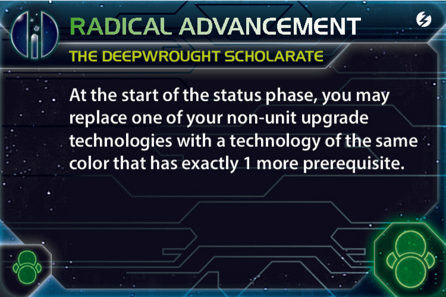

# The Deepwrought Scholarate — полный гайд по фракции

Актуальность: 17 августа 2026 года.

Гайд предполагает стандартную партию **Twilight Imperium IV + Prophecy of Kings + Thunder’s Edge** на 5-6 игроков на 10-14 очков.

  

> Иллюстрации новых компонентов приведены на английском языке. Для старых технологий по возможности использованы русские карты. Текст гайда имеет приоритет над изображением, если редакции компонентов различаются.

## Содержание

- [Краткий вывод](#краткий-вывод)
- [Старт и способности](#старт-и-способности)
- [Как работает сосуществование](#как-работает-сосуществование)
- [Прорыв Visionaria Select](#прорыв-visionaria-select)
- [Агент Doctor Carrina](#агент-doctor-carrina)
- [Командир Aello и Альянс](#командир-aello-и-альянс)
- [Мехи и флагман](#мехи-и-флагман)
- [Основной план игры](#основной-план-игры)
- [Выбор стартовых технологий](#выбор-стартовых-технологий)
- [Технологический путь](#технологический-путь)
- [Стратегические карты первого раунда](#стратегические-карты-первого-раунда)
- [Практически идеальный первый раунд](#практически-идеальный-первый-раунд)
- [Приоритет в драфте](#приоритет-в-драфте)
- [Обещание Share Knowledge](#обещание-share-knowledge)
- [Герой Ta Zern](#герой-ta-zern)
- [Дипломатия](#дипломатия)
- [Главные ошибки](#главные-ошибки)
- [Итоговая памятка](#итоговая-памятка)
- [Источники](#источники)

## Краткий вывод

**The Deepwrought Scholarate** — чрезвычайно сильная экономико-технологическая фракция, но её главное оружие — не само количество технологий, а дипломатия.

Вы помогаете другим исследовать технологии, а взамен получаете:

- те же технологии;
- чужие обещания;
- соседство с нужными игроками;
- присутствие на планетах, необходимых для целей;
- дополнительные Ocean-карты 1/1.

По ощущениям это смесь Jol-Nar и Empyrean, которую вдобавок чрезвычайно трудно окончательно выбить из игры.

Фракция раскрывается, когда вы заранее договариваетесь о чужих исследованиях через Visionaria, а собственные исследования тратите не на базовые технологии, а на улучшения отрядов и фракционные технологии. Если стол готов торговаться, Deepwrought очень быстро превращает дипломатию в технологии, товары, Ocean-карты и планеты для целей.

## Старт и способности

### Стартовые компоненты

  

- Домашняя планета **Ikatena 4/4**.
- 1 дредноут.
- 1 транспортник.
- 4 истребителя.
- 3 пехоты.
- 1 космодок.
- 3 товара.
- Во время подготовки к партии фракция дважды исследует технологию.

Ikatena — одна из самых удобных домашних планет: её можно использовать как 4 ресурса для карты «Исследования» или производства либо как 4 влияния для жетонов и Мекатола.

### Фракционные способности

#### Research Team

Когда наземные войска высаживаются на планету, ваши войска на этой планете могут начать **сосуществование**, не вступая в наземный бой.

Способность работает как при вашей высадке на чужую планету, так и при чужом вторжении на вашу планету. Согласно опубликованным разъяснениям, Deepwrought может выбрать сосуществование на обороне, даже если атакующий предпочёл бы начать бой.

#### Oceanbound

Когда ваши войска начинают совместное существование на планете:

- получите готовую Ocean-карту;
- каждая Ocean-карта эквивалентна карте планеты 1/1;
- всего существует пять Ocean-карт;
- если Ocean-карт становится больше, чем планет с вашими совместно существующими войсками, сбросьте лишние карты.

Ocean приходит готовым, поэтому его можно потратить в том же раунде.

### Как работает сосуществование

При совместном существовании:

- один игрок контролирует планету и получает её карту;
- остальные игроки только совместно существуют на ней;
- совместно существующий игрок не может тратить ресурсы и влияние планеты;
- **при проверке целей** он считается контролирующим эту планету;
- для любых других игровых эффектов контролирующим её не считается;
- совместно существующие структуры всегда блокированы;
- если на планете остаются войска только одного игрока, он получает контроль;
- при новой активации системы контролирующий или совместно существующий игрок может начать наземный бой;
- бомбардировка может быть направлена против войск конкретного игрока на планете.

Важные исключения:

- Совместное существование на Mecatol Rex помогает выполнять цели, требующие контролировать Мекатол.
- Оно **не даёт** дополнительное победное очко от «Экспансии», потому что это способность стратегической карты, а не проверка цели.
- Оно **не даёт** очко Styx: способность Styx требует настоящего контроля.
- Если враг получает контроль над Ikatena, а ваши войска остаются там в сосуществовании, вы всё ещё считаетесь контролирующим домашнюю планету при проверке возможности набирать публичные очки.
- Однако домашний космодок будет блокирован и не сможет производить.
- Враг может активировать систему повторно и попытаться уничтожить ваши совместно существующие войска.

## Прорыв Visionaria Select

Фракция критически завязана на прорыве, так как он может помочь ей набрать темп в раунде 1, поэтому выполнение экспедиции будет ключевой задачей в начале.

  

Visionaria — главная причина, по которой Deepwrought не обязан самостоятельно исследовать все базовые технологии.

Когда вы разыгрываете Visionaria, каждый другой игрок может:

- потратить 3 товара;
- передать вам одно обещание;
- исследовать обычную технологию, не являющуюся фракционной технологией или улучшением отряда.

Вы получаете каждую технологию, исследованную таким способом. Поэтому ваш лучший первый раунд часто строится вокруг чужих исследований **Гравитационного двигателя** и **Ускоренного метаболизма**.

### Базовое предложение столу

> Ты платишь 3 товара и не тратишь стратегический жетон. Если выберешь технологию, которой у меня ещё нет, я верну твоё обещание.

В первом раунде возвращение обещаний должно быть скорее стандартом, чем исключением. Ваша задача — не собрать набор слабых обещаний, по типу перемирия, а гарантированно получить ключевые технологии и создать у стола привычку пользоваться Visionaria.

Возврат обещаний происходит отдельной транзакцией, поэтому полностью надёжен только с соседом. Для несоседа это сначала устное обещание; агент удобно решает проблему, потому что размещает вашу пехоту в сосуществовании и создаёт соседство с одним из партнёров.

За особенно важную технологию допустимо даже доплатить 1–2 товара:

> Ты отдаёшь 3 товара в Visionaria, я возвращаю обещание и плачу тебе 1 товар, если ты берёшь согласованную технологию.

Для партнёра это технология за 2 товара без стратегического жетона. Для вас — та же технология, Ocean через агента и ускорение всей партии в нужную сторону.

### Приоритет технологий для заказа

В первом раунде две главные цели:

1. **Гравитационный двигатель** — мобильность, синяя база и путь к «Транспортнику II».

  

2. **Ускоренный метаболизм** — 3 командных жетона вместо 2 в каждой фазе статуса.

  

Ускоренный метаболизм особенно ценен в первом раунде: он успевает сработать несколько раз и превращается в заметное преимущество по жетонам. Для его исследования нужны две зелёные метки; агент Doctor Carrina закрывает только одну, поэтому партнёр всё равно должен иметь ещё одну зелёную метку, технологическую специализацию или подходящую синергию.

Гравитационный двигатель тоже легко продаётся столу: маломобильные фракции часто хотят его уже в первом раунде для экспансии. Если вы заранее находите такого игрока, собственный старт можно сделать более экономическим, не исследуя эту технологию самостоятельно.

После двух главных целей полезны почти любые технологии, которые дают темп или требования:

- «Сарвинские инструменты»;
- «Алгоритм ИИ»;
- «Сеть сканирующих дронов»;
- «Запускающий ретранслятор»;
- «Продвинутая логистика»;
- «Световолновой отражатель»;
- «Бактериальное оружие X-89»;
- «Интегрированная экономика»;
- «Отражатели массы», если реально нужны астероиды или защита от космических пушек;
- «Самосборочные механизмы», если вы активно играете через мехов.

Не платите полную цену за случайную технологию. Но если игрок готов исследовать её за возврат обещания, лишняя технология обычно полезна.

### Когда прекратить пользоваться Visionaria

Обычно Visionaria активно разыгрывается в первом и втором раундах. В третьем и дальше она нужна только ради конкретной технологии, задерживающей акции или ценного обещания.

Останавливайтесь, если:

- ключевые требования уже собраны;
- лидер получает от Visionaria больше вас;
- соперники выходят в «Продвинутую логистику» или «Световолновой отражатель» для победного хода;
- вам нужны улучшения отрядов, которые Visionaria не даёт;
- стол начал воспринимать ваш технологический доход как общую угрозу.

Если игрок просто хочет исследовать что-то через ваш прорыв, запретить это нельзя, но возвращать обещание вы не обязаны.

## Агент Doctor Carrina

  

Doctor Carrina делает две вещи одновременно: помогает другому игроку исследовать технологию и размещает вашу пехоту на одной из его не домашних планет с наземным войском. Эта пехота сразу начинает сосуществование.

Лучшие применения:

1. На согласованного исследователя «Гравитационного двигателя» или «Ускоренного метаболизма», которому не хватает ровно одной метки.
2. На владельца «Исследований», если Visionaria уже использована и вам важно открыть Aello до массовых исследований.
3. На будущего партнёра по «Альянсу».
4. На игрока, контролирующего планету, полезную для текущей или вероятной цели.

Планету выбираете вы. На ней должны находиться чужие наземные войска: на полностью пустой планете сосуществование не начинается.

### Приоритет планет

Главный критерий — не экономика планеты, потому что её карту вы не получите, а **выполнение целей**.

Приоритет:

1. Планета, прямо закрывающая открытую публичную или секретную цель.
2. Планета с технологической специализацией для целей на такие планеты.
3. Недостающий тип: культурная, опасная или индустриальная планета.
4. Планета с вложением.
5. Планета у края карты или рядом с чужой домашней системой.
6. Планета в аномалии или у червоточины.
7. Планета, превращающая вас в соседа сразу нескольких игроков.

Если текущие цели ничего не подсказывают, выбирайте технологическую специализацию или тип планеты, которого у вас меньше всего. В колоде публичных целей регулярно встречаются требования на четыре планеты одного типа и технологические специализации.

Если нужная планета действительно ценна, агента можно дать бесплатно или даже доплатить 1 товар. Правильное присутствие, Ocean и открытый командир обычно стоят дороже.

## Командир Aello и Альянс

  

Aello открывается, когда вы впервые начинаете сосуществование. После этого другой игрок, исследуя технологию, может уменьшить её ресурсную стоимость на 1. Затем вы:

- получаете 1 товар; либо
- превращаете 1 свой товар в торговый товар.

Запретить использование Aello вы не можете.

### Зачем рано передавать Альянс

После передачи «Альянса» на столе появляется вторая копия Aello:

- исследователь может применить обе копии и получить скидку 2;
- вы и держатель «Альянса» оба получаете экономический эффект;
- вы можете использовать копию собственного командира у партнёра для своих исследований;
- «Исследования» становятся дешевле для всего стола, а вы получаете часть созданной экономики.

Не обязательно продавать «Альянс» за максимальную цену. Хороший обмен командирами или дешёвая передача надёжному партнёру часто выгоднее нескольких товаров. Особенно ценен обмен на сильный экономический «Альянс» другой фракции.

Mahact не может получить «Альянс», но, имея ваш командный жетон в своём флотском резерве, способен использовать Aello через Imperia и создать дополнительную копию скидки.

### Важный порядок «Исследований»

Если агент открывает Aello во время первого исследования владельца «Исследований»:

- сам владелец «Исследований» не может применить только что открытого Aello к уже оплаченному первому исследованию;
- он сможет использовать Aello для второго исследования за 6 ресурсов;
- игроки, следующие после него, смогут использовать Aello;
- игроки, уже разрешившие вторичную способность до открытия командира, воспользоваться им не смогут.

Поэтому лучше открыть Aello через Visionaria **до** розыгрыша «Исследований».

## Мехи и флагман

### Eanautic

  

Мех особенно ценен благодаря **Production 1**.

Размещайте мехов:

- на передовых планетах;
- в сосуществовании рядом с центром;
- на маршруте будущего флагмана;
- там, где нужно постепенно производить пехоту, истребители или дополнительных мехов.

Если другой игрок активирует систему с совместно существующим Eanautic, вы можете переместить меха и всю свою пехоту с его планеты на контролируемую вами планету в домашней системе.

Это позволяет сохранить пластик, но может привести к потере:

- Ocean-карты;
- планеты для проверки цели;
- участка маршрута флагмана.

### D.W.S. Luminous

  

Флагман получает +1 движения за каждую систему, через которую проходит и в которой уже находятся ваши отряды, даже если там присутствуют корабли других игроков.

Сеть сосуществования создаёт для него маршруты через всю галактику. Поэтому удалённая пехота нужна не только ради Ocean и целей: она заранее готовит победные перемещения.

Стройте флагман обычно в третьем-четвёртом раунде, когда:

- уже создана цепочка ваших отрядов;
- нужно достичь противоположной стороны карты;
- планируется захват Styx или Mecatol Rex;
- готовится победный ход с «Продвинутой логистикой» или «Световолновым отражателем»;
- требуется перевезти большой объём пехоты и истребителей.

Флагман имеет вместимость 6 и нередко полезнее «Звезды войны» именно благодаря дальности и возможности перебросить значительный десант.

## Основной план игры

Главный принцип:

> Обычные технологии получает стол через Visionaria; вы получаете их вместе со столом, а собственные исследования тратите на улучшения отрядов и фракционные технологии.

Отсюда следует весь план. Вам не нужен идеальный слайс с безупречной экономикой: часть ресурсов придёт из Ocean, Aello и Hydrothermal Mining, а недостающие типы планет можно закрывать сосуществованием. Вам гораздо важнее ранний доступ к хорошей стратегической карте и заранее согласованные технологические партнёры.

### Первый раунд

Цель первого раунда — запустить двигатель фракции:

1. Открыть прорыв.
2. Разыграть Visionaria и получить хотя бы одну ключевую технологию.
3. Через Doctor Carrina создать первое сосуществование.
4. Получить Ocean-карту и открыть Aello.
5. Передать «Альянс» до основного исследования технологий.
6. Занять собственный слайс настолько, насколько позволяет стартовый флот.
7. Набрать первое публичное очко.

Идеальный вариант — заранее согласовать «Гравитационный двигатель» и «Ускоренный метаболизм» с двумя игроками. Если это удалось, собственные стартовые технологии можно выбирать ради экономики: «Источник темной энергии», «Нейромотиваторы», «Биостимуляторы», «Сарвинские инструменты» или Radical Advancement. Если «Гравитационный двигатель» через Visionaria не гарантирован, его лучше взять самостоятельно.

### Второй и третий раунды

В середине игры нужно превратить ранний разгон в устойчивую позицию:

- расширить сеть сосуществования до 3–5 полезных планет;
- получать обычные технологии через Visionaria только когда они действительно нужны;
- собственные исследования направлять в «Транспортник II», «Истребитель II», «Космическую базу II», «Дредноут II» и фракционные технологии;
- брать Hydrothermal Mining, когда стабильно удерживаются минимум три Ocean-карты;
- решить, идёте ли вы за Mecatol Rex, Styx или другим бонусным очком;
- строить пехоту, транспортники, истребители, мехов и флотский резерв;
- не выходить в очевидное лидерство без защиты Ikatena.

### Конец игры

В конце партии экономика сама по себе уже ничего не решает. Её нужно превратить в победный ход:

- построить флагман;
- подготовить цепочку собственных отрядов для его движения;
- получить «Продвинутую логистику» и «Световолновой отражатель»;
- укрепить Ikatena обычной пехотой;
- при огромной экономике и красной базе рассмотреть «Звезду войны», но не считать её обязательной;
- использовать героя для удаления технологии, которая позволяет лидеру победить или столу остановить вас;
- перестать раздавать технологии соперникам без конкретной выгоды.

## Выбор стартовых технологий

Единственного правильного выбора нет: он зависит не только от слайса, но прежде всего от того, **какие технологии готовы исследовать другие игроки через Visionaria в первом раунде**.

### Рекомендуемый высокий потолок: Источник темной энергии + Нейромотиваторы

Это основной экономический старт при договороспособном столе.

| Источник темной энергии                                                                      | Нейромотиваторы                                                                                                             |
| -------------------------------------------------------------------------------------------- | --------------------------------------------------------------------------------------------------------------------------- |
|  |  |

*Источник темной энергии пока показан на английской карте; справа — отдельная русская базовая карта «Нейромотиваторы».*

**Источник темной энергии** даёт доступ к жетонам пограничья и полезное правило отступления. Если в партии мало фракций, планирующих исследовать пустые системы, нетронутые жетоны пограничья превращаются в отдельный экономический ресурс: товары, жетоны, карты действий, фрагменты реликвий и другие эффекты исследования.

**Нейромотиваторы** начиная с первой фазы статуса дают две карты действий вместо одной. Это стабильная прибыль, которая обычно окупается всю партию, но которую неприятно исследовать позднее вместо улучшения отряда.

Этот старт выбирается при выполнении двух предварительных условий:

1. Найден игрок, способный исследовать **Гравитационный двигатель** через Visionaria.
2. Найден игрок с минимум одной зелёной меткой, способный исследовать **Ускоренный метаболизм**.

Doctor Carrina игнорирует только **одно** требование. Поэтому:

- «Гравитационный двигатель» может исследовать игрок без синей метки, если агент применяется к нему;
- «Ускоренный метаболизм» требует две зелёные метки, поэтому даже с агентом исследователю нужна ещё одна зелёная метка или подходящая синергия/технологическая специализация;
- если агент нужен для «Ускоренного метаболизма», исследователь «Гравитационного двигателя» должен самостоятельно иметь синюю метку, и наоборот.

Главное достоинство старта: вы не тратите собственные два исследования на технологии, которые можете гарантированно получить через Visionaria, и начинаете с двух технологий, сразу производящих ценность.

### Как реализовать Источник темной энергии в первом раунде

В стартовом флоте нет эсминца, поэтому «Источник темной энергии» не приносит деньги автоматически. Нужен план производства:

- произвести 1–2 эсминца через вторичную способность «Войны»;
- либо построить их обычным производством, если домашняя система ещё не заблокирована командным жетоном;
- в оставшихся тактических действиях отправить эсминцы в системы с жетонами пограничья;
- не тратить на разведку жетоны, необходимые для публичной цели или расширения.

«Эсминец I» стоит всего 1 ресурс и имеет движение 2, поэтому это удобный исследователь. Тем не менее «Источник темной энергии» — экономическая возможность, а не обязанность: не следует жертвовать очком ради случайного жетона пограничья.

### Безопасный синий вариант: Источник темной энергии + Гравитационный двигатель

Если договориться о «Гравитационном двигателе» не удалось, последовательное исследование «Источника темной энергии», затем «Гравитационного двигателя» является наиболее надёжным синим стартом.

| Отражатели массы                                                                                                                | Гравитационный двигатель                                                                                                          |
| ------------------------------------------------------------------------------------------------------------------------------- | --------------------------------------------------------------------------------------------------------------------------------- |
|  |  |

*Русские базовые карты «Отражатели массы» и «Гравитационный двигатель»: первая ситуативна, вторая почти всегда нужна для мобильности и «Транспортника II».*

Преимущества:

- немедленная мобильность;
- доступ к жетонам пограничья;
- две синие метки для «Транспортника II»;
- «Гравитационный двигатель» можно продавать через Share Knowledge;
- после зелёной или жёлтой метки доступен путь к «Дредноуту II».

В большинстве партий «Источник темной энергии» полезнее «Отражателей массы». Исключения:

- важные маршруты проходят через астероидные поля;
- ключевая система или будущая позиция Thunder’s Edge находится в астероидах;
- на столе много PDS и критична защита от Space Cannon;
- жетоны пограничья уже активно разбирают другие фракции.

Если «Отражатели массы» неожиданно понадобятся позднее, выгоднее договориться, чтобы другой игрок исследовал их через Visionaria, вернуть его обещание и при необходимости субсидировать исследование.

### Альтернатива с технологической специализацией: Нейромотиваторы + Биостимуляторы

Сильный экономический старт при доступной планете с технологической специализацией.

Схема:

1. Занять планету с технологической специализацией.
2. В конце хода использовать «Биостимуляторы», чтобы подготовить её.
3. Затем истощить её для экспедиции.
4. Получить Visionaria Select без траты 3 товаров и без сброса карт.

Недостаток — отсутствие синей метки. Желательно заранее договориться о «Гравитационном двигателе» и, если получится, «Источнике темной энергии» либо другой синей базе.

### Гибкий зелёный вариант: Нейромотиваторы + Radical Advancement

В начале первой фазы статуса можно:

- заменить Radical Advancement на **Ускоренный метаболизм** и получить 3 командных жетона вместо 2 уже в этой фазе;
- при большом количестве Ocean-карт заменить «Нейромотиваторы» на **Hydrothermal Mining**, сохранив Radical Advancement;
- позднее превращать слабые технологии из Visionaria в более сильные технологии того же цвета с ровно одним дополнительным требованием.

Этот путь хорош, если «Гравитационный двигатель» и другие синие технологии уже обещаны партнёрами, а прорыв гарантирован через «Торговлю», «Лидерство» или «Политику».

### Жёлтые экономические старты

Жёлтые технологии действительно труднее заказывать у стола: многие фракции не хотят тратить раннее исследование на жёлтую ветку. Поэтому одну из них иногда разумно взять самостоятельно.

**Сарвинские инструменты**:

- экономит по 1 ресурсу при производстве;
- особенно хорошо работает при частом производстве мехами с Production 1;
- имеет высокую долгосрочную отдачу, но почти не решает первый ход самостоятельно.

**Сеть сканирующих дронов**:

- полезна в богатом собственном слайсе с хорошими колодами исследований;
- не срабатывает при первичном захвате планеты, потому что на момент активации вы ещё её не контролировали;
- начинает стабильно приносить пользу со второго раунда.

**Психоархеология**:

- сильна при нескольких планетах с технологическими специализациями;
- позволяет использовать их требования, даже когда они истощены;
- превращает контролируемые планеты с технологическими специализациями в товары;
- значительно слабее без подходящих планет.

Комбинация жёлтой технологии с «Нейромотиваторами» может быть хорошей экономической альтернативой «Источнику темной энергии» + «Нейромотиваторам», но лишает вас ранней синей базы.

### Красные технологии

Для обычного экономического старта красная ветка имеет низкий приоритет. Исключение — **Алгоритм ИИ**, если заранее планируются многочисленные улучшения отрядов и «Звезда войны». Это инвестиция в будущую военную мощь, а не темп первого раунда.

### Hydrothermal Mining со старта

Не следует брать её автоматически.

- 1 Ocean — слабая отдача.
- 2 Oceans — нормальная долгосрочная инвестиция.
- 3–5 Oceans — одна из сильнейших экономических технологий в игре.

Оптимальное окно для неё обычно находится во втором раунде. Если удаётся получить фракционную технологию через Entropic Scar в начале фазы статуса, это особенно выгодно.

## Технологический путь

Главный принцип:

> Обычные технологии получайте через Visionaria. Собственные исследования тратьте на улучшения отрядов и фракционные технологии.

### Приоритет улучшений

| Транспортник II                                                                           | Истребитель II                                                                            | Космическая база II                                                                             | Дредноут II                                                                                       |
| ----------------------------------------------------------------------------------------- | ----------------------------------------------------------------------------------------- | ----------------------------------------------------------------------------------------------- | ------------------------------------------------------------------------------------------------- |
|  |  |  |  |

*Практический костяк улучшений: мобильность и Capacity сначала, дешёвый экран и тяжёлый флот — по ситуации.*

1. **Транспортник II** — обычно лучший первый апгрейд.
2. **Истребитель II** — дешёвая и эффективная защита.
3. **Космическая база II** — легко доступна благодаря зелёно-жёлтой синергии.
4. **Дредноут II** — если строится тяжёлый флот.
5. **Эсминец II** — против флотов с истребителями или для секретной цели.
6. **Крейсер II** — ситуативный поздний рывок.
7. **Пехота II** — обычно низкий приоритет: сосуществование, мехи и X-89 решают наземные задачи лучше.
8. **Звезда войны** — только при избытке ресурсов и подготовленной красной базе.

Если уже в первом раунде через Visionaria появились две синие метки, очень желательно последовать «Исследованиям» и сразу получить «Транспортник II». Начиная со второго раунда «Исследования» становятся более важной стратегической картой именно потому, что Visionaria не позволяет исследовать улучшения отрядов.

### Зелёно-жёлтая синергия

После открытия прорыва каждую принадлежащую вам зелёную или жёлтую технологию и соответствующую технологическую специализацию можно считать одним из этих двух цветов:

- при исследовании технологий;
- при проверке технологических целей.

Каждый компонент выбирает цвет отдельно. Например:

- две зелёные технологии могут выполнить два жёлтых требования «Космической базы II»;
- четыре зелёные технологии можно при проверке цели разделить на две зелёные и две жёлтые;
- зелёную технологию можно использовать как жёлтое требование «Дредноута II».

Сама карта прорыва технологией не считается.

### Фракционные технологии

| Hydrothermal Mining                                                                                               | Radical Advancement                                                                                               |
| ----------------------------------------------------------------------------------------------------------------- | ----------------------------------------------------------------------------------------------------------------- |
|  |  |

*Обе фракционные технологии новые и пока показаны на английском. Hydrothermal Mining — экономика от Ocean-карт; Radical Advancement — переработка слабой технологии в более требовательную технологию того же цвета.*

**Hydrothermal Mining** — сильная экономическая технология, когда у вас стабильно есть 3–5 Ocean-карт. Обычно её лучше брать во втором раунде: к этому моменту уже понятно, сколько сосуществований реально удерживается, и не приходится жертвовать самым важным ранним улучшением отряда.

**Radical Advancement** намного ситуативнее. Она полезна, если стол через Visionaria даёт вам слабые технологии, которые можно в начале фазы статуса заменить технологией того же цвета с ровно одним дополнительным требованием.

Примеры применения:

- превратить Radical Advancement в «Ускоренный метаболизм»;
- превратить «Нейромотиваторы» в Hydrothermal Mining;
- превратить слабую жёлтую технологию среднего уровня в Transit Diodes;
- заранее взять дешёвую технологию только для последующего повышения.

Синергия прорыва не меняет цвет для Radical Advancement: синергия применяется только при исследовании и проверке технологических целей.

### Военная конверсия экономики

Экономический разгон имеет смысл только тогда, когда к третьему-четвёртому раунду он превращается в пластик.

Приоритет расходов:

1. Пехота для Ikatena и ключевых планет.
2. Транспортники и истребители.
3. Мехи на передовых производственных точках.
4. Дредноуты и флагман.
5. Увеличение флотского резерва.
6. «Звезда войны» — только при избыточной экономике и подготовленных требованиях.

Вариант со «Звездой войны» реален благодаря Hydrothermal Mining и Aello, но требует красной базы. Наиболее логичный путь начинается с «Алгоритма ИИ». «Звезда войны» должна дополняться большим экраном «Истребителей II» и достаточной вместимостью; одиночная дорогая «Звезда войны» без истребителей слишком уязвима и не решает задачу защиты разогнавшейся фракции.

X-89 особенно полезен как средство наступления и как технология, которую опасно оставлять соперникам при попытке взять Ikatena. При угрозе наземного уничтожения можно удалить X-89 героем.

  

> Здесь показана актуальная кодексная X-89: она удваивает попадания ваших бросков Bombardment и наземного боя, а также истощает каждую планету, против которой вы применили Bombardment. Старая базовая русская карта с уничтожением всей пехоты после бомбардировки для этого гайда не используется.

## Стратегические карты первого раунда

### Лучший выбор: Торговля

Лучший общий выбор.

Идеальная первая акция:

1. Разыграть «Торговлю».
2. Получить 3 товара и пополнить товары.
3. В конце этой же стратегической акции потратить 3 товара на экспедицию.
4. Открыть Visionaria Select.

Бесплатно пополняйте товары прежде всего игрокам, которые:

- готовы купить технологию через Visionaria;
- обменяют ваши товары;
- станут хорошими партнёрами по «Альянсу»;
- способны исследовать нужную вам технологию.

«Торговля» позволяет увязать бесплатное пополнение с технологическим контрактом:

> Я бесплатно пополняю тебе товары, а ты через Visionaria исследуешь согласованную технологию. Твоё обещание я возвращаю.

Если игроку всё ещё не хватает мотивации, можно добавить 1 товар. Тогда фактически он получает технологию за 2 товара без траты стратегического жетона, а вы получаете ту же технологию.

### Сильные альтернативы: Лидерство и Политика

Их порядок зависит от секретной цели, наличия Naalu и ценности позиции председателя.

#### Лидерство

«Лидерство» особенно хорошо, если стартовая секретная цель почти невыполнима или слишком дорога.

С инициативой 1 можно:

1. Первой акцией разыграть «Лидерство».
2. Получить командные жетоны (кладем по умолчанию в стратегию столько жетонов, сколько нам нужно чтобы разыграть все вторичные способности (политика, строительство, война, исследование) и обязательно их разыгрываем, если хватает ресурсов, остальные в тактику).
3. В конце хода сбросить плохую ненабранную секретную цель для экспедиции.
4. Открыть прорыв раньше остальных игроков.

Главное исключение — **Naalu**. Их жетон инициативы 0 позволяет действовать раньше «Лидерства» и забрать часть экспедиции за секретную цель. При Naalu эту линию нельзя считать гарантированной.

Даже без плохой секретной цели «Лидерство» полезно, если план требует:

- следовать «Торговле», «Войне» и «Исследованиям»;
- активно исследовать жетоны пограничья через «Источник темной энергии»;
- претендовать на Mecatol Rex;
- сохранить тактические жетоны для расширения.

#### Политика

«Политика» почти равна «Лидерству», особенно если секретная цель хорошая.

Она даёт две карты действий, которые можно сразу сбросить для экспедиции. Дополнительно можно поставить себя первым в очереди следующего раунда и взять:

- «Лидерство» для раннего Мекатола;
- «Экспансию», если Мекатол уже занят;
- «Торговлю» или «Исследования» для продолжения разгона.

Позицию председателя можно продать, если другой игрок готов дорого заплатить. По умолчанию выгодно передать её себе или партнёру так, чтобы во втором раунде гарантировать нужную карту. Как правило цена продажи председателя равна 2 товарам, но можно договариваться на изучение нужной технологии через ваш прорыв.

### Ситуативно: Дипломатия

Сильна, если:

- рядом есть планета с технологической специализацией;
- готовится ранний захват Мекатола;
- Ikatena будет потрачена на «Исследования» или производство и её особенно выгодно подготовить повторно.

Основной путь к прорыву:

1. Занять планету с технологической специализацией — она приходит истощённой.
2. Позднее разыграть «Дипломатию» и подготовить её.
3. В конце стратегической акции снова истощить её для экспедиции.

Использовать Ikatena для части экспедиции «5 ресурсов» или «5 влияния» неудобно: одной домашней планеты недостаточно, а добавление ещё одной планеты часто приводит к перерасходу. Главная ценность «Дипломатии» — технологическая специализация и повторное использование экономики 4/4. Поэтому целимся именно в планету с технологической специализацией.

### Ниже в первом раунде: Исследования

В первом раунде обычно ниже «Торговли», «Лидерства», «Политики» и подходящей «Дипломатии». Обычные технологии выгоднее получать через Visionaria, а ресурсов на второе исследование за 6 может не хватить.

У «Исследований» есть две линии применения.

**Позитивная линия:**

- контролировать момент исследования;
- взять раннее улучшение отряда;
- получать экономику с чужих исследований через Aello;
- после передачи «Альянса» использовать копию Aello и снизить стоимость второго исследования с 6 до 5;
- оплатить эти 5 ресурсов через Ikatena 4/4 и готовый Ocean.

**Негативная линия:** разыграть «Исследования» очень рано, пока соперники не собрали 4 ресурса. Игроки, не сумевшие последовать, сильнее заинтересуются Visionaria за 3 товара без стратегического жетона. Это рабочее давление, но оно зависит от экономики стола и может вызвать лишнее раздражение.

«Исследования» становятся значительно важнее во втором-третьем раундах, когда необходимо последовательно исследовать улучшения отрядов, недоступные через Visionaria.

### Остальные карты

- **Война** — низкий приоритет как собственная карта, но её вторичная способность очень полезна для производства эсминцев под «Источник темной энергии», дополнительного транспортника и пехоты. Иногда можно взять, если с ней получается захватить весь слайс и другого хорошего выбора нет.
- **Строительство** — низкий приоритет. На Ikatena уже стоит космодок; домашний PDS полезен, но редко стоит отдельной стратегической карты. Берите только если сможете выполнить с ней цель. Этой фракции обычно достаточно вторичной способности.
- **Экспансия** — почти всегда последний выбор в первом раунде; со второго раунда может закрыть отставание по публичным целям или принести дополнительное очко с Мекатола.

Итоговый ориентир:

1. «Торговля».
2. «Лидерство» при плохой секретной цели и без Naalu; иначе «Политика».
3. «Политика» или «Лидерство» — оставшаяся из пары.
4. «Дипломатия» при доступной технологической специализации.
5. «Война».
6. «Исследования».
7. «Строительство».
8. «Экспансия», если нет необычной возможности немедленно набрать очко.

## Практически идеальный первый раунд

Ниже — линия с максимальным экономическим потолком при договороспособном столе и полученной «Торговле».

### Подготовка

- Исследовать **Источник темной энергии**.
- Исследовать **Нейромотиваторы**.
- Найти двух технологических партнёров до начала фазы действий.
- Первый партнёр должен быть способен исследовать «Гравитационный двигатель».
- Второй — «Ускоренный метаболизм».
- Заранее определить, кому потребуется Doctor Carrina для игнорирования одной метки.
- Заранее понять, как партнёры получат нужные товары: им может понадобиться соседство, чтобы обменять товары.

Если обеспечить оба исследования невозможно, не притворяйтесь, что контракт гарантирован. Безопасный запасной старт — «Источник темной энергии» + «Гравитационный двигатель».

### Последовательность

1. Разыграть «Торговлю» первой или второй акцией.
2. Получить 3 товара.
3. В конце хода купить часть экспедиции за 3 товара.
4. Открыть Visionaria Select.
5. Бесплатно пополнить товары технологическим партнёрам и помочь их обмыть.
6. Расшириться в две системы:
   - транспортник перевозит 2 пехоты и 2 истребителя;
   - дредноут перевозит 1 пехоту.
7. Разыграть Visionaria, когда у партнёров появились необходимые товары.
8. Во время нужного исследования применить Doctor Carrina к партнёру, которому не хватает ровно одной метки.
9. Первый согласованный игрок исследует «Гравитационный двигатель».
10. Второй согласованный игрок исследует «Ускоренный метаболизм».
11. Разместить свою пехоту в сосуществовании на планете, подходящей под текущую или вероятную цель.
12. Получить готовую Ocean-карту 1/1 и открыть Aello.
13. После разрешения Visionaria вернуть обещания законными транзакциями, когда игроки являются соседями; при необходимости субсидировать исследование на 1 товар.

Схема показывает идеальный темп, но порядок двух исследований и применения агента меняется в зависимости от меток партнёров.
14. На следующем своём ходу передать «Альянс» партнёру — желательно до «Исследований».
15. При возможности последовать «Исследованиям» и исследовать «Транспортник II» либо другое улучшение отряда.
16. Через «Войну» произвести 1–2 эсминца для «Источника темной энергии», дополнительный транспортник или пехоту — в зависимости от цели и денег.
17. Если остаются тактические жетоны, исследовать жетон пограничья эсминцем, не ослабляя собственный слайс.
18. Выполнить публичную цель.

Если вы взяли «Лидерство», «Политику» или «Дипломатию», а экспедиция за секретную цель всё ещё доступна, плохую секретную цель часто лучше потратить на прорыв, чем отдавать более ценные ресурсы.

Эта линия даёт к первой фазе статуса:

- Источник темной энергии;
- Нейромотиваторы;
- Гравитационный двигатель;
- Ускоренный метаболизм;
- минимум один Ocean;
- открытого командира;
- дополнительную карту действия;
- 3 командных жетона вместо 2;
- потенциальное исследование жетона пограничья;
- возможно, первое улучшение отряда.

Это чрезвычайно сильный темп, но он зависит от реальных меток и согласия двух игроков. Не следует строить всю подготовку на устных обещаниях людей, которые могут не получить 3 товара или изменить решение.

### Приоритет целей первого раунда

1. Открыть прорыв до того, как нужную часть экспедиции займёт другой игрок.
2. Получить «Гравитационный двигатель» и «Ускоренный метаболизм» через согласованные исследования.
3. Открыть командира и передать «Альянс».
4. Набрать 1 победное очко.
5. Получить минимум одну Ocean-карту.
6. Занять и удержать собственный слайс.
7. Получить улучшение отряда, если это не ломает экономику.
8. Исследовать жетон пограничья, если это не мешает пунктам выше.

Публичное очко остаётся базовым приоритетом. Однако допустимо осознанно пропустить очень дорогую цель первого раунда — например, требующую сохранить 5 товаров, — если вместо неё вы получаете огромный экономический разгон и уже планируете взять «Экспансию» во втором раунде, чтобы наверстать темп. Это исключение должно быть просчитано, а не использоваться как оправдание бесконечной экономической подготовки.

Mecatol Rex в первом раунде — приятный бонус, но не обязательная цель. Нередко выгоднее взять «Политику» и забрать его в начале второго раунда.

## Приоритет в драфте

После разбора первого раунда видно главное: Deepwrought меньше других фракций зависит от идеального слайса и сильнее зависит от ранней стратегической карты.

Причины:

- «Гравитационный двигатель» можно получить через Visionaria;
- дефицит планет определённого типа компенсируется сосуществованием;
- Ikatena 4/4 даёт отличную базовую экономику;
- Ocean-карты и Hydrothermal Mining создают дополнительный доход;
- хорошие ранние сделки требуют «Торговли», «Лидерства» или «Политики» чаще, чем конкретной планеты в слайсе.

Поэтому **место в порядке выбора стратегических карт часто важнее небольшого преимущества слайса**. Желательно сидеть как можно ближе к спикеру, чтобы гарантировать «Торговлю», «Лидерство» или «Политику».

Слайс всё же не безразличен. Особенно полезны:

- доступная планета с технологической специализацией;
- пустые системы с жетонами пограничья;
- удобные пути к соседям;
- три доступные планеты для стартовой пехоты;
- защищаемая домашняя зона;
- разнообразие типов планет для целей.

Иными словами: ради первого или второго выбора стратегии можно взять немного более слабый слайс, но не следует добровольно брать явно плохую экономику или полностью закрытую позицию.

## Обещание Share Knowledge

Share Knowledge временно даёт игроку одну вашу обычную, нефракционную технологию, не являющуюся улучшением отряда, до конца фазы статуса.

### Лучшие технологии для продажи

- **Гравитационный двигатель** — движение и выполнение требований.
- **Ускоренный метаболизм** — дополнительный жетон.
- **Биостимуляторы** — повторное использование технологии или технологической специализации.
- **Запускающий ретранслятор** — постройка и дополнительная задерживающая акция.
- **Продвинутая логистика** — чрезвычайно ценный двойной ход.
- **Световолновой отражатель** — движение через чужие флоты.
- Технология с нужной цветной меткой для выполнения технологической цели.

### Ориентировочная цена

- Базовая технология — 1 товар.
- Полезная технология на весь раунд — 2 товара.
- Технология, закрывающая цель или сильную атаку, — 3+ товара.
- Технология, создающая победный ход, лидеру не продаётся.

Share Knowledge также является компонентной акцией и может использоваться покупателем как задержка.

Не продавайте «Продвинутую логистику», «Световолновой отражатель» или «Гравитационный двигатель» игроку на 7–9 очках, пока полностью не просчитаете его оставшиеся действия.

## Герой Ta Zern

  

Ta Zern удаляет выбранную обычную технологию из всей партии. Каждый игрок, у которого эта технология уже была исследована, затем исследует другую технологию.

Герой не обязательно уменьшает общее количество технологий, но навсегда удаляет конкретную возможность.

### Лучшие цели

- **Отражатели массы** — если важная позиция или Thunder’s Edge находятся в астероидах.
- **Бактериальное оружие X-89** — если угрожают вашей домашней пехоте.
- **Световолновой отражатель** — чтобы остановить проход через флоты.
- **Продвинутая логистика** — против победного двойного хода.
- **Гравитационный двигатель** — когда вы впереди и хотите снизить мобильность всего стола.

Используйте героя поздно, когда понятно, какая технология непосредственно решает партию.

Если вы сами владели удалённой технологией, вы также исследуете замену. Если технология удалена только из вашей колоды, не будучи исследованной, замены вы не получаете.

## Дипломатия

### Территориальная доктрина

Сосуществование не означает, что нужно отказаться от собственного слайса и жить только на чужих планетах.

Правильная структура позиции:

- собственный слайс вы контролируете обычным способом;
- строите там флот, космодоки и крупный гарнизон;
- за пределами слайса размещаете одиночную пехоту или мехов через агента и договорённости;
- чужие игроки продолжают контролировать и защищать свои планеты;
- ваши удалённые отряды обеспечивают Ocean-карты, цели, соседство и маршруты флагмана.

Это позволяет меньше воевать за дальние контрольные цели. Вместо захвата четырёх опасных планет можно контролировать свои две и совместно существовать ещё на двух чужих. Сосед заинтересован защищать систему, потому что карта планеты и её экономика принадлежат ему.

Не обещайте автоматически защищать каждую такую планету собственным флотом. Базовая сделка заключается именно в том, что хозяин сохраняет экономику и основную ответственность за оборону, а вы помогаете только при отдельной взаимовыгодной договорённости.

### Базовая сделка на сосуществование

> Ты получаешь карту планеты и всю её экономику. Я оставляю одну пехоту; для целей планета считается нашей обоих. Я получаю Ocean и не атакую тебя.

Это особенно удобно для совместного выполнения целей на:

- планеты одного типа;
- планеты с вложениями;
- планеты у края поля;
- системы рядом с домашними системами;
- планеты с технологическими специализациями.

Если текущей цели нет, размещайтесь с расчётом на вероятные будущие требования: четыре планеты одного типа, технологические специализации, вложения, край карты и системы у чужих домашних систем.

### Базовая сделка на агента

> Я позволяю тебе проигнорировать одну метку технологии. Взамен я выбираю одну твою не домашнюю планету с наземным войском и размещаю там пехоту в сосуществовании.

Не позволяйте партнёру автоматически выбирать самую бесполезную для вас планету. Выбор планеты — значительная часть ценности агента.

### Базовая сделка на Visionaria

> Если ты исследуешь новую для меня технологию, я верну обещание и при необходимости помогу оплатить 1 товар. Если исследуешь уже имеющуюся у меня технологию, обещание остаётся у меня.

### Управление угрозой

Deepwrought способен очень быстро накопить технологии, товары и планеты для целей. Поэтому:

- возвращайте дешёвые обещания игрокам, которые реально вам помогают;
- не требуйте оплату за каждую мелочь;
- создайте одного надёжного партнёра по «Альянсу»;
- не объявляйте заранее все возможности флагмана;
- при большом преимуществе прекратите кормить стол технологиями;
- защищайте домашнюю систему обычной пехотой, а не только правилом сосуществования.

## Главные ошибки

- Не открыть прорыв в первом раунде.
- Начать с «Отражателей массы» по привычке, хотя в слайсе нет важных астероидов, а жетоны пограничья остаются без конкуренции.
- Выбрать «Источник темной энергии» + «Нейромотиваторы», не договорившись заранее о «Гравитационном двигателе» и «Ускоренном метаболизме».
- Забыть, что агент игнорирует только одну из двух зелёных меток «Ускоренного метаболизма».
- Взять «Источник темной энергии», но не предусмотреть производство эсминцев и тактические жетоны для исследований.
- Потратить агента на случайную слабую планету.
- Передержать «Альянс» в руке до розыгрыша «Исследований».
- Исследовать обычные базовые технологии самостоятельно вместо улучшений отрядов.
- Продолжать Visionaria после того, как она стала больше помогать соперникам.
- Путать сосуществование с полноценным контролем и пытаться тратить ресурсы чужой планеты.
- Пытаться получить очко «Экспансии» или Styx через сосуществование.
- Считать, что совместно существующий космодок продолжает производить.
- Отдать сильную собственную планету ради одного Ocean 1/1 без иной выгоды.
- Накопить огромное количество технологий и денег, но забыть о публичных целях.
- Не превратить экономику второго раунда во флот и гарнизон к третьему-четвёртому.
- Жить только через сосуществование, не контролируя и не защищая собственный слайс.
- Продавать «Продвинутую логистику» или «Световолновой отражатель» потенциальному победителю.
- Слишком рано показать себя явным лидером.

## Итоговая памятка

### До начала партии

- Есть два надёжных технологических партнёра: **Источник темной энергии + Нейромотиваторы**.
- Нет гарантии получить «Гравитационный двигатель»: **Источник темной энергии + Гравитационный двигатель**.
- «Отражатели массы» берутся при важных астероидах или космических пушках, а не по умолчанию.
- Есть близкая технологическая специализация: **Нейромотиваторы + Биостимуляторы**.
- Хотите гибкий зелёный разгон: **Нейромотиваторы + Radical Advancement**.
- До выбора технологий проверить, кто реально может исследовать «Гравитационный двигатель» и «Ускоренный метаболизм».

### Первый раунд

- Лучшие карты: **Торговля**, затем **Лидерство/Политика**, затем ситуативная **Дипломатия**.
- Прорыв необходимо открыть как можно раньше.
- Главные заказы Visionaria: **Гравитационный двигатель** и **Ускоренный метаболизм**.
- Обещания первых технологических партнёров лучше вернуть; при необходимости доплатить 1 товар.
- Агента лучше применить к партнёру, которому не хватает одной метки, и сделать это до «Исследований».
- «Альянс» нужно передать после открытия Aello, но до массового исследования.
- Через «Войну» желательно построить дешёвые эсминцы для «Источника темной энергии».
- Публичное очко важнее случайной дополнительной технологии или жетона пограничья.

### Середина игры

- Обычные технологии — через Visionaria.
- Свои исследования и «Исследования» — на улучшения отрядов и фракционные технологии.
- Поддерживать 3–5 выгодных сосуществований.
- Контролировать и защищать свой слайс обычным способом.
- Строить мехов на фронте.
- Превращать Hydrothermal Mining и Aello в транспортники, истребители, пехоту и флотский резерв.
- Следить, когда Visionaria начинает сильнее помогать соперникам.

### Конец игры

- Флагман + цепочка собственных отрядов.
- «Продвинутая логистика» и «Световолновой отражатель».
- Большой гарнизон Ikatena.
- «Звезда войны» только при избыточной экономике и подготовленной красной базе.
- Герой удаляет ключевую технологию соперников.
- Никаких дешёвых технологий лидеру партии.

## Источники

- [The Deepwrought Scholarate — Twilight Imperium Wiki](https://twilight-imperium.fandom.com/wiki/The_Deepwrought_Scholarate)
- [The Deepwrought Scholarate — TI4 Lookup](https://ti4lookup.com/factions/deepwrought)
- [Официальные правила Thunder’s Edge, PDF](https://images-cdn.fantasyflightgames.com/filer_public/ca/e7/cae7706f-cdb5-4ee1-a20c-7f76a13d135c/te_rulebook_web.pdf)
- [Официальное объяснение Breakthrough и Synergy от Fantasy Flight Games](https://www.fantasyflightgames.com/en/news/2025/7/31/thunders-edge/)
- [Правила и разъяснения Deepwrought Scholarate](https://tirules2.com/F_deepwrought)
- [Правила coexistence](https://tirules2.com/R_coexistence)
- [Правила экспедиции](https://tirules2.com/R_expedition)
- [Правила технологической синергии](https://tirules2.com/R_synergy)
- [Справочник обычных технологий, включая Dark Energy Tap и Hyper Metabolism](https://www.tirules2.com/C_technology)
- [Официальное исправление Hyper Metabolism — Codex I](https://images-cdn.fantasyflightgames.com/filer_public/94/c5/94c59830-533e-47aa-a708-25634575161b/twilight_codex_v1-compressed.pdf)
- [Space Cats Peace Turtles, эпизод 445: Deepwrought Scholarate Beginner’s Guide](https://www.tapesearch.com/episode/445-deepwrought-scholarate-beginner-s-guide/oBMefyQjBPfD8nfDEMcqVV)
- [AsyncTI4: изображения англоязычных компонентов и актуальной X-89](https://github.com/AsyncTI4/TI4_map_generator_bot)
- [HobbyHour: русские сканы базовых технологий](https://www.hobbyhour.ru/sumerki-imperii-karti-tehnologii/)

Изображения сохранены локально в общей библиотеке `assets`, поэтому гайд остаётся наглядным без доступа к интернету, а карточки можно переиспользовать в других гайдах. Они используются как справочные материалы для личного игрового гайда; права на игровые компоненты принадлежат их правообладателям.
