# The Deepwrought Scholarate — полный гайд по фракции

Актуальность: 17 августа 2026 года.

Гайд предполагает стандартную партию **Twilight Imperium IV + Prophecy of Kings + Thunder’s Edge** на 6 игроков и 10 победных очков. Английские названия компонентов сохранены, поскольку устоявшейся русской локализации дополнения пока нет.

  

> Иллюстрации новых компонентов приведены на английском языке. Для старых технологий по возможности использованы русские карты. Текст гайда имеет приоритет над изображением, если редакции компонентов различаются.

## Содержание

- [Краткий вывод](#краткий-вывод)
- [Старт и способности](#старт-и-способности)
- [Как работает coexistence](#как-работает-coexistence)
- [Основной план игры](#основной-план-игры)
- [Выбор стартовых технологий](#выбор-стартовых-технологий)
- [Приоритет в драфте](#приоритет-в-драфте)
- [Стратегические карты первого раунда](#стратегические-карты-первого-раунда)
- [Практически идеальный первый раунд](#практически-идеальный-первый-раунд)
- [Visionaria Select](#visionaria-select)
- [Агент Doctor Carrina](#агент-doctor-carrina)
- [Командир Aello и Alliance](#командир-aello-и-alliance)
- [Записка Share Knowledge](#записка-share-knowledge)
- [Технологический путь](#технологический-путь)
- [Мехи и флагман](#мехи-и-флагман)
- [Герой Ta Zern](#герой-ta-zern)
- [Дипломатия](#дипломатия)
- [Главные ошибки](#главные-ошибки)
- [Итоговая памятка](#итоговая-памятка)
- [Источники](#источники)

## Краткий вывод

**The Deepwrought Scholarate** — чрезвычайно сильная экономико-технологическая фракция, но её главное оружие — не само количество технологий, а дипломатия.

Вы помогаете другим исследовать технологии, а взамен получаете:

- те же технологии;
- товары и торговые товары;
- чужие promissory notes;
- соседство с нужными игроками;
- присутствие на планетах, необходимых для целей;
- дополнительные Ocean-карты 1/1.

По ощущениям это смесь Jol-Nar и Empyrean, которую вдобавок чрезвычайно трудно окончательно выбить из игры.

Основной высокотемповый план строится не вокруг самостоятельного исследования всех обязательных технологий, а вокруг **заранее заключённых контрактов**:

1. По возможности начать с **Dark Energy Tap + Neural Motivator** — двух экономических технологий с нулевыми требованиями.
2. До розыгрыша Visionaria договориться минимум с двумя игроками:
   - один исследует **Gravity Drive**;
   - другой исследует **Hyper Metabolism**.
3. Взять **Trade**, получить 3 trade goods и открыть Breakthrough через экспедицию.
4. Через Visionaria обеспечить партнёрам дешёвые исследования, вернуть их promissory notes и при необходимости субсидировать 1 TG.
5. Применить агента к одному из исследований и начать coexistence на планете, полезной для целей.
6. Получить Ocean-карту, открыть Aello и передать Alliance до Technology.
7. Уже с первого-второго раунда исследовать преимущественно улучшения юнитов.

Такой старт сильнее Antimass + Gravity Drive, **если договорённости действительно гарантированы**. Если подходящих исследователей нет или стол отказывается сотрудничать, безопасным запасным вариантом становится **Dark Energy Tap + Gravity Drive**. Antimass Deflectors нужен прежде всего при важных астероидных полях или угрозе Space Cannon.

## Старт и способности

### Стартовые компоненты

  

- Домашняя планета **Ikatena 4/4**.
- 1 дредноут.
- 1 транспортник.
- 4 истребителя.
- 3 пехоты.
- 1 космодок.
- 3 товара.
- Во время подготовки к партии фракция дважды исследует технологию.

Ikatena — одна из самых удобных домашних планет: её можно использовать как 4 ресурса для Technology или производства либо как 4 влияния для жетонов и Мекатола.

### Research Team

Когда наземные войска высаживаются на планету, ваши войска на этой планете могут начать **coexistence**, не вступая в наземный бой.

Способность работает как при вашей высадке на чужую планету, так и при чужом вторжении на вашу планету. Согласно опубликованным разъяснениям, Deepwrought может выбрать coexistence на обороне, даже если атакующий предпочёл бы начать бой.

### Oceanbound

Когда ваши войска начинают совместное существование на планете:

- получите готовую Ocean-карту;
- каждая Ocean-карта эквивалентна карте планеты 1/1;
- всего существует пять Ocean-карт;
- если Ocean-карт становится больше, чем планет с вашими совместно существующими войсками, сбросьте лишние карты.

Ocean приходит готовым, поэтому его можно потратить в том же раунде.

## Как работает coexistence

При совместном существовании:

- один игрок контролирует планету и получает её карту;
- остальные игроки только совместно существуют на ней;
- совместно существующий игрок не может тратить ресурсы и влияние планеты;
- **при проверке целей** он считается контролирующим эту планету;
- для любых других игровых эффектов контролирующим её не считается;
- совместно существующие структуры всегда блокированы;
- если на планете остаются войска только одного игрока, он получает контроль;
- при новой активации системы контролирующий или совместно существующий игрок может начать наземный бой;
- бомбардировка может быть направлена против войск конкретного игрока на планете.

### Важные исключения

- Совместное существование на Mecatol Rex помогает выполнять цели, требующие контролировать Мекатол.
- Оно **не даёт** дополнительное победное очко от Imperial, потому что это способность стратегической карты, а не проверка цели.
- Оно **не даёт** очко Styx: способность Styx требует настоящего контроля.
- Если враг получает контроль над Ikatena, а ваши войска остаются там в coexistence, вы всё ещё считаетесь контролирующим домашнюю планету при проверке возможности набирать публичные очки.
- Однако домашний космодок будет блокирован и не сможет производить.
- Враг может активировать систему повторно и попытаться уничтожить ваши совместно существующие войска.

### Экономическая оценка

Не следует добровольно отдавать планету 3/1 или 1/3 только ради Ocean 1/1. Обычно это невыгодно.

Coexistence оправдан, если он:

- спасает вашу армию;
- закрывает победную цель;
- прекращает дорогую войну;
- открывает командира;
- создаёт соседство;
- размещает ваш юнит на будущем маршруте флагмана;
- позволяет обоим игрокам засчитать одну и ту же планету для целей.

## Основной план игры

### Первый раунд

- Открыть Breakthrough.
- До Visionaria согласовать Gravity Drive и Hyper Metabolism с конкретными игроками.
- Создать первое совместное существование.
- Получить Ocean-карту.
- Открыть командира Aello.
- Передать Alliance до основного исследования технологий.
- Занять две системы и до трёх планет.
- При старте с Dark Energy Tap подготовить эсминцы для исследования frontier tokens, если это не мешает цели.
- Набрать первое публичное очко.
- По возможности получить первое улучшение юнита.

### Второй и третий раунды

- Расширить сеть совместного существования до 3–5 планет.
- Получать обычные технологии через Visionaria.
- Собственные исследования использовать для Carrier II, Fighter II, Space Dock II или Dreadnought II.
- Исследовать обе фракционные технологии либо получить их через Entropic Scar, если возникает такая возможность.
- Решить, берёте ли вы Мекатол, Styx или другое бонусное очко.
- Исследовать Hydrothermal Mining, если стабильно удерживаются минимум три Ocean-карты.
- Перевести экономическое преимущество в настоящий флот, гарнизон Ikatena и запас командных жетонов.
- Не выходить в слишком очевидное лидерство без защиты.

### Конец игры

- Построить флагман.
- Подготовить сеть собственных юнитов для его движения.
- Получить Fleet Logistics и Light/Wave Deflector.
- Укрепить Ikatena пехотой.
- При огромной экономике и подходящей красной базе рассмотреть War Sun, но не считать её обязательной.
- Использовать героя для удаления технологии, необходимой лидеру или игрокам, пытающимся остановить вас.
- Перестать раздавать технологии соперникам без конкретной выгоды.

## Выбор стартовых технологий

Единственного правильного выбора нет: он зависит не только от слайса, но прежде всего от того, **какие технологии готовы исследовать другие игроки через Visionaria в первом раунде**.

### Рекомендуемый высокий потолок: Dark Energy Tap + Neural Motivator

Это основной экономический старт при договороспособном столе.

| Dark Energy Tap | Нейромотиваторы |
|---|---|
| 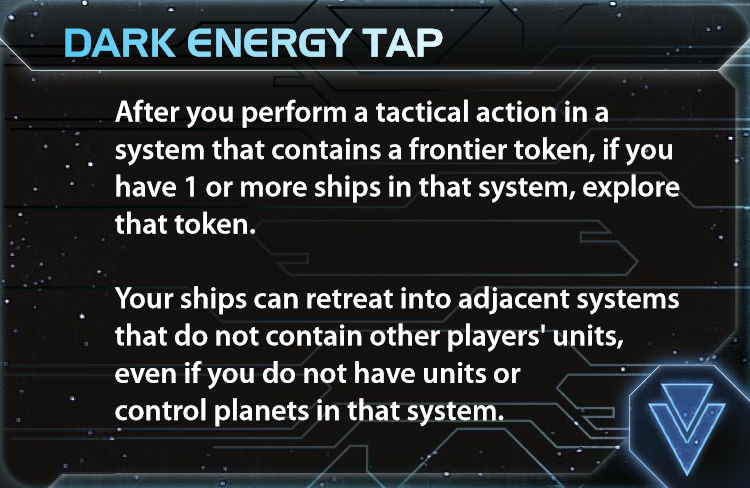 | 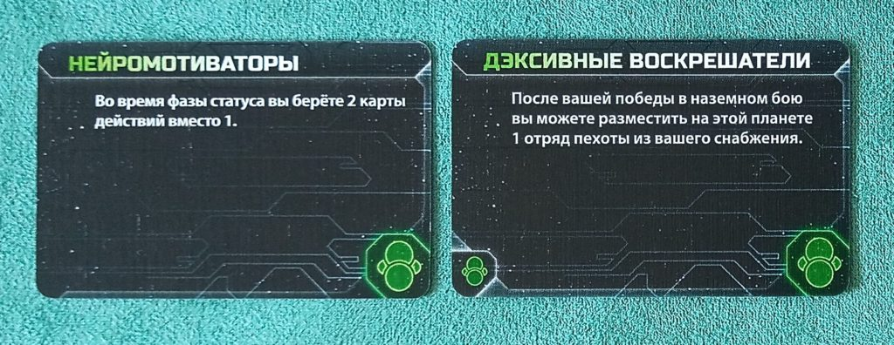 |

*DET пока доступен только на английском; справа — русская базовая карта «Нейромотиваторы» (вместе с соседней картой на исходном скане).*

**Dark Energy Tap** даёт доступ к frontier tokens и полезное правило отступления. Если в партии мало фракций, планирующих исследовать пустые системы, нетронутые frontier tokens превращаются в отдельный экономический ресурс: товары, жетоны, карты действий, фрагменты реликвий и другие эффекты исследования.

**Neural Motivator** начиная с первой Status Phase даёт две карты действий вместо одной. Это стабильная прибыль, которая обычно окупается всю партию, но которую неприятно исследовать позднее вместо улучшения юнита.

Этот старт выбирается при выполнении двух предварительных условий:

1. Найден игрок, способный исследовать **Gravity Drive** через Visionaria.
2. Найден игрок с минимум одной зелёной предпосылкой, способный исследовать **Hyper Metabolism**.

Doctor Carrina игнорирует только **одно** требование. Поэтому:

- Gravity Drive может исследовать игрок без синей технологии, если агент применяется к нему;
- Hyper Metabolism требует две зелёные предпосылки, поэтому даже с агентом исследователю нужна ещё одна зелёная технология или подходящая синергия/tech skip;
- если агент нужен для Hyper Metabolism, исследователь Gravity Drive должен самостоятельно иметь синюю предпосылку, и наоборот.

Главное достоинство старта: вы не тратите собственные два исследования на технологии, которые можете гарантированно получить через Visionaria, и начинаете с двух технологий, сразу производящих ценность.

### Как реализовать Dark Energy Tap в первом раунде

В стартовом флоте нет эсминца, поэтому DET не приносит деньги автоматически. Нужен план производства:

- произвести 1–2 эсминца через вторичную способность Warfare;
- либо построить их обычным производством, если домашняя система ещё не заблокирована командным жетоном;
- в оставшихся тактических действиях отправить эсминцы в системы с frontier tokens;
- не тратить на разведку жетоны, необходимые для публичной цели или расширения.

Destroyer I стоит всего 1 ресурс и имеет Move 2, поэтому это удобный исследователь. Тем не менее DET — экономическая возможность, а не обязанность: не следует жертвовать очком ради случайного frontier token.

### Безопасный синий вариант: Dark Energy Tap + Gravity Drive

Если договориться о Gravity Drive не удалось, последовательное исследование DET, затем Gravity Drive является наиболее надёжным синим стартом.

  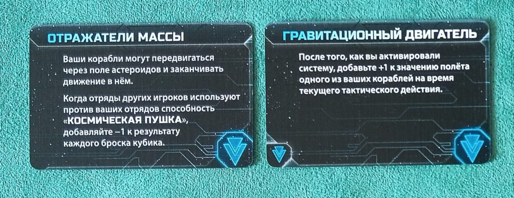

*Русские базовые карты «Отражатели массы» и «Гравитационный двигатель»: первая ситуативна, вторая почти всегда нужна для мобильности и Carrier II.*

Преимущества:

- немедленная мобильность;
- доступ к frontier tokens;
- два синих требования для Carrier II;
- Gravity Drive можно продавать через Share Knowledge;
- после зелёной или жёлтой технологии доступен путь к Dreadnought II.

В большинстве партий DET полезнее Antimass Deflectors. Исключения:

- важные маршруты проходят через астероидные поля;
- ключевая система или будущая позиция Thunder’s Edge находится в астероидах;
- на столе много PDS и критична защита от Space Cannon;
- frontier tokens уже активно разбирают другие фракции.

Если Antimass неожиданно понадобится позднее, выгоднее договориться, чтобы другой игрок исследовал его через Visionaria, вернуть его promissory note и при необходимости субсидировать исследование.

### Альтернатива с tech skip: Neural Motivator + Bio-Stims

Сильный экономический старт при доступной планете с технологической специализацией.

Схема:

1. Занять tech-skip планету.
2. В конце хода использовать Bio-Stims, чтобы подготовить её.
3. Затем истощить её для экспедиции.
4. Получить Visionaria Select без траты 3 trade goods и без сброса карт.

Недостаток — отсутствие синей технологии. Желательно заранее договориться о Gravity Drive и, если получится, Dark Energy Tap либо другой синей базе.

### Гибкий зелёный вариант: Neural Motivator + Radical Advancement

В начале первой Status Phase можно:

- заменить Radical Advancement на **Hyper Metabolism** и получить 3 командных жетона вместо 2 уже в этой фазе;
- при большом количестве Ocean-карт заменить Neural Motivator на **Hydrothermal Mining**, сохранив Radical Advancement;
- позднее превращать слабые технологии из Visionaria в более сильные технологии того же цвета с ровно одним дополнительным требованием.

Этот путь хорош, если Gravity Drive и другие синие технологии уже обещаны партнёрами, а Breakthrough гарантирован через Trade, Leadership или Politics.

### Жёлтые экономические старты

Жёлтые технологии действительно труднее заказывать у стола: многие фракции не хотят тратить раннее исследование на жёлтую ветку. Поэтому одну из них иногда разумно взять самостоятельно.

**Sarween Tools**:

- экономит по 1 ресурсу при производстве;
- особенно хорошо работает при частом производстве мехами с Production 1;
- имеет высокую долгосрочную отдачу, но почти не решает первый ход самостоятельно.

**Scanlink Drone Network**:

- полезна в богатом собственном слайсе с хорошими колодами исследований;
- не срабатывает при первичном захвате планеты, потому что на момент активации вы ещё её не контролировали;
- начинает стабильно приносить пользу со второго раунда.

**Psychoarchaeology**:

- сильна при нескольких tech-skip планетах;
- позволяет использовать их требования, даже когда они истощены;
- превращает контролируемые tech-skip планеты в trade goods;
- значительно слабее без подходящих планет.

Комбинация жёлтой технологии с Neural Motivator может быть хорошей экономической альтернативой DET + Neural, но лишает вас ранней синей базы.

### Красные технологии

Для обычного экономического старта красная ветка имеет низкий приоритет. Исключение — **AI Development Algorithm**, если заранее планируются многочисленные улучшения юнитов и War Sun. Это инвестиция в будущую военную мощь, а не темп первого раунда.

### Hydrothermal Mining со старта

| Hydrothermal Mining | Radical Advancement |
|---|---|
| 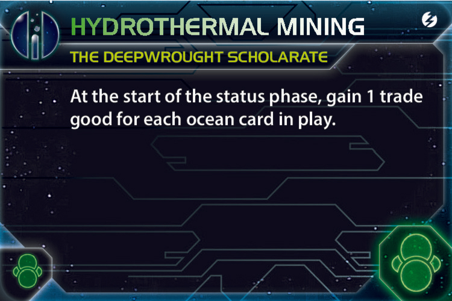 |  |

*Обе фракционные технологии новые и пока показаны на английском. Hydrothermal Mining — экономика от Ocean-карт; Radical Advancement — переработка слабой технологии в более требовательную технологию того же цвета.*

Не следует брать её автоматически.

- 1 Ocean — слабая отдача.
- 2 Oceans — нормальная долгосрочная инвестиция.
- 3–5 Oceans — одна из сильнейших экономических технологий в игре.

Оптимальное окно для неё обычно находится во втором раунде. Если удаётся получить фракционную технологию через Entropic Scar в начале Status Phase, это особенно выгодно.

## Приоритет в драфте

Deepwrought значительно меньше других фракций зависит от идеального слайса:

- Gravity Drive можно получить через Visionaria;
- дефицит планет определённого типа компенсируется coexistence;
- Ikatena 4/4 даёт отличную базовую экономику;
- Ocean-карты и Hydrothermal Mining создают дополнительный доход.

Поэтому **место в порядке выбора стратегических карт часто важнее небольшого преимущества слайса**. Желательно сидеть как можно ближе к Speaker, чтобы гарантировать Trade, Leadership или Politics.

Слайс всё же не безразличен. Особенно полезны:

- доступная tech-skip планета;
- пустые системы с frontier tokens;
- удобные пути к соседям;
- три доступные планеты для стартовой пехоты;
- защищаемая домашняя зона;
- разнообразие типов планет для целей.

Иными словами: ради первого или второго выбора стратегии можно взять немного более слабый слайс, но не следует добровольно брать явно плохую экономику или полностью закрытую позицию.

## Стратегические карты первого раунда

### 1. Trade

Лучший общий выбор.

Идеальная первая акция:

1. Разыграть Trade.
2. Получить 3 trade goods и пополнить товары.
3. В конце этой же стратегической акции потратить 3 trade goods на экспедицию.
4. Открыть Visionaria Select.

Бесплатно пополняйте товары прежде всего игрокам, которые:

- готовы купить технологию через Visionaria;
- обменяют ваши товары;
- станут хорошими партнёрами по Alliance;
- способны исследовать нужную вам технологию.

Trade позволяет увязать бесплатное пополнение с технологическим контрактом:

> Я бесплатно пополняю тебе товары, а ты через Visionaria исследуешь согласованную технологию. Твою promissory note я возвращаю.

Если игроку всё ещё не хватает мотивации, можно добавить 1 TG. Тогда фактически он получает технологию за 2 TG без траты стратегического жетона, а вы получаете ту же технологию.

### 2–3. Leadership и Politics

Их порядок зависит от секретной цели, наличия Naalu и ценности позиции Speaker.

#### Leadership

Leadership особенно хорош, если стартовая секретная цель почти невыполнима или слишком дорога.

С инициативой 1 можно:

1. Первой акцией разыграть Leadership.
2. Получить командные жетоны.
3. В конце хода сбросить плохую ненабранную секретную цель для экспедиции.
4. Открыть Breakthrough раньше остальных игроков.

Главное исключение — **Naalu**. Их жетон инициативы 0 позволяет действовать раньше Leadership и забрать часть экспедиции за секретную цель. При Naalu эту линию нельзя считать гарантированной.

Даже без плохой секретной цели Leadership полезен, если план требует:

- следовать Trade, Warfare и Technology;
- активно исследовать frontier tokens через DET;
- претендовать на Mecatol Rex;
- сохранить тактические жетоны для расширения.

#### Politics

Politics почти равна Leadership, особенно если секретная цель хорошая.

Она даёт две карты действий, которые можно сразу сбросить для экспедиции. Дополнительно можно поставить себя первым в очереди следующего раунда и взять:

- Leadership для раннего Мекатола;
- Imperial, если Мекатол уже занят;
- Trade или Technology для продолжения разгона.

Позицию Speaker можно продать, если другой игрок готов дорого заплатить. По умолчанию выгодно передать её себе или партнёру так, чтобы во втором раунде гарантировать нужную карту.

### 4. Diplomacy

Сильна, если:

- рядом есть tech-skip планета;
- готовится ранний захват Мекатола;
- Ikatena будет потрачена на Technology или производство и её особенно выгодно подготовить повторно.

Основной путь к Breakthrough:

1. Занять tech-skip планету — она приходит истощённой.
2. Позднее разыграть Diplomacy и подготовить её.
3. В конце стратегической акции снова истощить её для экспедиции.

Использовать Ikatena для части экспедиции «5 ресурсов» или «5 влияния» неудобно: одной домашней планеты недостаточно, а добавление ещё одной планеты часто приводит к перерасходу. Главная ценность Diplomacy — tech skip и повторное использование экономики 4/4.

### 5. Technology

В первом раунде обычно ниже Trade, Leadership, Politics и подходящей Diplomacy. Обычные технологии выгоднее получать через Visionaria, а ресурсов на второе исследование за 6 может не хватить.

У Technology есть две линии применения.

**Позитивная линия:**

- контролировать момент исследования;
- взять ранний unit upgrade;
- получать экономику с чужих исследований через Aello;
- после передачи Alliance использовать копию Aello и снизить стоимость второго исследования с 6 до 5;
- оплатить эти 5 ресурсов через Ikatena 4/4 и готовый Ocean.

**Негативная линия:** разыграть Technology очень рано, пока соперники не собрали 4 ресурса. Игроки, не сумевшие последовать, сильнее заинтересуются Visionaria за 3 TG без стратегического жетона. Это рабочее давление, но оно зависит от экономики стола и может вызвать лишнее раздражение.

Technology становится значительно важнее во втором-третьем раундах, когда необходимо последовательно исследовать unit upgrades, недоступные через Visionaria.

### Остальные карты

- **Warfare** — низкий приоритет как собственная карта, но её вторичная способность очень полезна для производства эсминцев под DET, дополнительного транспортника и пехоты.
- **Construction** — низкий приоритет. На Ikatena уже стоит космодок; домашний PDS полезен, но редко стоит отдельной стратегической карты. Construction становится лучше только при заранее выбранной хорошей передовой планете.
- **Imperial** — почти всегда последний выбор в первом раунде; со второго раунда может закрыть отставание по публичным целям или принести дополнительное очко с Мекатола.

Итоговый ориентир:

1. Trade.
2. Leadership при плохой секретной цели и без Naalu; иначе Politics.
3. Politics или Leadership — оставшаяся из пары.
4. Diplomacy при доступном tech skip.
5. Technology.
6. Warfare.
7. Construction.
8. Imperial, если нет необычной возможности немедленно набрать очко.

## Практически идеальный первый раунд

Ниже — линия с максимальным экономическим потолком при договороспособном столе и полученном Trade.

### Подготовка

- Исследовать **Dark Energy Tap**.
- Исследовать **Neural Motivator**.
- Найти двух технологических партнёров до начала Action Phase.
- Первый партнёр должен быть способен исследовать Gravity Drive.
- Второй — Hyper Metabolism.
- Заранее определить, кому потребуется Doctor Carrina для игнорирования одной предпосылки.

Если обеспечить оба исследования невозможно, не притворяйтесь, что контракт гарантирован. Безопасный запасной старт — Dark Energy Tap + Gravity Drive.

### Последовательность

1. Разыграть Trade первой или второй акцией.
2. Получить 3 trade goods.
3. В конце хода купить часть экспедиции за 3 trade goods.
4. Открыть Visionaria Select.
5. Бесплатно пополнить товары технологическим партнёрам и помочь их обменять.
6. Расшириться в две системы:
   - транспортник перевозит 2 пехоты и 2 истребителя;
   - дредноут перевозит 1 пехоту.
7. Разыграть Visionaria, когда у партнёров появились необходимые trade goods.
8. Первый согласованный игрок исследует Gravity Drive.
9. Второй согласованный игрок исследует Hyper Metabolism.
10. После разрешения Visionaria вернуть promissory notes законными транзакциями, когда игроки являются соседями; при необходимости субсидировать исследование на 1 TG.

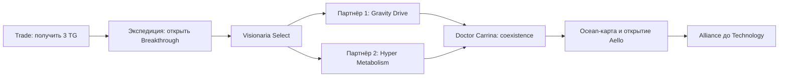

Схема показывает идеальный темп, но порядок двух исследований и применения агента меняется в зависимости от предпосылок партнёров.
11. Применить агента к тому исследователю, которому не хватает ровно одной предпосылки.
12. Разместить свою пехоту в coexistence на планете, подходящей под текущую или вероятную цель.
13. Получить готовую Ocean-карту 1/1 и открыть Aello.
14. На следующем своём ходу передать Alliance партнёру — желательно до Technology.
15. При возможности последовать Technology и исследовать Carrier II либо другой unit upgrade.
16. Через Warfare произвести 1–2 эсминца для DET, дополнительный транспортник или пехоту — в зависимости от цели и денег.
17. Если остаются тактические жетоны, исследовать frontier token эсминцем, не ослабляя собственный слайс.
18. Выполнить публичную цель.

Эта линия даёт к первой Status Phase:

- Dark Energy Tap;
- Neural Motivator;
- Gravity Drive;
- Hyper Metabolism;
- минимум один Ocean;
- открытого командира;
- дополнительную карту действия;
- 3 командных жетона вместо 2;
- потенциальный frontier exploration;
- возможно, первое улучшение юнита.

Это чрезвычайно сильный темп, но он зависит от реальных предпосылок и согласия двух игроков. Не следует строить всю подготовку на устных обещаниях людей, которые могут не получить 3 TG или изменить решение.

### Приоритет целей первого раунда

1. Открыть Breakthrough до того, как нужную часть экспедиции займёт другой игрок.
2. Получить Gravity Drive и Hyper Metabolism через согласованные исследования.
3. Открыть командира и передать Alliance.
4. Набрать 1 VP.
5. Получить минимум одну Ocean-карту.
6. Занять и удержать собственный слайс.
7. Получить unit upgrade, если это не ломает экономику.
8. Исследовать frontier token, если это не мешает пунктам выше.

Публичное очко остаётся базовым приоритетом. Однако допустимо осознанно пропустить очень дорогую цель первого раунда — например, требующую сохранить 5 trade goods, — если вместо неё вы получаете огромный экономический разгон и уже планируете взять Imperial во втором раунде, чтобы наверстать темп. Это исключение должно быть просчитано, а не использоваться как оправдание бесконечной экономической подготовки.

Mecatol Rex в первом раунде — приятный бонус, но не обязательная цель. Нередко выгоднее взять Politics и забрать его в начале второго раунда.

## Visionaria Select

  

Visionaria позволяет каждому другому игроку:

- потратить 3 trade goods;
- передать вам одну promissory note;
- исследовать обычную технологию, не являющуюся faction technology или unit upgrade.

Вы получаете каждую исследованную таким способом технологию.

Командир Aello не уменьшает эту стоимость, поскольку Visionaria требует trade goods, а Aello уменьшает только количество потраченных ресурсов.

### Базовое предложение столу

> Ты платишь 3 trade goods и не тратишь стратегический жетон. Если выберешь технологию, которой у меня ещё нет, я верну твою promissory note.

В первом раунде возвращение записки должно быть скорее стандартом, чем исключением. Ваша задача — не собрать набор слабых записок, а гарантированно получить ключевые технологии и создать у стола привычку пользоваться Visionaria.

Но само получение записки происходит внутри разрешения Visionaria, а обычный возврат — отдельной транзакцией. Поэтому гарантированно вернуть карту можно соседу в допустимое окно транзакции. Для несоседа это сначала будет необязательное обещание; агент удобно решает проблему, создавая coexistence и тем самым соседство с одним из партнёров.

За особенно важную технологию допустимо доплатить 1–2 TG. Например:

> Ты отдаёшь 3 TG в Visionaria, я возвращаю записку и плачу тебе 1 TG, если ты берёшь согласованную технологию.

Фактическая цена партнёра — 2 TG без стратегического жетона. Для него это почти всегда выгодно, а вы получаете ту же технологию.

### Приоритет технологий для заказа

В первом раунде существуют две главные цели:

1. **Gravity Drive** — мобильность и синяя база.
2. **Hyper Metabolism** — 3 командных жетона вместо 2 в каждой Status Phase.

  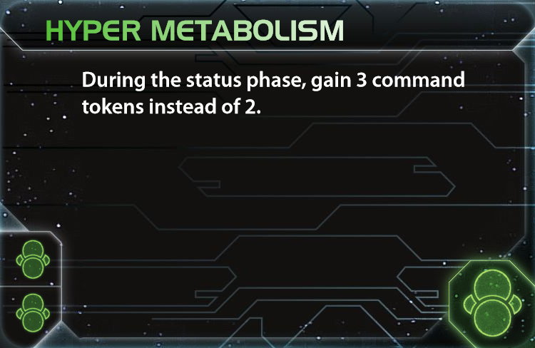

Hyper Metabolism особенно ценен именно в первом раунде: он успевает сработать несколько раз и окупается большим количеством дополнительных жетонов. Для его исследования партнёру нужны две зелёные предпосылки; Doctor Carrina закрывает только одну из них.

Дальнейший приоритет:

3. Жёлтая или зелёная база, которой вам не хватает.
4. Sling Relay.
5. Fleet Logistics.
6. Light/Wave Deflector.
7. X-89 Bacterial Weapon.
8. Integrated Economy.
9. Antimass Deflectors — только при реальной потребности в астероидах или защите от Space Cannon.
10. Self-Assembly Routines — ситуативно полезна с мехами.

После получения Gravity Drive и Hyper Metabolism остальные исследования опциональны. Не следует платить полную цену игроку за случайную красную или жёлтую технологию. Но если он готов исследовать её за возвращение записки и небольшую субсидию, лишняя технология обычно полезна — особенно как материал для Radical Advancement.

### Какие записки оставлять

Не обязательно требовать реальную плату от каждого участника. Новая технология обычно важнее Political Secret.

Однако можно оставить:

- Ceasefire;
- Trade Agreement;
- ценную фракционную записку;
- записку игрока, который исследовал уже имеющуюся у вас технологию;
- записку игрока, которому вы не хотите бесплатно помогать.

Visionaria работает на любом расстоянии, но вернуть записку обычной транзакцией можно только соседу. С несоседом обещание возврата до появления соседства будет необязательным устным соглашением.

### Когда прекратить пользоваться Visionaria

Обычно её стоит активно использовать в первом и втором раундах. В третьем — только ради конкретной нужной технологии.

Останавливайтесь, если:

- необходимые требования уже собраны;
- лидер получает от Visionaria больше вас;
- соперники собирают Fleet Logistics и Light/Wave для победного хода;
- вам нужны улучшения юнитов, которые Visionaria не даёт;
- стол начал воспринимать ваш технологический доход как общую угрозу.

Если никто не участвует, Visionaria всё равно можно исчерпать как задерживающую компонентную акцию.

## Агент Doctor Carrina

  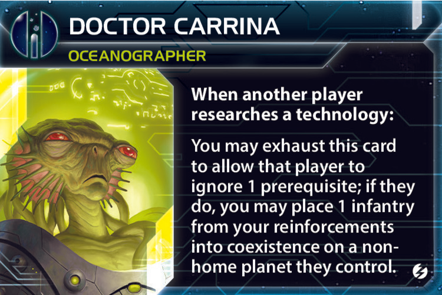

Агента лучше применять:

1. На согласованного исследователя Gravity Drive или Hyper Metabolism, которому не хватает ровно одной предпосылки.
2. На будущего партнёра по Alliance.
3. На владельца Technology, если Visionaria ещё не использована.
4. На игрока, контролирующего планету, полезную для целей.

Вы выбираете планету для своей пехоты. На ней должны находиться чужие наземные войска: на полностью пустой планете coexistence не начинается.

### Приоритет планет

Главный критерий — не экономика планеты, потому что её карту вы не получите, а **выполнение целей**.

Приоритет:

1. Планета, прямо закрывающая открытую публичную или секретную цель.
2. Tech-skip планета для целей на технологические специализации.
3. Недостающий тип: cultural, hazardous или industrial.
4. Планета с вложением.
5. Планета у края карты или рядом с чужой домашней системой.
6. Планета в аномалии или у червоточины.
7. Планета, превращающая вас в соседа сразу нескольких игроков.

Если текущие цели ничего не подсказывают, выбирайте tech-skip или тип планеты, которого у вас меньше всего: в колоде публичных целей регулярно встречаются требования на четыре планеты одного типа и технологические специализации.

Если нужная планета действительно ценна, агента можно дать бесплатно или даже доплатить 1 TG. Правильное присутствие, Ocean и открытый командир обычно стоят дороже.

### Важный порядок Technology

Если агент открывает Aello во время первого исследования владельца Technology:

- сам владелец Technology не может применить только что открытого Aello к уже оплаченному первому исследованию;
- он сможет использовать Aello для второго исследования за 6 ресурсов;
- игроки, следующие после него, смогут использовать Aello;
- игроки, уже разрешившие вторичную способность до открытия командира, воспользоваться им не смогут.

Поэтому лучше открыть Aello через Visionaria **до** розыгрыша Technology.

## Командир Aello и Alliance

  

Aello позволяет другому игроку уменьшить ресурсную стоимость исследования технологии на 1. После этого вы:

- получаете один товар; либо
- превращаете один свой товар в trade good.

Запретить использование Aello вы не можете.

### Зачем рано передавать Alliance

После передачи Alliance на столе появляется вторая копия Aello:

- исследователь может применить обе копии и получить скидку 2;
- вы и держатель Alliance оба получаете экономический эффект;
- вы можете использовать копию собственного командира у партнёра для своих исследований;
- Technology становится значительно дешевле для всего стола, а вы получаете часть созданной экономики.

Не обязательно пытаться продать Alliance за максимальную цену. Хороший обмен командирами или дешёвая передача надёжному партнёру часто выгоднее нескольких TG.

Mahact не может получить Alliance, но, имея ваш командный жетон в своём флотском резерве, способен использовать Aello через Imperia и создать дополнительную копию скидки.

### Предпочтительные партнёры

- Богатые фракции, которые регулярно исследуют технологии: Hacan, Nomad.
- Jol-Nar, если вы готовы к каскаду Research Agreement и не боитесь усилить его.
- Игрок с сильным экономическим командиром.
- Надёжный сосед, который будет использовать и конвертировать товары каждый раунд.

Не передавайте Alliance лидеру, если дополнительные скидки могут непосредственно создать его победный ход.

## Записка Share Knowledge

Share Knowledge временно даёт игроку одну вашу обычную, нефракционную технологию, не являющуюся улучшением юнита, до конца Status Phase.

### Лучшие технологии для продажи

- **Gravity Drive** — движение и выполнение требований.
- **Hyper Metabolism** — дополнительный жетон.
- **Bio-Stims** — повторное использование технологии или tech-skip.
- **Sling Relay** — постройка и дополнительная задерживающая акция.
- **Fleet Logistics** — чрезвычайно ценный двойной ход.
- **Light/Wave Deflector** — движение через чужие флоты.
- Технология нужного цвета для выполнения технологической цели.

### Ориентировочная цена

- Базовая технология — 1 TG.
- Полезная технология на весь раунд — 2 TG.
- Технология, закрывающая цель или сильную атаку, — 3+ TG.
- Технология, создающая победный ход, лидеру не продаётся.

Share Knowledge также является компонентной акцией и может использоваться покупателем как задержка.

Не продавайте Fleet Logistics, Light/Wave или Gravity Drive игроку на 7–9 очках, пока полностью не просчитаете его оставшиеся действия.

## Технологический путь

Главный принцип:

> Обычные технологии получайте через Visionaria. Собственные исследования тратьте на unit upgrades и faction technologies.

### Приоритет улучшений

| Carrier II | Fighter II | Space Dock II | Dreadnought II |
|---|---|---|---|
| 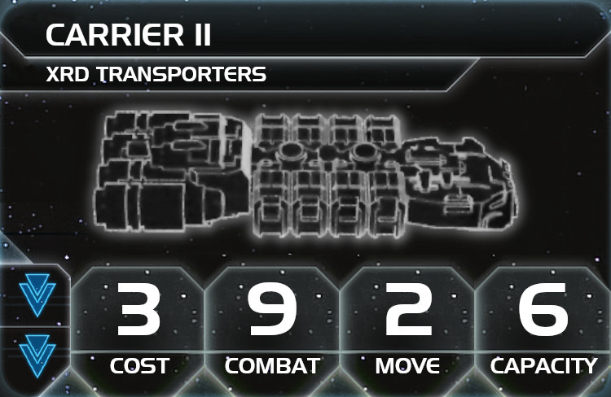 |  |  |  |

*Практический костяк улучшений: мобильность и Capacity сначала, дешёвый экран и тяжёлый флот — по ситуации.*

1. **Carrier II** — обычно лучший первый апгрейд.
2. **Fighter II** — дешёвая и эффективная защита.
3. **Space Dock II** — легко доступен благодаря зелёно-жёлтой синергии.
4. **Dreadnought II** — если строится тяжёлый флот.
5. **Destroyer II** — против истребителей или для секретной цели.
6. **Cruiser II** — ситуативный поздний рывок.
7. **Infantry II** — обычно низкий приоритет: coexistence, мехи и X-89 решают наземные задачи лучше.

Если уже в первом раунде через Visionaria появились две синие предпосылки, очень желательно последовать Technology и сразу получить Carrier II. Начиная со второго раунда Technology становится более важной стратегической картой именно потому, что Visionaria не позволяет исследовать unit upgrades.

### Зелёно-жёлтая синергия

После открытия Breakthrough каждую принадлежащую вам зелёную или жёлтую технологию и соответствующий tech-skip можно считать одним из этих двух цветов:

- при исследовании технологий;
- при проверке технологических целей.

Каждый компонент выбирает цвет отдельно. Например:

- две зелёные технологии могут выполнить два жёлтых требования Space Dock II;
- четыре зелёные технологии можно при проверке цели разделить на две зелёные и две жёлтые;
- зелёную технологию можно использовать как жёлтое требование Dreadnought II.

Сама карта Breakthrough технологией не считается.

### Рекомендуемый набор к концу игры

- Gravity Drive.
- Carrier II.
- Fighter II или Dreadnought II.
- Fleet Logistics.
- Light/Wave Deflector.
- X-89 Bacterial Weapon либо Integrated Economy.
- Hydrothermal Mining при трёх и более стабильных Ocean-картах.

### Военная конверсия экономики

Экономический разгон имеет смысл только тогда, когда к третьему-четвёртому раунду он превращается в пластик.

Приоритет расходов:

1. Пехота для Ikatena и ключевых планет.
2. Транспортники и истребители.
3. Мехи на передовых производственных точках.
4. Дредноуты и флагман.
5. Увеличение флотского резерва.
6. War Sun — только при избыточной экономике и подготовленных требованиях.

Вариант с War Sun реален благодаря Hydrothermal Mining и Aello, но требует красной базы. Наиболее логичный путь начинается с AI Development Algorithm. War Sun должна дополняться большим экраном Fighter II и достаточной Capacity; одиночная дорогая War Sun без истребителей слишком уязвима и не решает задачу защиты разогнавшейся фракции.

X-89 особенно полезен как средство наступления и как технология, которую опасно оставлять соперникам при попытке взять Ikatena. При угрозе наземного уничтожения можно удалить X-89 героем.

  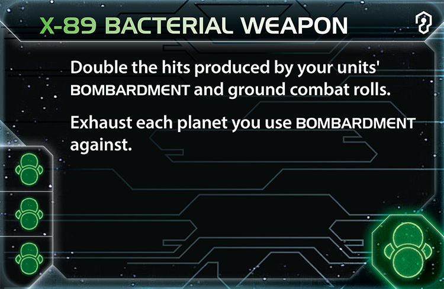

> Здесь показана актуальная кодексная X-89: она удваивает попадания ваших бросков Bombardment и наземного боя, а также истощает каждую планету, против которой вы применили Bombardment. Старая базовая русская карта с уничтожением всей пехоты после бомбардировки для этого гайда не используется.

### Radical Advancement

Полезна, если стол даёт вам слабые технологии через Visionaria. В начале Status Phase такую технологию можно заменить технологией того же цвета с ровно одним дополнительным требованием.

Примеры применения:

- превратить Radical Advancement в Hyper Metabolism;
- превратить Neural Motivator в Hydrothermal Mining;
- превратить слабую жёлтую технологию среднего уровня в Transit Diodes;
- заранее взять дешёвую технологию только для последующего повышения.

Синергия Breakthrough не меняет цвет для Radical Advancement: синергия применяется только при исследовании и проверке технологических целей.

## Мехи и флагман

### Eanautic

  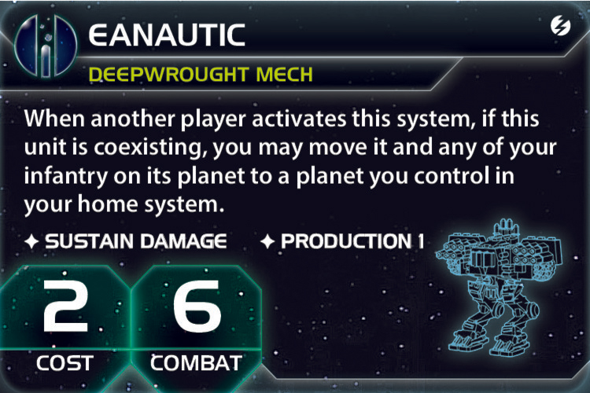

Мех особенно ценен благодаря **Production 1**.

Размещайте мехов:

- на передовых планетах;
- в совместном существовании рядом с центром;
- на маршруте будущего флагмана;
- там, где нужно постепенно производить пехоту, истребители или дополнительные мехи.

Если другой игрок активирует систему с совместно существующим Eanautic, вы можете переместить меха и всю свою пехоту с его планеты на контролируемую вами планету в домашней системе.

Это позволяет сохранить пластик, но может привести к потере:

- Ocean-карты;
- планеты для проверки цели;
- участка маршрута флагмана.

### D.W.S. Luminous

  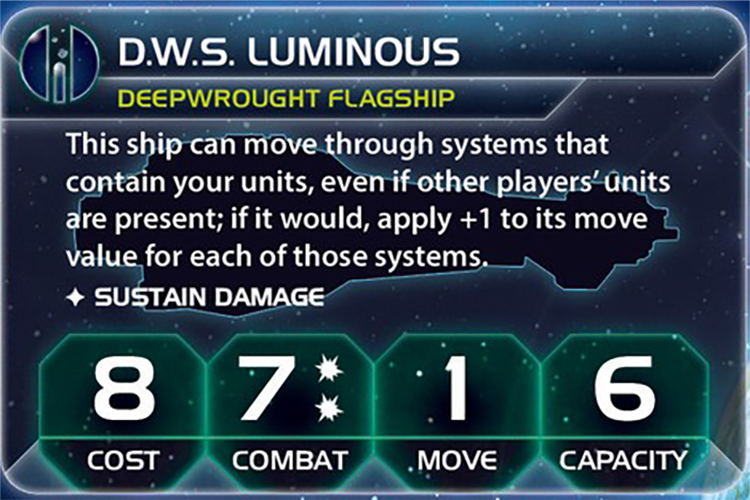

Флагман получает +1 движения за каждую систему, через которую проходит и в которой уже находятся ваши юниты, даже если там присутствуют корабли других игроков.

Сеть совместного существования создаёт для него своеобразные рельсы через всю галактику.

Стройте флагман обычно в третьем-четвёртом раунде, когда:

- уже создана цепочка ваших юнитов;
- нужно достичь противоположной стороны карты;
- планируется захват Styx или Mecatol Rex;
- готовится победный ход с Fleet Logistics или Light/Wave;
- требуется перевезти большой объём пехоты и истребителей.

Флагман имеет Capacity 6 и нередко полезнее War Sun именно благодаря дальности и возможности перебросить значительный десант.

## Герой Ta Zern

  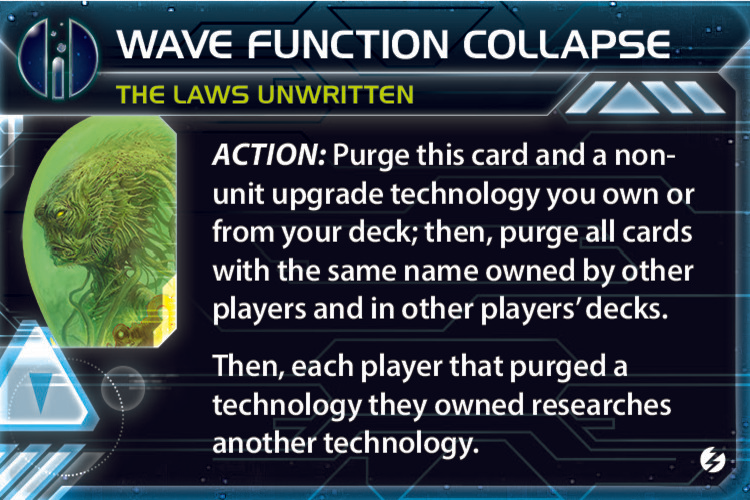

Ta Zern удаляет выбранную обычную технологию из всей партии. Каждый игрок, у которого эта технология уже была исследована, затем исследует другую технологию.

Герой не обязательно уменьшает общее количество технологий, но навсегда удаляет конкретную возможность.

### Лучшие цели

- **Antimass Deflectors** — если важная позиция или Thunder’s Edge находятся в астероидах.
- **X-89 Bacterial Weapon** — если угрожают вашей домашней пехоте.
- **Light/Wave Deflector** — чтобы остановить проход через флоты.
- **Fleet Logistics** — против победного двойного хода.
- **Gravity Drive** — когда вы впереди и хотите снизить мобильность всего стола.

Используйте героя поздно, когда понятно, какая технология непосредственно решает партию.

Если вы сами владели удалённой технологией, вы также исследуете замену. Если технология удалена только из вашей колоды, не будучи исследованной, замены вы не получаете.

## Дипломатия

### Территориальная доктрина

Coexistence не означает, что нужно отказаться от собственного слайса и жить только на чужих планетах.

Правильная структура позиции:

- собственный слайс вы контролируете обычным способом;
- строите там флот, космодоки и крупный гарнизон;
- за пределами слайса размещаете одиночную пехоту или мехов через агента и договорённости;
- чужие игроки продолжают контролировать и защищать свои планеты;
- ваши удалённые юниты обеспечивают Ocean-карты, цели, соседство и маршруты флагмана.

Это позволяет меньше воевать за дальние контрольные цели. Вместо захвата четырёх hazardous-планет можно контролировать свои две и совместно существовать ещё на двух чужих. Сосед заинтересован защищать систему, потому что карта планеты и её экономика принадлежат ему.

Не обещайте автоматически защищать каждую такую планету собственным флотом. Базовая сделка заключается именно в том, что хозяин сохраняет экономику и основную ответственность за оборону, а вы помогаете только при отдельной взаимовыгодной договорённости.

### Базовая сделка на coexistence

> Ты получаешь карту планеты и всю её экономику. Я оставляю одну пехоту; для целей планета считается нашей обоих. Я получаю Ocean и не атакую тебя.

Это особенно удобно для совместного выполнения целей на:

- планеты одного типа;
- планеты с вложениями;
- планеты у края поля;
- системы рядом с домашними системами;
- планеты с технологическими специализациями.

Если текущей цели нет, размещайтесь с расчётом на вероятные будущие требования: четыре планеты одного типа, tech skips, вложения, край карты и системы у чужих домашних систем.

### Базовая сделка на агента

> Я позволяю тебе проигнорировать одно требование технологии. Взамен я выбираю одну твою не домашнюю планету с наземным войском и размещаю там пехоту в coexistence.

Не позволяйте партнёру автоматически выбирать самую бесполезную для вас планету. Выбор планеты — значительная часть ценности агента.

### Базовая сделка на Visionaria

> Если ты исследуешь новую для меня технологию, я верну записку и при необходимости помогу оплатить 1 TG. Если исследуешь уже имеющуюся у меня технологию, записка остаётся у меня.

### Управление угрозой

Deepwrought способен очень быстро накопить технологии, товары и планеты для целей. Поэтому:

- возвращайте дешёвые записки игрокам, которые реально вам помогают;
- не требуйте оплату за каждую мелочь;
- создайте одного надёжного партнёра по Alliance;
- не объявляйте заранее все возможности флагмана;
- при большом преимуществе прекратите кормить стол технологиями;
- защищайте домашнюю систему обычной пехотой, а не только правилом coexistence.

## Главные ошибки

- Не открыть Breakthrough в первом раунде.
- Начать с Antimass по привычке, хотя в слайсе нет важных астероидов, а frontier tokens остаются без конкуренции.
- Выбрать DET + Neural, не договорившись заранее о Gravity Drive и Hyper Metabolism.
- Забыть, что агент игнорирует только одну из двух зелёных предпосылок Hyper Metabolism.
- Взять DET, но не предусмотреть производство эсминцев и тактические жетоны для исследований.
- Потратить агента на случайную слабую планету.
- Передержать Alliance в руке до розыгрыша Technology.
- Исследовать обычные базовые технологии самостоятельно вместо улучшений юнитов.
- Продолжать Visionaria после того, как она стала больше помогать соперникам.
- Путать coexistence с полноценным контролем и пытаться тратить ресурсы чужой планеты.
- Пытаться получить очко Imperial или Styx через coexistence.
- Считать, что совместно существующий космодок продолжает производить.
- Отдать сильную собственную планету ради одного Ocean 1/1 без иной выгоды.
- Накопить огромное количество технологий и денег, но забыть о публичных целях.
- Не превратить экономику второго раунда во флот и гарнизон к третьему-четвёртому.
- Жить только через coexistence, не контролируя и не защищая собственный слайс.
- Продавать Fleet Logistics или Light/Wave потенциальному победителю.
- Слишком рано показать себя явным лидером.

## Итоговая памятка

### До начала партии

- Есть два надёжных технологических партнёра: **Dark Energy Tap + Neural Motivator**.
- Нет гарантии получить Gravity Drive: **Dark Energy Tap + Gravity Drive**.
- Antimass берётся при важных астероидах или Space Cannon, а не по умолчанию.
- Есть близкий tech skip: **Neural + Bio-Stims**.
- Хотите гибкий зелёный разгон: **Neural + Radical Advancement**.
- До выбора технологий проверить, кто реально может исследовать Gravity Drive и Hyper Metabolism.

### Первый раунд

- Лучшие карты: **Trade**, затем **Leadership/Politics**, затем ситуативная **Diplomacy**.
- Breakthrough необходимо открыть как можно раньше.
- Главные заказы Visionaria: **Gravity Drive** и **Hyper Metabolism**.
- Записки первых технологических партнёров лучше вернуть; при необходимости доплатить 1 TG.
- Агента лучше применить к партнёру, которому не хватает одной предпосылки, и сделать это до Technology.
- Alliance нужно передать после открытия Aello, но до массового исследования.
- Через Warfare желательно построить дешёвые эсминцы для DET.
- Публичное очко важнее случайной дополнительной технологии или frontier token.

### Середина игры

- Обычные технологии — через Visionaria.
- Свои исследования и Technology — на unit upgrades и фракционные технологии.
- Поддерживать 3–5 выгодных coexistence.
- Контролировать и защищать свой слайс обычным способом.
- Строить мехов на фронте.
- Превращать Hydrothermal Mining и Aello в транспортники, истребители, пехоту и флотский резерв.
- Следить, когда Visionaria начинает сильнее помогать соперникам.

### Конец игры

- Флагман + цепочка собственных юнитов.
- Fleet Logistics и Light/Wave.
- Большой гарнизон Ikatena.
- War Sun только при избыточной экономике и подготовленной красной базе.
- Герой удаляет ключевую технологию соперников.
- Никаких дешёвых технологий лидеру партии.

## Источники

- [The Deepwrought Scholarate — Twilight Imperium Wiki](https://twilight-imperium.fandom.com/wiki/The_Deepwrought_Scholarate)
- [The Deepwrought Scholarate — TI4 Lookup](https://ti4lookup.com/factions/deepwrought)
- [Официальные правила Thunder’s Edge, PDF](https://images-cdn.fantasyflightgames.com/filer_public/ca/e7/cae7706f-cdb5-4ee1-a20c-7f76a13d135c/te_rulebook_web.pdf)
- [Официальное объяснение Breakthrough и Synergy от Fantasy Flight Games](https://www.fantasyflightgames.com/en/news/2025/7/31/thunders-edge/)
- [Правила и разъяснения Deepwrought Scholarate](https://tirules2.com/F_deepwrought)
- [Правила coexistence](https://tirules2.com/R_coexistence)
- [Правила экспедиции](https://tirules2.com/R_expedition)
- [Правила технологической синергии](https://tirules2.com/R_synergy)
- [Справочник обычных технологий, включая Dark Energy Tap и Hyper Metabolism](https://www.tirules2.com/C_technology)
- [Официальное исправление Hyper Metabolism — Codex I](https://images-cdn.fantasyflightgames.com/filer_public/94/c5/94c59830-533e-47aa-a708-25634575161b/twilight_codex_v1-compressed.pdf)
- [Space Cats Peace Turtles, эпизод 445: Deepwrought Scholarate Beginner’s Guide](https://www.tapesearch.com/episode/445-deepwrought-scholarate-beginner-s-guide/oBMefyQjBPfD8nfDEMcqVV)
- [AsyncTI4: изображения англоязычных компонентов и актуальной X-89](https://github.com/AsyncTI4/TI4_map_generator_bot)
- [HobbyHour: русские сканы базовых технологий](https://www.hobbyhour.ru/sumerki-imperii-karti-tehnologii/)

Изображения сохранены локально в `assets/deepwrought`, поэтому гайд остаётся наглядным без доступа к интернету. Они используются как справочные материалы для личного игрового гайда; права на игровые компоненты принадлежат их правообладателям.
