# Last Bastion — полный гайд по фракции

Актуальность: 17 августа 2026 года.

Гайд предполагает стандартную партию **Twilight Imperium IV + Prophecy of Kings + Thunder’s Edge** на 6 игроков и 10 победных очков. Английские названия новых компонентов сохранены, поскольку устоявшейся русской локализации дополнения пока нет.

  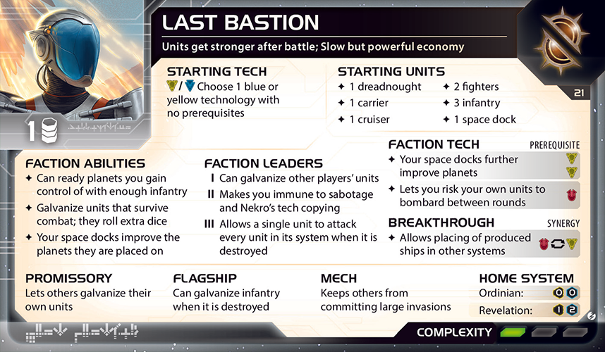

> Иллюстрации новых компонентов приведены на английском языке. Для старых технологий по возможности использованы русские карты. Текст гайда имеет приоритет над изображением, если редакции компонентов различаются.

## Содержание

- [Краткий вывод](#краткий-вывод)
- [Стартовая позиция](#стартовая-позиция)
- [Liberate](#liberate)
- [Galvanize и Phoenix Standard](#galvanize-и-phoenix-standard)
- [Основной план игры](#основной-план-игры)
- [Приоритет в драфте](#приоритет-в-драфте)
- [Выбор стартовой технологии](#выбор-стартовой-технологии)
- [Стратегические карты первого раунда](#стратегические-карты-первого-раунда)
- [Практически идеальный первый раунд](#практически-идеальный-первый-раунд)
- [The Icon](#the-icon)
- [Helios I и Helios II](#helios-i-и-helios-ii)
- [Агент Dame Briar](#агент-dame-briar)
- [Командир Nip and Tuck и Alliance](#командир-nip-and-tuck-и-alliance)
- [Технологический путь](#технологический-путь)
- [Proxima Targeting VI](#proxima-targeting-vi)
- [Мех A3 Valiance](#мех-a3-valiance)
- [Флагман The Egeiro](#флагман-the-egeiro)
- [Герой Lyra Keen](#герой-lyra-keen)
- [Записка Raise the Standard](#записка-raise-the-standard)
- [Дипломатия](#дипломатия)
- [Главные ошибки](#главные-ошибки)
- [Итоговая памятка](#итоговая-памятка)
- [Источники](#источники)

## Краткий вывод

**Last Bastion** — фракция территориального разгона. Она начинает бедно и медленно, зато превращает захват планет в пехоту, повторно использует правильно захваченные миры, наращивает постоянную экономику космодоками и постепенно делает небольшое число юнитов значительно опаснее обычного.

Главная сила фракции — не отдельная эффектная комбинация, а сцепление четырёх механизмов:

1. **Liberate** подготавливает новую планету либо бесплатно добавляет на неё пехоту.
2. **4X41C “Helios”** увеличивает ресурсную ценность планеты и создаёт огромный Production.
3. **The Icon** переносит произведённые корабли из тыла к уже активированным передовым системам.
4. **Galvanize** превращает выжившие в боях юниты в постоянные источники дополнительных кубиков.

Надёжный план выглядит так:

- начать с **Sarween Tools** или **Scanlink Drone Network**;
- в первом раунде получить второй Carrier и занять минимум две системы;
- рано поставить второй Helios на хорошую передовую планету;
- открыть The Icon, чтобы включить красно-жёлтую synergy и удалённое размещение кораблей;
- получить мобильность через Gravity Drive и Carrier II либо компенсировать её The Icon;
- исследовать Helios II;
- при подходящих tech skips выйти в **Integrated Economy**;
- не искать бессмысленные войны ради жетонов Galvanize, но превращать каждый неизбежный бой в долгосрочное усиление;
- каждый раунд использовать легендарную способность Ordinian при пасе.

Last Bastion не обязан завоёвывать половину карты. Фракции достаточно стабильно набирать публичные цели, удерживать сеть экономических доков и к последнему раунду иметь несколько оцинкованных ключевых юнитов, сильную руку action cards и защищённый победный маршрут.

## Стартовая позиция

### Домашняя система

  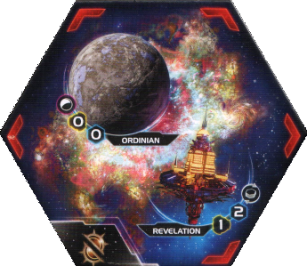

Домашняя система находится в **nebula** и содержит:

- **Ordinian 0/0** — легендарную планету;
- **Revelation 1/2** — space station;
- стартовый Helios I на Ordinian.

Helios I увеличивает ресурсную ценность своей планеты на 1. Поэтому, пока стартовый док стоит на месте, фактическая экономика дома равна:

- Ordinian — 1/0;
- Revelation — 1/2;
- суммарно — 2 ресурса или 2 влияния.

Это всё ещё бедный дом. Для сравнения, многие фракции оплачивают Technology одной домашней системой, а Last Bastion почти всегда нужны новые подготовленные планеты, trade goods или Diplomacy.

Nebula даёт обороняющимся кораблям +1 к результатам combat rolls. При этом:

- ваши корабли могут входить в домашнюю систему и выходить из неё;
- корабли не могут двигаться **сквозь** nebula;
- домашняя система остаётся неудобным транзитным узлом;
- противнику трудно выбить вас из дома обычным флотом.

### Revelation

Revelation — не планета. На неё нельзя высаживать ground forces или ставить структуры, и она не учитывается в целях на планеты.

Чтобы сохранить право набирать публичные цели, Last Bastion должен контролировать **Ordinian**. Контроль Revelation для этого не требуется.

Как space station, Revelation:

- увеличивает commodity value фракции с напечатанного 1 до 2;
- позволяет заключать сделки с владельцами других space stations без соседства;
- может быть истощена, чтобы превратить ваши commodities в trade goods;
- даёт карту 1/2, которую можно тратить и подготавливать как карту планеты.

Владение station и соседство — разные вещи. Дальняя сделка через две станции не делает игроков соседями и не позволяет обменивать promissory notes, если конкретный эффект требует соседства вне транзакции.

Если истощить Revelation для конвертации commodities, её 1 ресурс или 2 влияния в этом раунде уже недоступны. Не считайте одну и ту же карту дважды.

### Ordinian и Hyperion VI

Легендарная способность **4X41D “Hyperion” VI** позволяет истощить карту, когда вы пасуете, чтобы:

- взять 1 action card;
- получить 1 command token.

Жетон можно положить в любой ваш пул по обычным правилам получения жетона. Чаще всего он нужен:

- в strategy pool для обязательных вторичных способностей следующего раунда;
- в tactics для очередного захвата;
- во fleet pool перед крупным боем или применением The Icon.

Это один из главных источников дохода фракции. Не забывайте способность даже в первом раунде и не истощайте Hyperion заранее: истощается именно легендарная карта, а не карта планеты Ordinian.

### Стартовые компоненты

- 1 Dreadnought.
- 1 Carrier.
- 1 Cruiser.
- 2 Fighters.
- 3 Infantry.
- 1 Helios I.
- Выбор одной синей или жёлтой технологии без требований.
- Напечатанное commodity value 1, фактически 2 при контроле Revelation.

Стартовый флот содержит три нефайтерных корабля. При обычном начальном fleet pool 3 все они уже занимают предел флота. Fighters должны поддерживаться Capacity Carrier и Dreadnought.

Carrier может перевезти три Infantry и один Fighter, оставив второй Fighter на Capacity Dreadnought. Однако обычно не следует складывать все три пехоты в одну активацию: отдельная Infantry нужна второму транспортному кораблю или новому Carrier.

## Liberate

Когда вы получаете контроль над планетой, применяется один из двух эффектов:

- если число **ваших Infantry** на ней не меньше её текущей ресурсной ценности, подготовьте планету;
- иначе поместите на неё 1 Infantry из подкреплений.

Мехи не учитываются при сравнении. Планета с Infantry и Mech всё равно проверяет только число фигур Infantry.

### Таблица быстрого расчёта

| Ресурсы планеты | Infantry при захвате | Результат Liberate |
|---:|---:|---|
| 0 | 0 или больше | Планета подготавливается |
| 1 | 1 или больше | Планета подготавливается |
| 2 | 1 | Планета остаётся истощённой, появляется ещё 1 Infantry |
| 2 | 2 или больше | Планета подготавливается |
| 3 | 1–2 | Планета остаётся истощённой, появляется ещё 1 Infantry |
| 3 | 3 или больше | Планета подготавливается |

Отсюда следует главный драфтовый парадокс Last Bastion:

- миры 0/X и 1/X проще немедленно использовать;
- миры 2/X и 3/X дают бесплатную пехоту, если вы высадили мало войск;
- высокая ресурсная ценность позже чрезвычайно выгодна для Helios и Integrated Economy.

### Порядок с исследованием

При захвате неразведанной планеты получение контроля и exploration имеют окно «when». Last Bastion может выбрать:

1. Сначала исследовать, затем применить Liberate.
2. Сначала применить Liberate, затем исследовать.

Если исследование изменило ресурсную ценность планеты или число Infantry, Liberate использует уже изменившиеся значения.

Примеры:

- на hazardous 2/1 высажена одна Infantry; можно сначала исследовать и надеяться получить вторую Infantry либо уменьшение ресурсов;
- на cultural 1/2 высажена одна Infantry; безопаснее сначала подготовить планету, если эффект исследования способен увеличить её ресурсы;
- планета 0/X подготавливается даже без Infantry, если иной эффект дал вам контроль без высадки.

### Захват чужих планет

Liberate работает и на контролируемых соперником мирах. После победы в ground combat вы получаете контроль, затем:

- либо сразу подготавливаете планету при достаточном числе выжившей Infantry;
- либо добавляете ещё одну Infantry.

Это делает малые точечные вторжения эффективнее затяжной войны. Захват 1/3 с одной Infantry одновременно:

- лишает соперника 3 влияния;
- даёт вам подготовленную карту 1/3;
- оставляет гарнизон;
- создаёт передовую точку для The Icon.

### Liberate и космодоки

Helios увеличивает ресурсы планеты, но только пока док находится на ней. Если вы сначала получили контроль и разрешили Liberate, а затем поставили док через Construction, новая ресурсная ценность не заставляет переиграть Liberate.

При последующем возвращении контроля или ином новом получении планеты проверяется уже увеличенная ценность. Планету 1/X с Helios I следует считать планетой 2/X: для подготовки потребуются две Infantry.

### Liberate и Integrated Economy

Liberate срабатывает **когда** вы получаете контроль, а Integrated Economy — **после** получения контроля. Поэтому сначала полностью разрешается Liberate, и только затем Integrated Economy.

Нельзя сначала произвести Infantry через Integrated Economy, а потом учесть её для подготовки планеты.

Зато обратная последовательность чрезвычайно сильна:

1. Высадить достаточно Infantry.
2. Подготовить планету через Liberate.
3. Разрешить Integrated Economy.
4. Истощить только что подготовленную планету для оплаты производства.

Ограничение Integrated Economy по суммарной стоимости произведённых юнитов и фактическая оплата — отдельные требования. Планета 3/X разрешает произвести юниты общей стоимостью не более 3, и её же 3 ресурса можно потратить на эту постройку.

## Galvanize и Phoenix Standard

Когда эффект предписывает galvanize юнит, под ним помещается жетон Galvanize, если такого жетона ещё нет.

Galvanized unit бросает **на один кубик больше**:

- для combat rolls;
- для unit abilities.

Примеры:

- Fighter I бросает в бою два кубика на 9 вместо одного;
- Dreadnought бросает два кубика на 5;
- PDS бросает два кубика Space Cannon 6;
- War Sun бросает четыре кубика в combat и четыре Bombardment вместо трёх;
- Flagship The Egeiro бросает два кубика вместо одного.

Дополнительный кубик не даёт второй активации способности и не усиливает эффекты без броска. Galvanized Helios не получает дополнительный Production.

### Phoenix Standard

В конце каждого combat вы можете galvanize один свой выживший юнит, участвовавший в этом combat.

Практические следствия:

- даже маленькая победа оставляет постоянный боевой бонус;
- проигранный бой тоже может дать жетон выжившему участнику;
- отступление завершает combat, поэтому выживший отступивший участник тоже может получить жетон;
- после space combat усиливается корабль, после ground combat — ground force;
- уже оцинкованный юнит не получает второй жетон и не бросает ещё один дополнительный кубик.

### Лимит жетонов

В запасе только семь жетонов Galvanize. Когда они закончились:

- новый юнит galvanize нельзя;
- жетон нельзя снять с живого юнита и переставить;
- чужие оцинкованные юниты от Dame Briar или Raise the Standard тоже удерживают ваши компоненты;
- жетон возвращается, когда отмеченный юнит уничтожен или удалён с поля.

Поэтому не раздавайте жетоны случайным чужим Fighters только ради раннего командира. В конце партии каждый жетон на PDS, Dreadnought, War Sun, Mech или флагмане может быть ценнее.

### Приоритет целей Galvanize

Обычно приоритет таков:

1. Юнит, который переживёт несколько будущих боёв.
2. Dreadnought, Mech или другой юнит с хорошим combat value.
3. PDS в узловой системе, если его можно оцинковать агентом.
4. Ключевой Carrier, которому два кубика помогают не погибнуть после потери экрана.
5. Fighter или Infantry, если жетон нужен сейчас для командира или героя.

Не забывайте о флагмане: один его обычный кубик выглядит скромно, но Galvanize фактически удваивает число его combat rolls.

## Основной план игры

### Первый раунд

- Получить второй Carrier либо создать иной способ второй полноценной экспансии.
- Занять минимум две системы и 3–5 планет.
- При высадке заранее считать пороги Liberate.
- Поставить второй Helios на экономически полезную передовую планету.
- Открыть The Icon, если цена экспедиции не ломает публичную цель и обязательные secondary.
- Исследовать Gravity Drive, Proxima Targeting VI или технологию, ведущую к Helios II.
- Набрать первое публичное очко.
- При пасе истощить Hyperion, взять action card и command token.

### Второй и третий раунды

- Исследовать Helios II.
- Довести сеть до двух-трёх доков.
- Получить Gravity Drive и Carrier II либо компенсировать движение передовым производством и The Icon.
- Открыть Nip and Tuck через естественные бои и аккуратные сделки.
- Собирать action cards: командир превращает лучшие из них в почти гарантированные эффекты.
- Подготовить путь в Integrated Economy, если для него не приходится пропускать очки и мобильность.
- Закрепиться на Mecatol, Styx, Thunder’s Edge или другом центральном объекте только при реальном победном плане.
- Превращать доход Helios в Infantry, Fighters и command tokens, а не только в дорогие корабли.

### Конец игры

- Держать оцинкованные юниты в системах, через которые проходит победный маршрут.
- Сохранить героя для решающего захвата или защиты.
- Подготовить action cards, которые нельзя отменить Sabotage.
- Использовать The Icon для восстановления флота непосредственно на фронте.
- Проверить защиту Ordinian: контроль одной планеты решает право набирать публичные цели.
- Не начинать последнюю войну раньше, чем понятна последовательность Leadership, Imperial и Status Phase.

## Приоритет в драфте

### Планеты

Лучший слайс не обязательно имеет максимальную сумму ресурсов.

Last Bastion особенно любит:

- планеты 0/2, 0/3 и 0/4 — они подготавливаются автоматически;
- планеты 1/2 и 1/3 — одна Infantry сразу открывает всю экономику;
- многопланетные системы — один Carrier превращает небольшое число Infantry в несколько карт;
- одну хорошую ресурсную планету 2/X или 3/X под передовой Helios;
- безопасные миры около центра, куда можно помещать корабли через The Icon.

Чистое влияние важнее, чем кажется. Helios сам добавляет ресурсы, а Hyperion даёт один жетон за раунд, но активной фракции всё равно постоянно нужны tactics и strategy tokens.

### Геометрия

Хороший слайс содержит:

- две полезные системы на расстоянии 1 от дома;
- маршрут к Mecatol без обязательного прохода сквозь домашнюю nebula;
- место для передового дока, откуда обычные корабли достигают центра;
- несколько систем, в которых после активации останется Infantry для The Icon;
- защищённую ресурсную планету, которую трудно заблокировать одним кораблём.

Длинный узкий слайс опасен: Carrier I медленный, а домашняя nebula не позволяет использовать дом как удобный сквозной коридор.

### Tech skips

Приоритет:

1. **Blue skip** — Gravity Drive, Carrier II, Dreadnought II и Fleet Logistics без лишней синей базы.
2. **Yellow или red skip** — после The Icon эти цвета взаимозаменяемы для требований и целей.
3. Второй yellow/red skip — быстрый Integrated Economy или Helios II.
4. Green skip — ситуативный Hyper Metabolism, Infantry II или Fighter II.

Особенно силён слайс с blue skip и хотя бы одним yellow/red skip. Он позволяет начать с Sarween или Scanlink, сохранить фракционную экономику и всё же получить мобильность.

### Space Stations

Каждая дополнительная station:

- увеличивает commodity value на 1;
- расширяет круг дальних торговых партнёров;
- позволяет конвертировать commodities без посредника;
- даёт небольшую карту ресурсов или влияния.

При базовом напечатанном значении 1 вторая или третья station значительно меняет Trade. Однако станция не помогает Liberate, целям на планеты и размещению Helios.

### Entropic Scar

Entropic Scar рядом со слайсом — один из лучших бонусов. В начале Status Phase корабль внутри может потратить strategy token и получить faction technology.

Обычно выбирайте:

- **Helios II**, если хотите немедленно разогнать экономику;
- **Proxima Targeting VI**, если предстоят наземные войны и Helios II уже исследован либо доступен обычным путём.

Помните, что внутри Entropic Scar нельзя применять unit abilities и нельзя применять их против находящихся там юнитов. Отправляйте дешёвый корабль и не стройте план вокруг его боевой способности.

## Выбор стартовой технологии

Доступны четыре варианта:

- Sarween Tools;
- Scanlink Drone Network;
- Dark Energy Tap;
- Antimass Deflectors.

| Sarween Tools | Scanlink Drone Network |
|---|---|
| 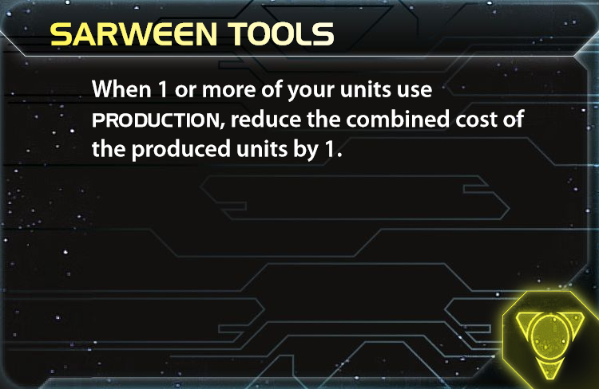 | 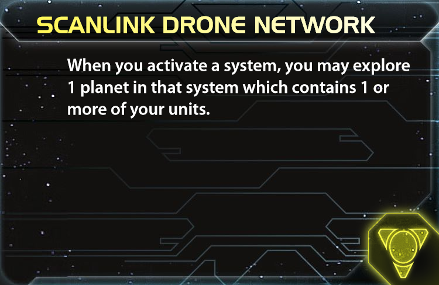 |

| Dark Energy Tap | Отражатели массы |
|---|---|
|  | 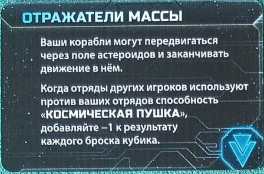 |

### Рекомендуемый экономический старт: Sarween Tools

Sarween уменьшает суммарную стоимость каждого вашего Production на 1.

Это особенно важно для Last Bastion, потому что фракция хочет производить:

- через домашний Helios;
- через передовые Helios;
- через Construction primary;
- через Warfare secondary;
- позднее через Integrated Economy.

Даже четыре применения за партию означают четыре ресурса, а активная сеть доков часто применяет Sarween чаще.

Дополнительные преимущества:

- жёлтый источник для Helios II;
- после The Icon может считаться красным требованием для Proxima Targeting VI;
- помогает оплатить второй Carrier в бедном первом раунде;
- приближает Transit Diodes и Integrated Economy.

Sarween — выбор по умолчанию, если:

- вы рассчитываете на Construction или Warfare;
- рядом нет обязательных астероидов;
- мобильность можно получить через blue skip;
- вы хотите ранний Helios II или Integrated Economy.

### Альтернатива: Scanlink Drone Network

После активации системы Scanlink позволяет исследовать контролируемую планету в ней, если на ней есть ваш unit с Production.

Каждый Helios становится повторяемым источником exploration. Это может дать:

- commodities и trade goods;
- Infantry;
- attachments;
- action cards;
- подготовку планет;
- relic fragments.

Scanlink особенно хорош, если:

- Warfare позволяет повторно активировать систему с доком;
- в слайсе много hazardous или cultural планет с полезными колодами;
- первый раунд гарантирует второй Helios;
- стол играет длинную экономическую партию;
- Sarween не нужен для критической постройки.

Недостаток — случайность. Одна неудачная DMZ может уничтожить план передового производства, а постоянная реактивация своих доков требует command tokens.

### Мобильный старт: Dark Energy Tap

DET позволяет исследовать frontier tokens и улучшает отступление.

Стартовый Cruiser имеет Move 2 и может исследовать близкую пустую систему. Кроме того, одна синяя технология сразу открывает Gravity Drive через обычное исследование.

Выбирайте DET, если:

- в слайсе есть полезные frontier tokens;
- пустые системы лежат на реальном маршруте экспансии;
- Gravity Drive нужен уже в первом раунде;
- экономический жёлтый путь можно получить через skips или Entropic Scar.

Не тратьте тактический жетон на случайный frontier token вместо публичной цели. У фракции и без того напряжённый первый раунд.

### Antimass Deflectors

Antimass нужен, если:

- астероидное поле блокирует единственный маршрут;
- рядом сильная PDS-сеть;
- Gravity Drive нужен следующим исследованием, а DET почти не имеет целей;
- survival важнее случайных frontier-наград.

В нейтральном слайсе Antimass слабее Sarween, Scanlink и DET. Он решает конкретную географическую проблему, а не общий недостаток фракции.

### Быстрый выбор

| Условие | Старт |
|---|---|
| Нет особой географии, нужен надёжный разгон | Sarween Tools |
| Ранние доки и частые повторные активации | Scanlink Drone Network |
| Нужна Gravity Drive и есть frontier tokens | Dark Energy Tap |
| Обязательные астероиды или опасный Space Cannon | Antimass Deflectors |

## Стратегические карты первого раунда

### 1. Construction

Construction — наиболее фракционная карта.

Обновлённая primary позволяет:

- либо поставить структуру, либо применить Production одного дока;
- затем поставить ещё одну структуру.

Лучший сценарий после первой экспансии:

1. Применить Production домашнего Helios и построить Carrier с Infantry.
2. Поставить новый Helios на захваченной ресурсной планете.

Так вы одновременно решаете стартовую нехватку Capacity и начинаете постоянный экономический рост.

Альтернатива — поставить два Helios в разных системах, если второй Carrier уже профинансирован через Warfare secondary или другой эффект.

Не ставьте док только ради +1 ресурса на планете, которую сосед заберёт следующим ходом. Helios — и экономический актив, и уязвимая структура.

### 2. Warfare

Warfare даёт тактическую операцию без размещения command token, даже в уже активированной системе.

Сильные применения:

- повторно активировать дом и произвести второй Carrier;
- сделать третью экспансию;
- активировать передовой док после Construction;
- исследовать планету ещё раз через Scanlink;
- перераспределить fleet pool перед и после операции.

Primary особенно хороша с Sarween и подготовленными через Liberate планетами: новые ресурсы немедленно оплачивают домашнюю постройку.

### 3. Trade

Trade решает бедность старта и гарантирует часть экспедиции за 3 trade goods.

План:

1. Получить 3 TG.
2. При необходимости пополнить commodities торговым партнёрам.
3. В конце хода потратить 3 TG на expedition slice.
4. Открыть The Icon и красно-жёлтую synergy.

Минус: после экспедиции сами 3 TG исчезают. Нужна отдельная экономика для Technology и Warfare secondary.

Revelation повышает фактическое commodity value до 2 и позволяет торговать с другими владельцами станций. Это делает Trade лучше, чем напечатанное «1 commodity» на faction sheet.

### 4. Leadership

Leadership хороша, если публичная цель требует жетонов или план содержит много secondary.

Она также может рано открыть Breakthrough:

- получить ненужную secret objective через обычную подготовку партии и сбросить её на expedition slice;
- либо накопить достаточно влияния для части за 5 influence после Liberate.

Не покупайте слишком много жетонов ценой Carrier и Technology. Первый раунд Last Bastion ограничен одновременно ресурсами, Capacity и пластиком.

### 5. Politics

Politics даёт две action cards и speaker token на следующий раунд.

Карты можно:

- сохранить для будущего неотменяемого розыгрыша под Nip and Tuck;
- сбросить две худшие на expedition slice;
- использовать для темпа и защиты.

Speaker особенно ценен для раунда 2: можно взять Leadership для раннего Mecatol, Imperial после захвата центра или Construction для продолжения доковой сети.

### Technology

Technology полезна, когда вы гарантированно оплачиваете хотя бы одно исследование после экспансии.

Приоритеты:

- Gravity Drive после синего старта;
- Proxima Targeting VI после открытия The Icon и жёлтого старта;
- технология, дающая второй красно-жёлтый источник для Helios II;
- Carrier II при двух синих источниках.

Не берите Technology только ради двойного исследования за 6 ресурсов: бедный дом часто превращает эту амбицию в потерянный публичный балл.

### Diplomacy и остальные

Diplomacy сильна, если:

- первые захваченные планеты уже подготовились через Liberate и могут быть потрачены до карты;
- затем вы снова готовите их для Technology или Production;
- в слайсе есть tech specialty для экспедиции;
- нужно защитить передовой Helios.

Imperial в первом раунде обычно слаб, если нет реалистичного Custodians. Остальные карты выбираются прежде всего под открытый публичный объект.

## Практически идеальный первый раунд

Универсального сценария нет: ресурсные значения соседних планет меняют число готовых карт и бесплатной Infantry. Ниже — надёжный шаблон с Sarween и Construction либо доступной Warfare secondary.

### Подготовка

- Найдите первую систему с двумя-тремя планетами.
- Для каждой планеты запишите ресурсный порог Liberate.
- Оставьте минимум одну Infantry для второго транспортного корабля.
- Договоритесь о времени Warfare, Technology и Trade.
- Выберите безопасную планету для второго Helios.
- Решите заранее, какой expedition slice реально оплатить.

### Последовательность

1. **Первая экспансия.** Carrier перевозит две Infantry и один-два Fighters. По возможности занимает двухпланетную систему.
2. **Liberate.** На мирах 0/X и 1/X добивайтесь подготовки. На дорогих ресурсных мирах сознательно получайте бесплатную Infantry, если немедленная экономика не нужна.
3. **Финансирование.** Используйте подготовленные планеты для второго Carrier, Technology или Construction production.
4. **Производство.** Постройте Carrier и 1–2 Infantry. С Sarween стоимость пакета Carrier + 2 Infantry равна 3 после скидки, но Production 3 домашнего Helios полностью заполнен.
5. **Второй Helios.** Поставьте док на защищённой планете с хорошими ресурсами или центральной геометрией.
6. **Вторая экспансия.** Новый Carrier либо Dreadnought с Infantry занимает следующую систему.
7. **Breakthrough.** Откройте The Icon через 3 TG, две action cards, secret objective, tech specialty или другой доступный slice.
8. **Technology.** Получите мобильность или второй красно-жёлтый источник. Не пропускайте обязательную постройку ради жадного tech.
9. **Status Phase.** Наберите публичное очко.
10. **Пас.** Истощите Hyperion, возьмите action card и command token.

### Транспортный расчёт

Стартовый Carrier может взять:

- 2 Infantry + 2 Fighters — безопасная обычная экспансия;
- 3 Infantry + 1 Fighter — захват трёх малых планет;
- 2 Infantry + 1 Fighter — если второй Fighter остаётся на Capacity Dreadnought и важна гибкость.

Нельзя оставить Fighter без Capacity. До движения посчитайте весь домашний fleet и загрузку после ухода Carrier.

### Приоритет целей первого раунда

1. Набрать публичное очко.
2. Получить второй источник Capacity.
3. Занять несколько планет и использовать Liberate.
4. Поставить второй Helios.
5. Открыть The Icon по приемлемой цене.
6. Исследовать одну действительно нужную технологию.
7. Получить Galvanize только при естественном combat.

Командир и три оцинкованных юнита почти никогда не важнее первого очка.

## The Icon

  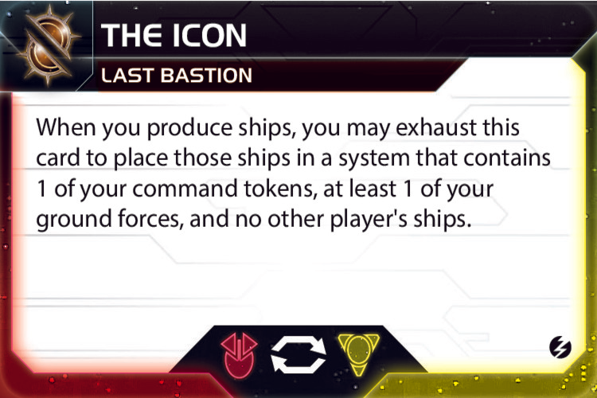

Breakthrough имеет красно-жёлтую synergy и следующий эффект:

> Когда вы производите корабли, карту можно истощить, чтобы поместить эти корабли в систему с вашим command token, хотя бы одной вашей ground force и без чужих кораблей.

### Что делает размещение

- Это placement, а не movement.
- Расстояние, nebula, астероиды и блокирующие корабли между системами не важны.
- Корабли появляются в одной подходящей системе.
- Произведённые ground forces остаются в обычном месте производства.
- Уже находившиеся у дока корабли не перемещаются.
- После размещения нужно соблюдать fleet pool и Capacity.

Фраза «those ships» означает корабли, произведённые в этом производстве. Нельзя выбрать половину для дальнего размещения, а половину оставить у дока, если эффект применяется ко всей созданной группе кораблей.

### Лучшие применения

- После захвата планеты произвести дома Fighters и Dreadnought, затем поставить их в активированную систему с выжившей Infantry.
- Восстановить экран у флота, который только что выиграл бой.
- Собрать флот около Mecatol, не проводя его через домашнюю nebula.
- Усилить систему, которую противник уже не может атаковать без новой активации.
- Разместить Carrier рядом с пехотой, которую нужно забрать в следующем раунде.
- С помощью Integrated Economy построить корабли на новой планете и направить их на другой участок фронта.

### Ограничения

Целевая система должна одновременно содержать:

- ваш command token;
- хотя бы одну вашу ground force;
- ноль кораблей других игроков.

Чужая Infantry на другой планете системы не запрещает размещение, если чужих **ships** нет. Однако coexistence и иные необычные состояния могут изменить безопасность такого узла.

Не оставляйте активированные системы без Infantry. Один дешёвый наземный юнит часто является «маяком» для целого произведённого флота.

### Красно-жёлтая synergy

После открытия The Icon каждая ваша красная или жёлтая технология и соответствующий tech skip может считаться одним из этих цветов:

- при выполнении технологических требований;
- при проверке технологических целей.

Один источник нельзя считать одновременно красным и жёлтым для одного требования.

Примеры:

- Sarween Tools может выполнить красное требование Proxima Targeting VI;
- Sarween + Proxima дают два источника для Helios II;
- красный tech skip может заменить жёлтый на пути к Transit Diodes;
- три смешанных красно-жёлтых источника открывают Integrated Economy или War Sun.

Сама карта The Icon технологией не считается. Unit upgrades также не становятся цветными технологиями.

## Helios I и Helios II

| Helios I | Helios II |
|---|---|
| 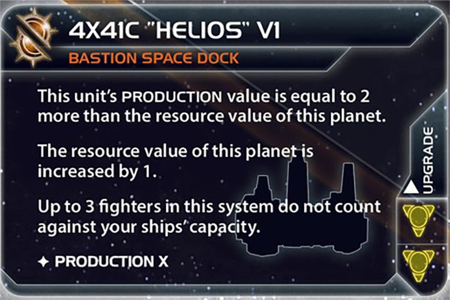 | 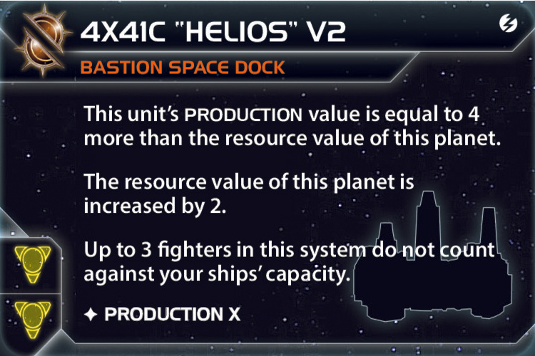 |

### Helios I

Базовый док:

- увеличивает ресурсы планеты на 1;
- имеет Production, равный увеличенным ресурсам планеты +2;
- до трёх Fighters в системе не считаются против Capacity кораблей.

Если напечатанная ресурсная ценность планеты равна R:

- новая ценность равна R+1;
- Production равен R+3.

Примеры:

| Планета | После Helios I | Production |
|---:|---:|---:|
| 0/X | 1/X | 3 |
| 1/X | 2/X | 4 |
| 2/X | 3/X | 5 |
| 3/X | 4/X | 6 |

### Helios II

Улучшенный док:

- увеличивает ресурсы планеты на 2;
- имеет Production, равный увеличенным ресурсам +4;
- до трёх Fighters не считаются против Capacity.

Для напечатанного значения R:

- новая ценность равна R+2;
- Production равен R+6.

| Планета | После Helios II | Production |
|---:|---:|---:|
| 0/X | 2/X | 6 |
| 1/X | 3/X | 7 |
| 2/X | 4/X | 8 |
| 3/X | 5/X | 9 |

Это не просто улучшение производства. Каждый док даёт постоянные ресурсы для Technology, objectives и Integrated Economy.

### Где ставить доки

Хороший Helios:

- стоит на планете 2/X или 3/X;
- защищён Infantry и Mech;
- имеет удобный путь к Mecatol или краю карты;
- находится в системе, которую выгодно повторно активировать Scanlink;
- не блокирует выполнение цели на структуры;
- создаёт подходящую точку производства даже без The Icon.

Домашний Helios II превращает Ordinian из 0/0 в 2/0 и получает Production 6. Это хорошая защищённая фабрика, но передовой док часто важнее из-за геометрии.

### Истребители без Capacity

До трёх Fighters в системе с Helios не занимают Capacity кораблей. Это позволяет:

- держать дешёвый оборонный экран даже без Carrier;
- не терять Fighters после ухода транспортов;
- защищать производственную систему от одиночных рейдеров.

Льгота действует только пока Helios существует. После уничтожения дока немедленно проверьте Capacity и удалите лишние Fighters по обычным правилам.

## Агент Dame Briar

  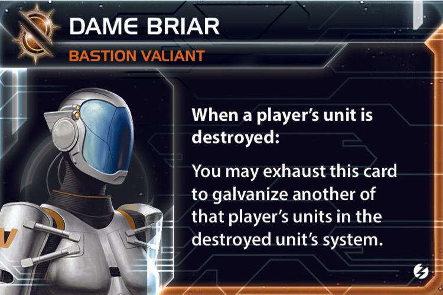

Когда юнит любого игрока уничтожен, Dame Briar можно истощить, чтобы galvanize другой юнит этого же игрока в системе уничтоженного.

### Важные правила

- Получателем может быть Last Bastion или другой игрок.
- Типы уничтоженного и усиленного юнита могут различаться.
- Можно galvanize структуру.
- Усиливаемый юнит должен принадлежать владельцу уничтоженного юнита.
- Оба юнита должны находиться в одной системе.
- Агент не требует соседства и не ограничен вашим боем.

### Лучшие применения для себя

- После потери Fighter усилить Dreadnought или флагман.
- После уничтожения Infantry усилить Mech перед следующими раундами ground combat.
- После потери корабля усилить PDS в той же системе.
- Создать Galvanize перед ожидаемым уничтожением юнита и применением героя.
- Получить третий жетон для открытия командира.

### Продажа агента

Базовое предложение:

> Когда ты потеряешь дешёвый юнит, я усилю твой лучший выживший корабль. Ты платишь 1–2 TG или возвращаешь услугу; жетон остаётся на юните до его уничтожения.

Цена выше, если усиливается:

- War Sun;
- флагман с несколькими combat dice или сильной unit ability;
- PDS II в центральной сети;
- юнит, необходимый для победного боя.

Учитывайте дефицит жетонов. Продажа за 1 TG невыгодна, если чужой безопасный Dreadnought удержит компонент до конца партии.

## Командир Nip and Tuck и Alliance

  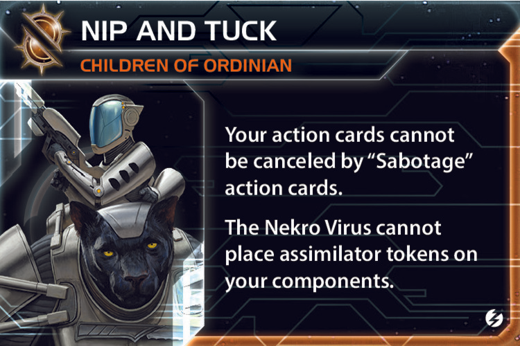

Командир открывается, когда на поле есть три galvanized units. Они не обязаны принадлежать Last Bastion.

После открытия:

- ваши action cards нельзя отменять картами **Sabotage**;
- Nekro Virus не может размещать Valefar Assimilator tokens на ваших компонентах.

Уже размещённые Nekro tokens не удаляются при открытии командира.

### Сильные action cards

Особенно опасны под командиром:

- Direct Hit;
- Skilled Retreat;
- Flank Speed;
- Morale Boost;
- Shields Holding;
- Parley;
- Reactor Meltdown;
- любые редкие карты, на которых строится победный ход.

Командир защищает только от action card **Sabotage**. Другие игровые эффекты отмены карт продолжают работать.

### Как открыть без плохой войны

- Первый жетон получить через естественный space combat.
- Второй — через естественный ground combat или Dame Briar.
- Третий — через продажу Raise the Standard после чужого боя.

Не атакуйте соседа без цели только ради unlock. Стоимость жетона, потерянного пластика и испорченной границы обычно выше ранней защиты action cards.

### Alliance

Alliance особенно ценна игрокам с сильными action cards:

- Yssaril;
- Mentak;
- Mahact;
- Ral Nel;
- любому претенденту на сложный боевой или победный ход.

Не отдавайте её лидеру только за разовый 1 TG. Надёжный формат:

- 2–4 TG за раунд высокой ценности;
- обмен Alliance;
- безопасная граница и регулярная торговля;
- конкретная помощь в открытии командира.

Nekro-защита является прежде всего вашей фракционной страховкой. Для большинства покупателей главная ценность — неотменяемые action cards.

## Технологический путь

### Надёжный красно-жёлтый путь

1. Sarween Tools или Scanlink Drone Network.
2. Открыть The Icon.
3. Proxima Targeting VI либо другой второй красно-жёлтый источник.
4. Helios II.
5. Transit Diodes.
6. Integrated Economy.

Порядок Helios II и Transit Diodes зависит от стола. Helios II даёт немедленную экономику; Transit Diodes приближает Integrated Economy и перемещает Infantry между уже контролируемыми планетами.

### Мобильный синий путь

1. Dark Energy Tap или Antimass Deflectors.
2. Gravity Drive.
3. Carrier II.
4. Fleet Logistics.
5. Light/Wave Deflector.

Этот путь надёжнее на широкой карте и в короткой партии. Он слабее развивает уникальные доки, зато позволяет набирать обычные пространственные цели и не зависеть от The Icon.

### Лучший гибрид с blue skip

1. Sarween Tools.
2. Открыть The Icon.
3. Использовать blue skip для Gravity Drive.
4. Gravity Drive + blue skip дают Carrier II.
5. Sarween + Proxima или другой красно-жёлтый источник дают Helios II.
6. Далее выбрать Fleet Logistics либо Integrated Economy.

Именно blue skip позволяет не выбирать между фракционной экономикой и базовой мобильностью.

### Self-Assembly Routines

Self-Assembly полезна, если вы строите и жертвуете A3 Valiance.

Она:

- увеличивает число мехов без затрат Production;
- возвращает trade good после уничтожения Mech;
- становится красно-жёлтым источником под The Icon;
- помогает открывать Helios II и Integrated Economy.

Это хорошая замена ранней Proxima, если наземные бои маловероятны.

### Transit Diodes

Transit Diodes перемещает до четырёх Infantry между уже контролируемыми планетами.

Применения:

- усилить свежую границу после захвата;
- собрать гарнизон Ordinian перед победным раундом;
- освободить Capacity Carrier;
- подготовить ground force в системе-маяке для The Icon;
- распределить Infantry по докам.

Она не помогает захватить неконтролируемую планету напрямую, поэтому не заменяет Carrier II.

### Integrated Economy

Это самая сильная поздняя технология фракции при агрессивном контроле планет.

После получения контроля можно произвести на планете юниты общей стоимостью не больше её ресурсов. Last Bastion способен подготовить эту же планету Liberate и сразу оплатить производство.

Лучшие покупки:

- Infantry для удержания мира;
- Fighters для восстановления экрана;
- Carrier на планете 3+ ресурсов;
- Destroyer или Cruiser для fleet composition;
- Mech вместе с дешёвыми юнитами, если хватает лимита стоимости.

Integrated Economy не бесплатна. Сначала проверьте лимит стоимости, затем оплатите производство обычными ресурсами и TG.

### War Sun

The Icon позволяет смешанным красно-жёлтым источникам выполнить три красных требования War Sun. Helios II создаёт Production и ресурсы для её постройки, а Galvanize даёт четвёртый combat и Bombardment die.

Но War Sun остаётся стоимостью 12. Она оправдана, если:

- публичная цель требует War Sun или flagship;
- экономика уже построена;
- нужен Planetary Shield bypass;
- герой сможет превратить её возможную гибель в решающий взрыв;
- мобильность и command tokens уже решены.

Не исследуйте War Sun вместо первого очка, Carrier II и защиты доков.

### Рекомендуемый набор к концу игры

Универсальный вариант:

- Sarween Tools;
- Gravity Drive;
- Proxima Targeting VI или Self-Assembly Routines;
- Helios II;
- Carrier II;
- Transit Diodes;
- Integrated Economy либо Fleet Logistics.

В короткой партии остановитесь раньше. Шесть технологий, которые реально помогают набирать очки, лучше восьми красивых технологий без флота.

## Proxima Targeting VI

  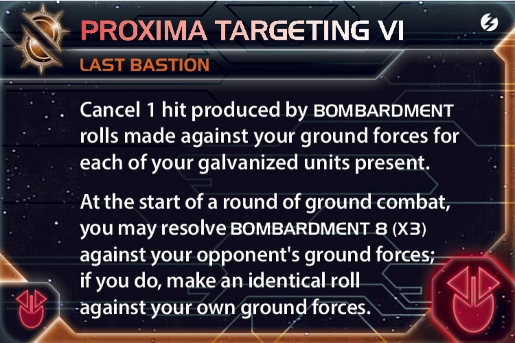

Фракционная красная технология имеет две части.

### Защита от Bombardment

Отмените один hit от Bombardment против ваших ground forces за каждый ваш galvanized unit на планете.

Один оцинкованный Mech отменяет один hit; три оцинкованные Infantry отменяют до трёх. Неоцинкованные юниты не помогают.

При собственном броске Proxima против себя эта защита тоже применяется.

### Взаимный обстрел

В начале каждого раунда ground combat можно:

1. Сделать Bombardment 8 (x3) против ground forces соперника.
2. Сделать идентичный бросок против своих ground forces.

Эффект опционален каждый раунд. Если собственная армия слишком уязвима, просто не применяйте его.

### Когда применять

Хорошие условия:

- у вас 2–3 galvanized ground forces и большинство собственных hits отменится;
- противник привёл много Infantry;
- A3 Valiance может Sustain Damage и после уничтожения усилить Infantry;
- нужно ускорить бой до подхода чужих подкреплений;
- собственная потеря активирует героя.

Плохие условия:

- единственная ваша Infantry не оцинкована;
- соперник имеет Planetary Shield, блокирующий Bombardment;
- вы защищаете важную планету и выигрываете обычный бой;
- случайная потеря уничтожит Capacity или победный гарнизон.

Proxima не требует присутствия корабля с Bombardment и может работать в оборонительном ground combat. По опубликованному разъяснению Planetary Shield блокирует Proxima Targeting VI; Plasma Scoring, наоборот, добавляет к её броску один кубик.

## Мех A3 Valiance

  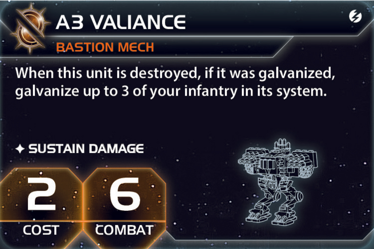

A3 Valiance стоит 2, попадает на 6 и имеет Sustain Damage.

Когда оцинкованный Mech уничтожен, можно galvanize до трёх ваших Infantry в его системе.

### Подготовка

Сам мех сначала должен получить жетон:

- выжить в ground combat и получить Phoenix Standard;
- быть усиленным Dame Briar после уничтожения другого вашего юнита;
- получить Raise the Standard, если записка временно оказалась у вас через чужой эффект.

После этого противник оказывается перед неприятным выбором:

- не добивать повреждённый Mech;
- либо уничтожить его и создать до трёх усиленных Infantry.

### Лучший боевой пакет

- 1 оцинкованный A3 Valiance;
- 3 обычные Infantry;
- Proxima Targeting VI;
- Self-Assembly Routines при наличии;
- герой в готовности.

Mech бросает два кубика на 6. После гибели он усиливает пехоту, возвращает TG от Self-Assembly и может стать триггером героя.

Способность говорит «в системе», а не «на этой планете». Можно galvanize Infantry на других планетах той же системы, если это стратегически полезнее.

Не уничтожайте мех добровольно без эффекта, который действительно его уничтожает. Sustain Damage повреждает, но сам по себе не уничтожает юнит.

## Флагман The Egeiro

  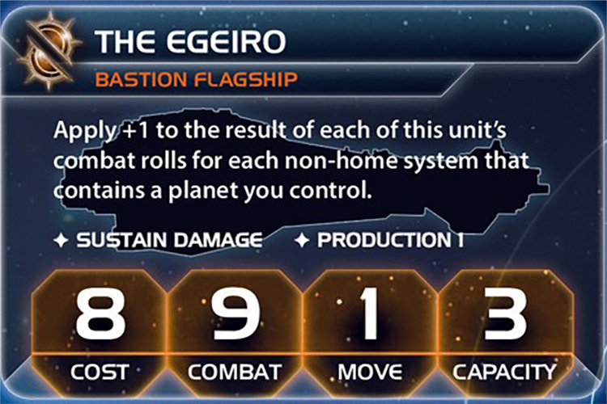

The Egeiro стоит 8, попадает на 9, имеет Move 1, Capacity 3, Sustain Damage и Production 1.

К результату каждого его combat roll добавляется +1 за каждую **не домашнюю систему**, содержащую контролируемую вами планету.

### Расчёт

Считаются системы, а не планеты:

- две ваши планеты в одной системе дают только +1;
- система с вашей и чужой планетой всё равно даёт +1;
- Ordinian не считается, поскольку находится в home system;
- космические станции не являются планетами.

Если вы контролируете планеты в пяти не домашних системах, флагман попадает на 4. При восьми системах результат 9 становится 1, но единица всё равно считается успехом по обычной логике модифицированного результата.

### Galvanized Egeiro

Galvanize даёт второй combat die. Это один из лучших жетонов фракции: бонус территориального контроля применяется к обоим броскам.

Флагман особенно хорош в середине и конце игры, когда Last Bastion уже расширился. Ранняя покупка при контроле двух систем оставляет дорогой корабль, попадающий лишь на 7.

### Production 1

Production позволяет:

- построить один Fighter или пару Infantry по лимиту количества 1 — Production считает фигурки, поэтому пара Infantry всё равно превышает Production 1 и невозможна;
- применять Sarween Tools;
- запускать The Icon при производстве корабля;
- строить вдали от доков.

Production 1 — полезная опция, но не причина посылать флагман без экрана в передовую систему.

## Герой Lyra Keen

  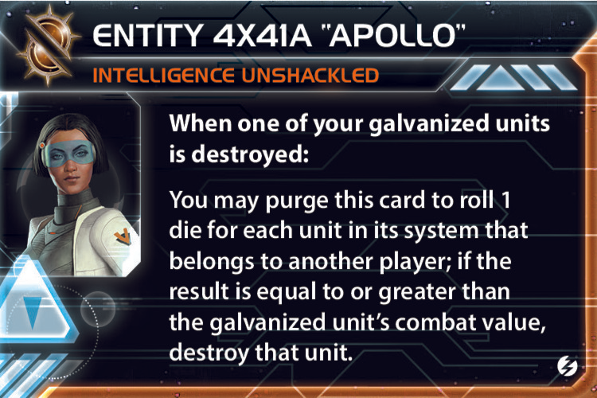

Герой открывается после трёх набранных целей.

**Entity 4X41A “Apollo”** срабатывает, когда один ваш galvanized unit уничтожен. Карту можно удалить из игры и бросить по одному кубику за каждый юнит других игроков в его системе. Если выделенный юниту результат не меньше combat value уничтоженного оцинкованного юнита, тот юнит уничтожается.

### Как выбрать жертву

Чем ниже число combat value, тем выше шанс уничтожения каждой цели:

| Уничтоженный юнит | Порог | Шанс на каждую цель |
|---|---:|---:|
| War Sun | 3+ | 80% |
| Dreadnought | 5+ | 60% |
| A3 Valiance | 6+ | 50% |
| Cruiser | 7+ | 40% |
| Infantry | 8+ | 30% |
| Fighter | 9+ | 20% |

Модификаторы combat roll уничтоженного юнита не применяются. Усиленный The Egeiro не получает лучший порог от территориального бонуса.

### Что может уничтожить Apollo

- корабли;
- Fighters;
- транспортируемые ground forces;
- ground forces на любой планете системы;
- структуры;
- юниты третьих игроков, не участвующих в текущем combat.

Каждый кубик заранее относится к конкретному юниту. Нельзя успешный результат переназначить более ценной цели.

Sustain Damage и отмена hits не спасают: герой непосредственно уничтожает юнит, а не производит hit.

### Лучшие моменты

- Оцинкованный Dreadnought погибает среди огромного вражеского флота.
- Оцинкованный Mech погибает на Mecatol и может очистить всю систему, включая корабли и структуры.
- Противник применяет Direct Hit к вашему повреждённому оцинкованному кораблю.
- Собственный Proxima уничтожает оцинкованный ground force в системе с множеством целей.
- Идёт последняя попытка соперника выбить вас с победной планеты.

### Порядок при Direct Hit

Если оцинкованный юнит уничтожен Direct Hit во время окна Sustain Damage, герой может сработать немедленно. Он способен уничтожить чужие юниты, которые соперник ещё планировал использовать для отмены оставшихся hits.

Командир Nip and Tuck делает ваш собственный Direct Hit неуязвимым для Sabotage, но герой обычно реагирует на уничтожение именно вашего юнита.

Не тратьте Apollo на два дешёвых Fighters, если его наличие само по себе защищает Mecatol, Styx или Ordinian от большого флота.

## Записка Raise the Standard

Держатель записки в конце combat:

1. Galvanize один свой участвовавший юнит.
2. Возвращает карту Last Bastion.

### Что продавать

- усиление Dreadnought или War Sun после гарантированного боя;
- усиление PDS не получится через записку, если структура не участвовала в combat;
- помощь в открытии Nip and Tuck;
- усиление флагмана союзника для совместного winslay;
- небольшой боевой контракт с соседом.

Ориентировочная цена:

- 1 TG за обычный корабль и ранний unlock;
- 2 TG за Dreadnought, флагман или важный Mech;
- 3+ TG за War Sun или решающий победный бой.

### Риски

- жетон остаётся на чужом юните;
- чужой усиленный корабль может позже атаковать вас;
- при исчерпании семи жетонов ваши эффекты перестают работать;
- передача записки не гарантирует, что игрок вообще вступит в подходящий combat.

Лучше продавать note в момент, когда бой уже неизбежен, а не за раунд до него.

## Дипломатия

### Образ фракции

Last Bastion выгодно выглядеть оборонительной державой, даже когда она постепенно расширяется.

Рабочая формулировка:

> Мне нужны планеты и доки для экономики, но война ради войны невыгодна. Я укрепляю эту систему; дальше не иду, если граница и торговля остаются безопасными.

Galvanize, мех и герой делают нападение на вас всё менее привлекательным. Используйте это как сдерживание, а не приглашение к ранней коалиции.

### Сделки через Revelation

Ищите владельцев других space stations. С ними можно торговать без обычного соседства.

Продавайте:

- Dame Briar;
- Raise the Standard;
- Alliance Nip and Tuck;
- временный отказ от центральной планеты;
- защиту границы оцинкованным флотом.

Не называйте дальнюю торговлю соседством и заранее уточняйте, какие компоненты разрешает обменивать конкретная транзакция.

### Мирная гальванизация

Командир требует три жетона, но вам не обязательно организовывать все бои самостоятельно.

Можно:

- наблюдать чужой бой и продать агента;
- заранее передать Raise the Standard участнику неизбежной стычки;
- договориться о дешёвом пограничном бою только если обе стороны получают реальную выгоду;
- дождаться нейтральных юнитов во Fracture.

Чужой жетон должен быть оправдан ценой и сроком жизни юнита.

### Управление угрозой

До Helios II фракция выглядит бедной. После двух-трёх доков её экономика может резко вырасти на 4–6 ресурсов, а The Icon скрывает реальную дальность подкреплений.

Чтобы не объединить стол:

- не стройте War Sun без цели;
- объясняйте, что передовые доки нужны для экономики;
- держите часть флота дома, пока не наступил победный раунд;
- продавайте боевые усиления обеим сторонам стола, но не лидеру;
- не показывайте героя на мелком бою;
- превращайте ресурсы в очки и защиту, а не в бессмысленное уничтожение соседей.

## Главные ошибки

- Считать Ordinian постоянной планетой 0/0 после установки Helios.
- Считать Revelation планетой.
- Думать, что для контроля home system нужно контролировать Revelation вместо Ordinian.
- Забывать, что Revelation повышает commodity value и позволяет дальние сделки со station owners.
- Называть владельцев двух stations соседями.
- Истощить Revelation для конвертации товаров и затем снова потратить её 1/2.
- Забыть применить Hyperion при пасе.
- Считать Mech при проверке Liberate.
- Не учитывать attachments и Helios при определении текущей ресурсной ценности.
- Всегда применять Liberate до exploration, не проверяя возможную выгоду другого порядка.
- Пытаться произвести Infantry через Integrated Economy до разрешения Liberate.
- Загружать все три стартовые Infantry в первый Carrier и оставлять второй флот без десанта.
- Оставить Fighter без Capacity после ухода Carrier.
- Брать Warfare, но не накопить ресурсов на Production.
- Ставить Helios на незащищённую пограничную планету.
- Забывать снять прирост ресурсов после уничтожения дока.
- Считать Production Helios от напечатанной, а не модифицированной ресурсной ценности.
- Думать, что Galvanize добавляет кубик к эффекту без roll.
- Давать одному юниту несколько жетонов Galvanize.
- Перемещать жетоны между живыми юнитами после исчерпания запаса.
- Бесплатно раздать семь жетонов чужим юнитам.
- Начинать ненужные войны только ради Nip and Tuck.
- Считать, что командир защищает action cards от всех способов отмены, а не только от Sabotage.
- Думать, что открытие командира снимает уже установленный Valefar token Nekro.
- Применять The Icon как movement.
- Переносить через The Icon ground forces или ранее построенные корабли.
- Размещать корабли в системе без своего command token или ground force.
- Нарушать fleet pool и Capacity после дальнего размещения.
- Считать Helios II цветной жёлтой технологией для требований.
- Считать The Icon дополнительной технологией.
- Исследовать Integrated Economy без экономики для оплаты её Production.
- Считать Proxima безопасной при одном galvanized unit и большом собственном гарнизоне.
- Игнорировать Planetary Shield при Proxima.
- Пытаться активировать способность A3 Valiance после одного Sustain Damage без уничтожения меха.
- Оценивать героя по модифицированному боевому значению Egeiro.
- Считать результаты Apollo hits и разрешать Sustain Damage.
- Забывать, что Apollo может уничтожить ground forces, структуры и юниты третьих игроков во всей системе.
- Строить The Egeiro слишком рано, когда контролируется мало систем.
- Путать число контролируемых планет с числом систем для бонуса Egeiro.
- Гнаться за War Sun раньше Carrier II, очков и command tokens.
- Играть в космический Risk вместо набора публичного очка каждый раунд.

## Итоговая памятка

### До начала партии

- По умолчанию выбрать Sarween Tools.
- Scanlink брать под ранние доки и повторные активации.
- DET брать под frontier tokens и быстрый Gravity Drive.
- Antimass брать под обязательные астероиды или PDS.
- При драфте искать blue skip, влияние, многопланетные системы и место для передового Helios.
- Для каждой соседней планеты посчитать порог Liberate.
- Учесть, что Revelation делает фактическое commodity value равным 2.

### Первый раунд

- Не отправлять все три Infantry одной группой без причины.
- Подготавливать миры 0/X и 1/X через Liberate.
- Получить второй Carrier или иной источник Capacity.
- Construction и Warfare — лучшие карты для пластикового разгона.
- Поставить второй Helios на защищённой полезной планете.
- Открыть The Icon, если цена не мешает первому очку.
- Набрать публичный балл.
- При пасе обязательно использовать Hyperion.

### Середина игры

- Исследовать Helios II.
- Получить Gravity Drive и Carrier II либо построить устойчивую передовую сеть.
- Открыть Nip and Tuck естественными боями и сделками.
- Копить сильные action cards.
- Держать Infantry в активированных системах как маяки The Icon.
- При доступных skips идти в Transit Diodes и Integrated Economy.
- Оцинковывать долговечные и ценные юниты.

### Конец игры

- Подготовить Ordinian, Mecatol, Styx или другие победные точки.
- Проверить семь жетонов Galvanize и освободить их только через реальные потери.
- Сохранить Apollo для системы с большим числом целей.
- Galvanized Dreadnought или Mech — обычно лучшая практическая жертва героя.
- Использовать неотменяемые action cards для победного окна.
- Производить подкрепления в тылу и переносить их The Icon.
- Не позволить одному рейдеру уничтожить Helios и обнулить экономический план.

## Источники

- [Last Bastion — Twilight Imperium Wiki](https://twilight-imperium.fandom.com/wiki/Last_Bastion)
- [Last Bastion — TI4 Lookup](https://ti4lookup.com/factions/bastion)
- [Официальные правила Thunder’s Edge, PDF](https://images-cdn.fantasyflightgames.com/filer_public/ca/e7/cae7706f-cdb5-4ee1-a20c-7f76a13d135c/te_rulebook_web.pdf)
- [Официальный обзор Last Bastion от Fantasy Flight Games](https://drafts.fantasyflightgames.com/en/news/2025/9/25/newcomers-to-the-galactic-stage/)
- [Правила и официальные разъяснения Last Bastion](https://tirules2.com/F_bastion)
- [Справочник Thunder’s Edge: expedition, space stations и Entropic Scar](https://twilight-imperium.fandom.com/wiki/Thunder%27s_Edge)
- [Справочник Breakthrough и Synergy](https://twilight-imperium.fandom.com/wiki/Breakthroughs)
- [Space Cats Peace Turtles, эпизод 441: Last Bastion Beginner’s Guide](https://podscan.fm/podcasts/space-cats-peace-turtles/episodes/441-last-bastion-beginners-guide)
- [Обсуждение технологического пути Last Bastion](https://www.reddit.com/r/twilightimperium/comments/1obmo1p/last_bastion_tech_path/)
- [Практические советы по Last Bastion](https://www.reddit.com/r/twilightimperium/comments/1t4djbi/last_bastion_gameplay_tips/)
