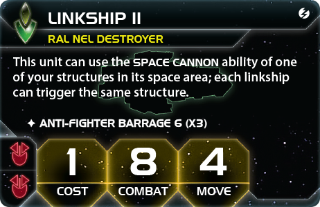
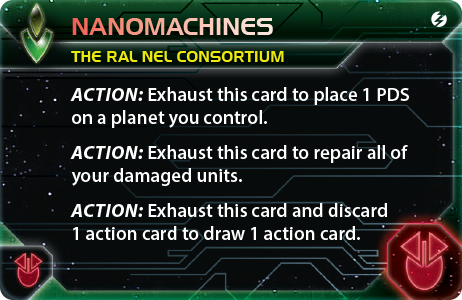
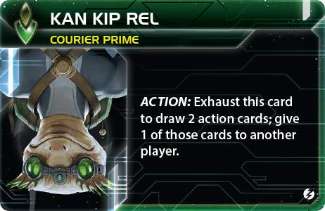
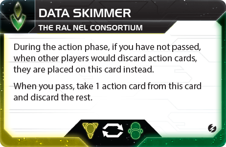
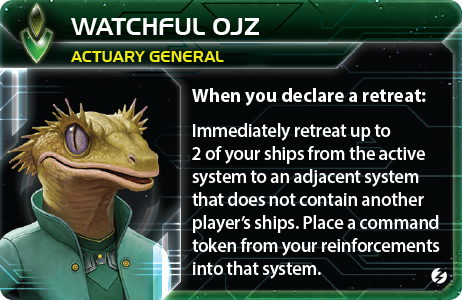
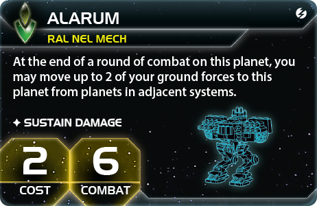
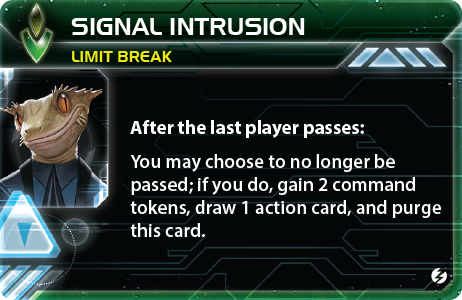
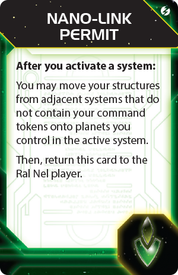

# The Ral Nel Consortium — полный гайд по фракции

Актуальность: 17 августа 2026 года.

Гайд предполагает стандартную партию **Twilight Imperium IV + Prophecy of Kings + Thunder’s Edge** на 6 игроков и 10 победных очков. Английские названия новых компонентов сохранены, поскольку устоявшейся русской локализации дополнения пока нет.

> В опубликованных материалах встречаются две редакции последней фразы Miniaturization: финальные базы компонентов указывают размещение структур в конце тактических действий, а иллюстрация листа фракции в официальном PDF Thunder’s Edge — в конце хода и только в активной системе. Перед партией проверьте текст на своём листе. Все стратегические выводы гайда опираются на общее для обеих редакций правило: перевезённый космодок размещается **после** шага Production и не может производить в том же действии.

## Содержание

- [Краткий вывод](#краткий-вывод)
- [Стартовая позиция](#стартовая-позиция)
- [Survival Instinct и Miniaturization](#survival-instinct-и-miniaturization)
- [Основной план игры](#основной-план-игры)
- [Приоритет в драфте](#приоритет-в-драфте)
- [Выбор стартовой технологии](#выбор-стартовой-технологии)
- [Стратегические карты первого раунда](#стратегические-карты-первого-раунда)
- [Практически идеальный первый раунд](#практически-идеальный-первый-раунд)
- [Linkship и мобильная PDS](#linkship-и-мобильная-pds)
- [Nanomachines](#nanomachines)
- [Агент Kan Kip Rel и Data Skimmer](#агент-kan-kip-rel-и-data-skimmer)
- [Командир Watchful Ojz и Ral Nel Bounce](#командир-watchful-ojz-и-ral-nel-bounce)
- [Технологический путь](#технологический-путь)
- [Мех Alarum и флагман Last Dispatch](#мех-alarum-и-флагман-last-dispatch)
- [Герой Director Nel](#герой-director-nel)
- [Записка Nano-Link Permit](#записка-nano-link-permit)
- [Дипломатия](#дипломатия)
- [Главные ошибки](#главные-ошибки)
- [Итоговая памятка](#итоговая-памятка)
- [Источники](#источники)

## Краткий вывод

**The Ral Nel Consortium** — мобильная фракция контроля карты, которая превращает дешёвые эсминцы и одну перевозимую PDS в опасную ударную группу, умеет стягивать флот и наземные войска к месту атаки и лучше почти всех пользуется поздним пасом.

Главная ошибка при чтении листа — принять Ral Nel за обычную «PDS-фракцию». Их сила не в том, чтобы неподвижно застроить весь слайс. Сильный Ral Nel:

- возит PDS вместе с флотом;
- использует **Linkship II** для нескольких выстрелов одной и той же PDS;
- сочетает Space Cannon с **Graviton Laser System**, а затем уничтожает истребители через Anti-Fighter Barrage;
- держит корабли в соседних системах, чтобы **Survival Instinct** превращал разрозненные силы в общую оборону;
- открывает командира поздним пасом и проводит безопасные налёты с отступлением;
- получает и фильтрует больше action cards, чем кажется по листу фракции;
- сохраняет героя до раунда, в котором несколько действий после общего паса действительно приносят победу.

Надёжный план выглядит так:

1. По умолчанию начать с **Plasma Scoring**; при важном пути к Carrier II или множеству улучшений — с **AI Development Algorithm**.
2. В первом удобном исследовании получить **Nanomachines**.
3. Рано открыть командира, но не ценой публичной цели.
4. Получить **Linkship II** и построить 3–4 эсминца.
5. Не возить по одной PDS каждым эсминцем: после улучшения нескольким Linkship II обычно достаточно **одной** общей PDS.
6. Решить проблему Capacity через Carrier II, War Sun, Cruiser II или хотя бы дополнительные Carrier I.
7. Использовать Data Skimmer и агента для поиска Sabotage, Overrule, Skilled Retreat и других решающих карт.
8. В финале дождаться общего паса, применить героя и выполнить победную последовательность в одиночку.

Фракция сильна в обороне, темпе и тактических разменах, но не получает бесплатных ресурсов и начинает без корабля с Move 2 и Capacity. Если слишком рано вложиться во все шесть PDS, Graviton, PDS II и красный верх, можно построить великолепную пушку, которая не перевозит пехоту и не набирает очки.

## Стартовая позиция

### Домашняя система и компоненты

- **Mez Lo Orz Fei Zsha 2/1**.
- **Rep Lo Orz Qet 1/3**.
- 1 дредноут.
- 1 транспортник.
- 1 Linkship I.
- 2 истребителя.
- 4 пехоты.
- 1 космодок.
- 2 PDS.
- 4 товара.
- На старте выберите одну красную или зелёную технологию без требований.

Дом даёт всего **3 ресурса и 4 влияния**. Это удобный, но небогатый расклад:

- планета 1/3 почти целиком оплачивает дополнительный командный жетон;
- планета 2/1 подходит для стартового космодока с Production 4;
- для вторичной способности Technology не хватает одного ресурса даже после истощения обеих планет;
- ранняя торговая сделка или Trade Goods важнее, чем у фракций с домом на 4 ресурса.

Чаще всего космодок следует поставить на планету 2/1, а PDS распределить по одной на каждую домашнюю планету. Так обе защищены Planetary Shield. Если карта и соседи безопасны, одну PDS можно сразу готовить к перевозке вперёд.

### Стартовый флот

Три нефайтерных корабля ровно заполняют стартовый fleet pool. Carrier и Dreadnought дают суммарно 5 Capacity, тогда как 4 Infantry и 2 Fighters требуют 6. Дополнительные три истребителя может поддерживать домашний Space Dock, пока они остаются в системе.

Практичные загрузки:

- **Carrier: 2 Infantry + 2 Fighters; Dreadnought: 1 Infantry** — безопасная экспансия с одной пехотой дома;
- **Carrier: 3 Infantry + 1 Fighter; Dreadnought: 1 Infantry** — максимум захваченных планет, но дом остаётся без наземного гарнизона;
- **Carrier: 3 Infantry + 1 Fighter; Dreadnought и Linkship прикрывают дом** — если второй путь экспансии не нужен.

Linkship I имеет Move 3, но не перевозит обычные ground forces. Его дальность помогает установить соседство, занять свободную Space Station, исследовать frontier token после Dark Energy Tap или доставить структуру, но сама по себе не решает захват планет.

## Survival Instinct и Miniaturization

### Survival Instinct

После активации системы, содержащей ваши корабли, можно переместить в неё до двух своих кораблей из соседних систем без ваших командных жетонов. Текст говорит «a player», поэтому способность работает и после вашей собственной активации, и после активации другого игрока.

Это срабатывает **до движения активного игрока** и создаёт три режима использования.

**Оборона.** Враг активирует пограничную систему, а вы стягиваете туда два корабля, Capacity-груз и перевозимую PDS. Противник должен либо отказаться от атаки, либо принять Space Cannon, Anti-Fighter Barrage и усиленный флот.

**Перераспределение.** Другой игрок за оговорённую плату активирует систему с вашим одиночным кораблём, и вы подтягиваете туда ещё два. Если атаки не происходит, на своём ходу эти корабли могут продолжить движение, поскольку в системе нет вашего жетона.

**Ловушка.** Слабый на вид Linkship или Carrier становится приманкой. Реальная оборона находится в соседних системах и появляется только после активации.

**Собственный сбор флота.** Вы активируете систему, где уже стоит ваш корабль, и до шага движения подтягиваете к нему ещё два корабля из разных соседних систем. Это не позволяет им затем выйти из активной системы, но собирает силы без обычного требования начинать движение в одном месте.

При перемещении корабль с Capacity может транспортировать Fighters и Ground Forces; Miniaturization также позволяет взять структуры. Корабль, выходящий из Gravity Rift, должен пройти обычную проверку на уничтожение.

Survival Instinct не работает, если:

- в активной системе нет ваших кораблей;
- нужный корабль находится не в соседней системе;
- в системе отправления лежит ваш командный жетон;
- вы пытаетесь переместить больше двух кораблей, не считая перевозимого груза.

Поэтому оборонительная сеть Ral Nel должна быть **распределённой**. Один огромный стек защищает только себя; три средних узла в соседних системах защищают друг друга.

### Miniaturization

Любой ваш корабль может транспортировать структуры. Это не требует Capacity и не расходует её. Практически это означает:

- Linkship без Capacity может везти PDS или Space Dock;
- один корабль может везти несколько структур, если иной эффект не ограничивает перевозку;
- структуру можно подобрать на стартовой планете или по пути так же, как обычный перевозимый юнит;
- в космосе структура не использует свои unit abilities;
- Linkship является специальным исключением и сам использует Space Cannon перевозимой структуры;
- после разрешённого листом фракции тайминга структуры можно разместить на контролируемых планетах.

Перевезённый Space Dock нельзя развернуть до Production. Поэтому схема «привезти док и сразу построить флот» не работает. Правильная схема:

1. Перевезти док на хорошую ресурсную планету.
2. Разместить его после Production.
3. Снять жетон или дождаться следующего раунда.
4. Активировать систему позднее и производить уже новым доком.

Miniaturization особенно сильна для целей на структуры: PDS и доки можно не только строить, но и переставлять туда, где они нужны для проверки контроля или производства.

## Основной план игры

### Первый раунд

- Занять две системы, если слайс и Warfare позволяют.
- Получить деньги на Technology: Trade, X−1, продажа карты агента или иной доход.
- Исследовать Nanomachines либо подготовить её получение через Entropic Scar.
- Произвести второй Carrier и 1–2 Linkship, если хватает ресурсов.
- Не оставить домашнюю систему без пехоты против агрессивного соседа.
- Использовать агента как компонентное действие и источник сделки.
- По возможности стать последним прошедшим и открыть Watchful Ojz.
- Получить Data Skimmer, если цена expedition slice не ломает публичную цель.
- Набрать первое публичное очко.

### Второй и третий раунды

- Исследовать Linkship II.
- Довести число Linkship до 3–4, но не забивать ими весь fleet pool.
- Перевезти одну PDS вместе с основной ударной группой.
- Поставить второй Space Dock на планету с хорошим Production.
- Решить проблему Capacity: Carrier II, дополнительные Carrier I, Cruiser II или War Sun.
- Получить Graviton Laser System, если мобильная PDS регулярно участвует в боях.
- Разместить Alarum и Infantry так, чтобы соседние планеты поддерживали друг друга.
- Превратить action-card economy в очки, а не копить карты до лимита руки.
- Не отставать от темпа публичных целей ради красивой PDS-сети.

### Конец игры

- Построить Last Dispatch только при наличии конкретного маршрута для его способности.
- Подготовить легальную систему отступления для Watchful Ojz.
- Оставить 2–3 командных жетона и необходимые корабли для действий после героя.
- Заранее расчистить Capacity и fleet pool для финального движения.
- Держать один мобильный PDS-пакет, а не шесть структур в одном космическом стеке.
- Перед общим пасом закончить обязательные сделки: после применения героя никто не обязан помогать.
- Использовать Signal Intrusion для победной последовательности, а не для компенсации плохого обычного раунда.

## Приоритет в драфте

### Ресурсы и производство

Домашние 3 ресурса — главное ограничение фракции. Ищите:

- минимум одну богатую систему рядом с домом;
- планету на 3 ресурса для будущего Space Dock;
- суммарно около 6 внешних ресурсов в удобной части слайса;
- возможность безопасно производить вне дома.

Influence тоже нужно для тактических жетонов и большого fleet pool, но домашняя планета 1/3 уже даёт хороший первый вклад. При равных вариантах ранний ресурсный слайс обычно полезнее чисто влиятельного.

### Планеты и геометрия

Лучший первый шаг — многопланетная система на расстоянии 1: Carrier может получить две планеты одной активацией. Вторая соседняя система с одной хорошей планетой подходит Dreadnought.

Survival Instinct любит треугольники смежных систем. Если ваши ключевые флоты стоят цепочкой без взаимной смежности, способность защищает значительно хуже.

### Технологические специализации

- **Blue skip** — лучший общий skip: ускоряет Gravity Drive или Carrier II.
- **Yellow skip** — помогает Graviton Laser System и PDS II.
- **Green skip** — открывает Bio-Stims и вместе с Data Skimmer может считаться жёлтым требованием.
- **Red skip** — приятен, но не обязателен: стартовая красная технология уже ведёт в Nanomachines и Linkship II.

Data Skimmer создаёт synergy между зелёными и жёлтыми технологиями. Один источник нельзя считать дважды, но каждую имеющуюся зелёную или жёлтую технологию и соответствующий tech skip можно назначить одним из двух цветов при исследовании и проверке технологических целей.

### Wormholes, Space Stations и Entropic Scar

Planetary wormholes усиливают стационарную сеть PDS II и дают Linkship дополнительные маршруты. Свободная Space Station в пределах Move 3 стартового Linkship может увеличить commodity value до 5 и стать отличным экономическим объектом первого раунда.

Entropic Scar особенно интересен: быстрый Linkship может войти в него, а в начале Status Phase вы тратите жетон из strategy pool и получаете faction technology без обычной цепочки требований. Лучший скачок — **Linkship II**; затем обычное исследование можно потратить на Nanomachines или мобильность. Не отправляйте туда единственный эсминец, если его легко уничтожат или жетон нужен для Technology/Warfare.

Аномалии, перекрывающие путь Carrier, хуже, чем для фракций с естественным Move 2. Дальность Linkship не компенсирует невозможность доставить Infantry.

## Выбор стартовой технологии

Доступны четыре варианта: Plasma Scoring, AI Development Algorithm, Neural Motivator и Psychoarchaeology.

### Рекомендуемый выбор: Plasma Scoring

Plasma Scoring — лучший выбор «вслепую».

Преимущества:

- немедленно даёт красное требование для Nanomachines;
- после Nanomachines открывает Linkship II без дополнительных условий;
- добавляет один кубик к общему Space Cannon roll;
- усиливает и мобильную PDS, и обычную наземную оборону;
- остаётся полезной всю игру без необходимости строить отдельный tech engine.

Надёжная последовательность:

**Plasma Scoring → Nanomachines → Linkship II.**

Это три технологии, из которых стартовая бесплатна, и уже ко второму-третьему раунду фракция получает свой основной боевой пакет.

### Гибкий выбор: AI Development Algorithm

AIDA сильнее Plasma, если заранее известно, что вы хотите несколько unit upgrades или обязаны быстро получить Capacity.

Схема:

1. Начать с AIDA.
2. Исследовать Nanomachines.
3. Исследовать Linkship II, исчерпав AIDA для игнорирования одного красного требования.
4. Получить Dark Energy Tap или использовать blue skip.
5. Исследовать Carrier II, снова применив AIDA в другом раунде.

AIDA также помогает получить PDS II, Cruiser II, Fighter II или War Sun и позже даёт скидку на производство за каждое своё unit upgrade.

Цена выбора:

- нет дополнительного кубика Space Cannon;
- AIDA исчерпывается, поэтому не помогает двум улучшениям в одном раунде;
- без конкретного плана она превращается в технологию, которая только догоняет Plasma по темпу.

Выбирайте AIDA при blue skip, богатом слайсе, цели на улучшения или намерении строить Carrier II/War Sun.

### Neural Motivator

Neural даёт дополнительную action card в Status Phase и усиливает главную скрытую экономику Ral Nel. Вместе с агентом и Data Skimmer рука быстро заполняется.

Это разумный старт, если:

- рядом есть red skip или Entropic Scar;
- Deepwrought гарантированно помогает получить красные технологии;
- стол беден на action cards и каждая карта особенно ценна;
- вы сознательно играете через сделки, Bio-Stims и зелёно-жёлтую synergy.

Главный недостаток — задержка Nanomachines и Linkship II. Не следует брать Neural только потому, что фракция любит карты: агент уже обеспечивает фильтрацию каждый раунд.

### Psychoarchaeology

Psychoarchaeology — выбор под конкретный слайс, а не общий стандарт.

Она оправдана, если:

- рядом есть blue skip для Gravity Drive или Carrier II;
- есть ценный красный/жёлтый skip, который нужно использовать истощённым;
- несколько tech-specialty planets будут регулярно превращаться в commodities;
- публичная цель требует технологических специализаций.

Без сильного skip технология почти ничего не делает в первом раунде и отодвигает красное ядро.

## Стратегические карты первого раунда

Точный рейтинг всегда подчинён публичной цели. Ни Warfare, ни Technology не стоят потерянного очка.

### 1. Warfare

Ral Nel начинает без Move 2 Capacity и часто не может достать ключевую систему в двух гексах. Обновлённая Warfare даёт дополнительное тактическое действие без размещения жетона и позволяет перераспределить командные жетоны до и после него.

Warfare стоит брать, когда:

- второй пояс обязателен для публичной цели;
- нужно занять обе хорошие стороны слайса;
- требуется дополнительная домашняя Production;
- нужно развезти Carrier и Dreadnought отдельными действиями;
- вы планируете ранний Space Station или Entropic Scar.

Не путайте новую Warfare со старым «снятием жетона». План движения нужно составлять по актуальному тексту карты.

### 2. Trade

Четыре commodities и бедный дом делают Trade лучшей экономической картой.

Она даёт:

- 3 TG с primary;
- 4 commodities для X−1 или прямого обмена;
- деньги на Technology secondary;
- ресурсы на Carrier и Linkship через Warfare secondary;
- естественный повод продать action card агента.

Trade — лучший выбор, если ближайшие планеты доступны без Warfare и Technology не нужен для немедленной цели.

### 3. Technology

Technology бесплатно даёт Nanomachines и экономит дефицитные 4 ресурса и strategy token. Однако двойное исследование за 6 ресурсов редко доступно без Trade Goods или богатой первой системы.

Берите Technology, если:

- остальные игроки способны задержать розыгрыш до ваших сделок;
- Nanomachines нужна в первом раунде для структуры или stall;
- доступна реальная двойная технология;
- публичная цель требует технологий.

Не разыгрывайте карту раньше, чем соседи смогут заплатить за secondary, если хотите сохранить дипломатическую ценность.

### 4. Leadership

Фракция тратит жетоны на расширение, Technology, Warfare и большой fleet pool. Leadership снимает этот дефицит и помогает переждать стол до последнего паса.

Домашняя 1/3 даёт ещё один жетон сверх трёх от primary, но иногда её выгоднее сохранить для будущего раунда, если уже хватает действий.

### 5. Politics

Politics добавляет action cards, улучшает позицию на втором раунде и помогает взять Warfare, Technology или Imperial в нужный момент. Это хороший темповый выбор при безопасном слайсе, но не исправляет нехватку ресурсов и Capacity прямо сейчас.

### Construction, Diplomacy и Imperial

**Construction** полезна для второго Space Dock и целей на структуры, но Nanomachines уже выдаёт бесплатные PDS. Брать её только ради ещё одной PDS обычно избыточно.

**Diplomacy** сильна в богатом слайсе и может оплатить Technology вместе с производством. Без ценных внешних планет она лишь повторно готовит слабый дом.

**Imperial** в первом раунде редко оправдана: фракция не имеет естественного маршрута на ранний Mecatol и обычно не контролирует его для дополнительного очка.

## Практически идеальный первый раунд

Единой последовательности нет: розыгрыш стратегических карт и публичная цель важнее красивого сценария. Ниже — стандарт для доступного соседнего слайса.

### Подготовка

- Стартовая технология: Plasma Scoring.
- Space Dock на планете 2/1.
- По одной PDS на каждую домашнюю планету.
- Carrier получает 2–3 Infantry и 1–2 Fighters.
- Dreadnought получает 1 Infantry, если планируется вторая экспансия.
- До первого хода договориться об X−1 или продаже карты агента.

### Последовательность

1. **Kan Kip Rel.** Возьмите две action cards, оставьте более полезную и отдайте вторую игроку, которому она нужна немедленно. При соседстве попросите 1 TG; сильная целевая карта может стоить 2 TG.
2. **Первая экспансия.** Carrier занимает лучшую многопланетную систему. При необходимости он бесплатно везёт одну PDS и размещает её на важной планете после действия.
3. **Technology.** Исследуйте Nanomachines через primary или secondary. Для secondary заранее нужны 4 ресурса; одного дома недостаточно.
4. **Nanomachines.** Если commander race требует stall, разместите бесплатную PDS на передовой планете. Если все PDS уже на поле, технология всё равно позднее позволяет переставлять их по уточнённому правилу.
5. **Production.** Через Warfare secondary постройте Carrier и дешёвые Linkship/Infantry. Production 4 — жёсткий предел, поэтому считайте не только стоимость, но и количество пластиковых фигур.
6. **Вторая экспансия.** Dreadnought или новый Carrier занимает вторую систему. Не оставляйте домашние планеты без наземной защиты, если сосед может войти в дом.
7. **Breakthrough.** Заберите expedition slice, только если цена не лишает Technology, Warfare или публичной цели. Data Skimmer приносит больше, когда получен до массового розыгрыша action cards.
8. **Последний пас.** Используйте компонентные action cards и доступные stalls, чтобы открыть Watchful Ojz. Если для этого приходится делать бессмысленную активацию и терять жетон для цели, командир может подождать.
9. **Status Phase.** Наберите публичное очко. Если Linkship находится в Entropic Scar и есть strategy token, получите Linkship II.

### Если взята Warfare

Используйте бесплатное тактическое действие Warfare для одного из расширений, сохранив обычные жетоны для второго. Не активируйте случайно систему отправления раньше, чем из неё выйдут нужные Carrier/Dreadnought: Survival Instinct и Warfare не отменяют все ограничения командных жетонов.

### Приоритет производства

1. Carrier, если без него второй раунд не доставит Infantry.
2. 1–2 Linkship для будущего Linkship II.
3. Infantry для контроля и Alarum-сети.
4. Fighters как дешёвый экран.
5. Mech, если ожидается наземная борьба или цель на мехов.

## Linkship и мобильная PDS

  

### Linkship I

Linkship I стоит 1, попадает на 9, имеет Move 3 и Anti-Fighter Barrage 9 (x2).

Каждый Linkship I может применить Space Cannon одной структуры в своей космической области, но каждую структуру можно активировать только один раз. Поэтому:

- 1 Linkship I + 1 PDS = 1 выстрел PDS;
- 3 Linkship I + 1 PDS = всё ещё 1 выстрел;
- 3 Linkship I + 3 PDS = до 3 выстрелов, по одному с каждой PDS.

PDS в космосе сама не стреляет: её unit abilities отключены Miniaturization. Выстрел разрешает именно текст Linkship.

### Linkship II

Linkship II стоит 1, попадает на 8, имеет Move 4 и Anti-Fighter Barrage 6 (x3). Требования — две красные технологии.

Главное изменение: каждый Linkship II может активировать одну и ту же структуру.

- 1 Linkship II + 1 PDS = 1 выстрел;
- 4 Linkship II + 1 PDS = 4 выстрела;
- 8 Linkship II + 1 PDS = 8 выстрелов.

Отсюда основной принцип: **после улучшения флоту обычно нужна одна PDS, а не одна PDS на каждый эсминец**. Остальные PDS лучше держать на планетах для Planetary Shield, Space Cannon Defense и сети PDS II.

### Порядок ударного пакета

Типичная атака из 3 Linkship II и одной PDS:

1. Корабли и PDS перемещаются в активную систему.
2. Три Linkship используют Space Cannon 6 одной PDS.
3. Plasma Scoring добавляет **один** дополнительный кубик к общему Space Cannon roll, а не по кубику каждому Linkship.
4. Graviton Laser System заставляет назначать попадания нефайтерным кораблям, если возможно.
5. В начале Space Combat три Linkship II бросают суммарно 9 кубиков Anti-Fighter Barrage на 6.
6. Оставшийся флот либо вступает в бой, либо объявляет отступление через Watchful Ojz.

Комбинация работает потому, что Graviton давит Carrier/Cruiser/Destroyer, а AFB убирает Fighters. Без Graviton противник часто назначит все PDS-попадания дешёвому экрану, который вы и так собирались уничтожить AFB.

### Нужна ли PDS II

PDS II улучшает точность с 6 до 5 и создаёт стационарную сеть огня в соседние системы. Но она **не обязательна** для мобильного пакета: Linkship уже применяет PDS I в своей космической области.

По состоянию на дату гайда официального отдельного ответа о стрельбе Linkship из соседней системы через перевозимую PDS II нет. Community rules reference использует консервативное толкование: Linkship не стреляет перевозимой PDS II в соседнюю систему. Согласуйте этот вопрос до партии и не стройте технологический план на спорной трактовке.

PDS II берите, если:

- на карте хорошие wormholes;
- цели требуют структуры;
- вы защищаете Mecatol, легендарную или домашнюю систему;
- стационарные PDS реально перекрывают несколько важных гексов.

Пропускайте её, если нужен Carrier II, Gravity Drive или победная технология и вся ваша Space Cannon ценность уже находится в активном мобильном пакете.

## Nanomachines

  

Nanomachines требует одну красную технологию. Это компонентное действие с тремя вариантами; при исчерпании выбирается только **один**.

### 1. Разместить PDS

Разместите одну PDS на контролируемой планете. Это:

- бесплатная структура;
- отдельный stall;
- выполнение части целей на структуры;
- пополнение мобильного боевого пакета;
- защита только что захваченной ключевой планеты.

Если все шесть PDS уже на поле, уточнение позволяет убрать одну PDS из системы без вашего командного жетона и разместить её заново. Это не даёт седьмую структуру, но превращает Nanomachines в дальнюю перестановку.

### 2. Починить все повреждённые юниты

Восстанавливаются все ваши damaged units на карте, а не только в одной системе. Лучшие применения:

- между двумя боями одного раунда;
- после Sustain Damage на War Sun, Dreadnought, Flagship или Mech;
- перед ожидаемым winslay;
- как пустой stall — действие разрешено даже без повреждённых юнитов.

### 3. Обменять action card

Сначала сбросьте одну карту из руки, затем возьмите одну новую. Нельзя посмотреть верхнюю карту и решить, что сбрасывать; без карты в руке действие недоступно.

Это не создаёт чистого преимущества по числу карт, но:

- удаляет узкую или бесполезную карту;
- ищет Sabotage и боевые ответы;
- даёт component-action stall;
- помогает не превышать hand limit.

Ваш собственный сброс не попадает на Data Skimmer.

### Bio-Stims

Bio-Stims готовит Nanomachines в конце хода и позволяет дважды использовать её за раунд. Лучшие пары действий:

- поставить две PDS;
- поставить PDS и позднее починить весь флот;
- дважды отфильтровать карты;
- использовать Nanomachines и Graviton в разных боях, выбирая, что именно подготовить.

Сочетание сильное, но требует двух зелёных источников. Не откладывайте Linkship II и Capacity на несколько раундов только ради теоретической двойной Nanomachines.

## Агент Kan Kip Rel и Data Skimmer

| Kan Kip Rel | Data Skimmer |
|---|---|
|  |  |

### Kan Kip Rel

Компонентным действием агент берёт две action cards, после чего одну из **этих двух** нужно отдать другому игроку. Старую карту из руки отдать вместо неё нельзя.

Агент одновременно даёт:

- выбор лучшей из двух карт;
- чистую дополнительную карту себе;
- stall;
- продаваемую выгоду другому игроку;
- топливо для Data Skimmer.

Обычная цена:

- 1 TG за неизвестную или умеренно полезную карту;
- 2 TG за карту, которая прямо решает текущую проблему покупателя;
- бесплатно как добавка к важной границе, Support Swap или технологической сделке.

Не обязательно раскрывать точное название карты всему столу. Достаточно честно описать категорию: «бой», «голосование», «экономика», «движение». Оплата в рамках обычной transaction требует соблюдения соседства; дальний долг остаётся non-binding.

### Data Skimmer

Data Skimmer — breakthrough с зелёно-жёлтой synergy. Пока вы не прошли, action cards других игроков, которые должны быть сброшены, кладутся на Data Skimmer. Когда вы проходите, возьмите одну из них, остальные отправьте в discard pile.

На карту попадают чужие action cards:

- после их розыгрыша;
- после отмены Sabotage;
- при превышении hand limit;
- при сбросе ради другого эффекта.

Ваши собственные сброшенные карты уходят прямо в discard pile. Карты на Data Skimmer пока не являются частью discard pile и недоступны The Codex.

### Как связать агента и breakthrough

Лучший получатель карты агента — игрок, который использует её **до вашего паса**. Тогда:

1. Вы берёте две карты.
2. Отдаёте одну партнёру.
3. Партнёр разыгрывает её.
4. Карта оказывается на Data Skimmer.
5. При пасе вы можете забрать её себе.

Это не повод отдавать сопернику Sabotage или победную карту без оплаты: он первым получает эффект. Но умеренная карта может принести вам TG, решить проблему партнёра и вернуться в руку.

### Управление пасом

Data Skimmer и Watchful Ojz толкают в одну сторону: оставаться активным дольше остальных. Однако действуйте осмысленно:

- Nanomachines и агент дают два бесплатных component-action stalls;
- component action cards лучше сохранять до конца раунда;
- не делайте пустые тактические активации ради одной случайной карты;
- если на Skimmer лежит Sabotage или Overrule, поздний пас может стоить реального жетона;
- если карта пуста, не превращайте commander race в самоцель.

## Командир Watchful Ojz и Ral Nel Bounce

  

Командир открывается, когда вы последним проходите в Action Phase.

При объявлении отступления он немедленно выводит до двух ваших кораблей из активной системы в соседнюю систему без кораблей другого игрока и кладёт туда командный жетон из подкреплений.

Важные детали:

- корабли с Capacity могут увезти Fighters и Ground Forces;
- по Miniaturization они могут увезти структуры;
- если немедленно ушли все оставшиеся ваши корабли, Space Combat сразу заканчивается;
- остальные корабли могут совершить обычное отступление в конце боевого раунда;
- система назначения блокируется вашим жетоном;
- планеты назначения могут принадлежать другому игроку, но вторжения не происходит;
- при выходе из Gravity Rift совершается проверка;
- для отступления в пустую систему без собственных юнитов или планет безопаснее иметь Dark Energy Tap либо заранее согласованное толкование правил.

### Обычное применение

- спасти Flagship и Carrier до бросков combat;
- вывести Carrier с Ground Forces, оставив дешёвые Linkship прикрывать отход;
- переместить два корабля, затем в конце раунда отвести остальные в ту же систему;
- сохранить PDS-пакет после Space Cannon и Anti-Fighter Barrage;
- провести разведывательную атаку без обязательства выигрывать полноценный бой.

### Ral Nel Bounce

Так сообщество называет налёт с немедленным отходом.

1. Активируйте систему с ценным вражеским флотом.
2. Введите Last Dispatch, несколько Linkship II и одну PDS.
3. Разрешите Space Cannon, желательно с Plasma и Graviton.
4. Разрешите Anti-Fighter Barrage Linkship II.
5. Объявите отступление.
6. Командир немедленно выводит Last Dispatch и ещё один ценный корабль.
7. Flagship уничтожает один вражеский корабль без Sustain Damage.
8. Остальные Linkship либо принимают один раунд боя и отходят нормально, либо остаются ради цели.

Налёт особенно эффективен против Carrier, Destroyer и Cruiser. Уничтожение Carrier не всегда мгновенно убивает его груз: во время Space Combat Capacity проверяется по соответствующим таймингам. Если после ухода всех ваших кораблей бой сразу заканчивается, превышение Capacity становится актуальным немедленно после боя.

Не делайте Bounce ради пары дешёвых Fighters. Вы тратите тактический жетон, блокируете систему отступления и рискуете Flagship за 8 ресурсов. Хорошая цель — сорвать победное движение, уничтожить Capacity, снять экран перед атакой союзника или выполнить боевой secret objective.

## Технологический путь

### Красное ядро

Надёжный минимум:

**Plasma Scoring → Nanomachines → Linkship II.**

Альтернатива под улучшения:

**AIDA → Nanomachines → Linkship II.**

После этого не существует обязательной единой ветки. Выбирайте по публичным целям и реальной проблеме флота.

### Ветка мобильности и Capacity

**Dark Energy Tap** полезна из-за большого числа быстрых Linkship, frontier tokens и возможности отступать в пустые системы. Она также начинает синюю ветку.

**Gravity Drive** ускоряет Carrier, Dreadnought и Flagship. Linkship II с Move 4 в ней почти не нуждается; ценность технологии — доставить Ground Forces и тяжёлые корабли.

**Carrier II** — самое надёжное решение слабости фракции. С AIDA и одной синей технологией его получить значительно легче. Без AIDA нужен blue skip или второе синее исследование.

**Fleet Logistics** и **Light/Wave Deflector** остаются победными технологиями поздней игры, но полный синий путь конкурирует с красным ядром и редко помещается без skips или дополнительного tech income.

### Ветка PDS

**Graviton Laser System** — лучший боевой множитель мобильной PDS. Space Cannon бьёт нефайтерные корабли, а AFB занимается истребителями.

**PDS II** улучшает точность и стационарный радиус, но не требуется для основной мобильной комбинации.

**Magen Defense Grid Ω** может быть сильна, если вы действительно оставляете PDS на ключевых планетах и строите много Infantry. Она слабее, когда все структуры постоянно находятся в космосе.

### Зелёно-жёлтая synergy

После Data Skimmer зелёные и жёлтые источники становятся взаимозаменяемыми для требований и технологических целей.

Примеры:

- Plasma Scoring + Neural Motivator могут удовлетворить красное и жёлтое требования PDS II;
- Neural Motivator + Psychoarchaeology могут считаться двумя жёлтыми для Graviton;
- Sarween Tools + Scanlink Drone Network могут считаться двумя зелёными для Bio-Stims;
- одна зелёная и одна жёлтая технология удовлетворяют Cruiser II и при необходимости могут поменяться ролями.

Synergy не превращает одну карту в два символа и не меняет цвет самой технологии для всех эффектов одновременно.

### Assault Cannon и War Sun

Дешёвые Linkship легко собирают три нефайтерных корабля для **Assault Cannon**. Вместе с Space Cannon, Graviton и AFB это создаёт ужасный первый обмен. Но для Assault Cannon нужны три настоящие красные технологии; Linkship II как unit upgrade не даёт красный цвет.

**War Sun** решает Capacity и Bombardment, двигается вместе с быстрым ударным пакетом и хорошо переносит полную починку Nanomachines. AIDA помогает игнорировать одно требование и снижать стоимость производства. Однако 12 ресурсов — огромная сумма для дома 3/4. War Sun берите при богатом слайсе, red skip, Entropic Scar или цели, а не как автоматическое продолжение красной ветки.

### Рекомендуемый набор к концу игры

Реалистичное ядро:

- Plasma Scoring или AIDA;
- Nanomachines;
- Linkship II;
- одна технология мобильности или Carrier II;
- Graviton либо PDS II по карте;
- одна победная технология под финальный маршрут.

Шесть-семь технологий, каждая из которых «идеально синергирует», часто хуже четырёх нужных технологий и флота, который действительно может набирать очки.

## Мех Alarum и флагман Last Dispatch

### Alarum

  

Alarum стоит 2, попадает на 6 и имеет Sustain Damage. В конце раунда Ground Combat на его планете можно переместить до двух своих Ground Forces с планет в соседних системах на эту планету.

Мех создаёт наземную версию Survival Instinct:

- пограничная планета выглядит слабо, но после первого раунда боя получает подкрепление;
- Infantry из двух соседних систем защищают одну ключевую точку;
- второй Alarum может прибыть как Ground Force и усилить следующий раунд;
- на атаке мех тянет подкрепление с уже контролируемых соседних планет.

Ограничения:

- подкрепление приходит только после раунда боя, поэтому начальный Alarum должен выжить;
- Ground Forces берутся с **планет**, а не из космоса;
- планеты в той же системе не считаются соседними системами;
- способность не помогает захватить удалённую планету без исходного меха;
- пустая сеть Infantry не создаёт ценности: сначала нужно произвести наземные войска.

Лучшее расположение — центральная планета, соседняя с двумя-тремя вашими системами. Не ставьте все мехи на одну планету; распределение повышает число возможных реакций.

### Last Dispatch

Last Dispatch стоит 8, попадает на 8 двумя кубиками, имеет Move 2, Capacity 4 и Sustain Damage.

Когда флагман отступает, можно уничтожить один корабль в активной системе без Sustain Damage. Цель выбирает Ral Nel.

Можно уничтожить:

- Carrier;
- Cruiser;
- Destroyer;
- Fighter;
- иной корабль, который потерял Sustain Damage.

Нельзя уничтожить корабль с Sustain Damage, даже если он уже повреждён. Skilled Retreat не запускает способность флагмана по опубликованному разъяснению.

Главная комбинация — Watchful Ojz: объявите отступление, немедленно выведите Last Dispatch и сразу примените его эффект. Флагман также решает Capacity, которого не хватает быстрым Linkship, но не стоит строить его только как дорогой Carrier.

## Герой Director Nel

  

Герой открывается после трёх набранных целей.

**Signal Intrusion** применяется после того, как прошёл последний игрок. Вы можете перестать считаться прошедшим; если сделали это, получите два командных жетона, возьмите одну action card и удалите героя из игры.

После этого можно совершить любое число обычных ходов, пока вы снова не пройдёте. Героя разрешено запустить даже после собственного последнего паса. При повторном пасе можно выполнить secret objective **Prove Endurance**, если соблюдены его условия.

### Лучшие применения

- забрать Mecatol и применить уже подготовленный способ получить очко;
- захватить домашнюю систему соперника для публичной или секретной цели;
- выполнить две контрольные задачи последовательными активациями;
- произвести флот, затем новым действием использовать его там, где это разрешают жетоны и движение;
- дождаться, когда соперники потратят Sabotage, PDS и боевые карты;
- пережить попытку winslay, а затем восстановить позицию и победить.

### Подготовка победного раунда

До общего паса проверьте:

1. Какие две-три активации нужны после героя.
2. Откуда выходят корабли и нет ли там ваших жетонов.
3. Хватает ли fleet pool и Capacity.
4. Где находятся мобильная PDS и Ground Forces.
5. Может ли Survival Instinct соперника или Ceasefire остановить маршрут.
6. Нужна ли action card из Data Skimmer до применения героя.
7. Не обязан ли партнёр совершить действие, которое он уже не сможет сделать после паса.

Два полученных жетона — топливо, а не полный план. Если корабли стоят неправильно, герой лишь даёт несколько поздних неэффективных ходов.

## Записка Nano-Link Permit

  

После активации системы держатель может переместить свои структуры из соседних систем без своих командных жетонов прямо на контролируемые им планеты в активной системе, затем вернуть карту Ral Nel.

Это не Miniaturization:

- структуры перемещаются напрямую на планеты, а не перевозятся кораблями;
- они могут использовать unit abilities в том же тактическом действии;
- прибывший Space Dock может производить в конце действия;
- прибывшая PDS может участвовать в подходящем Space Cannon timing;
- владельцу не нужен корабль для перевозки.

### Что можно продать

- перенос Space Dock на богатую передовую планету с немедленной Production;
- внезапную PDS-защиту активной системы;
- выполнение публичной цели на структуры;
- эвакуацию дока или PDS из будущей атаки;
- подготовку Mecatol или домашней системы к winslay;
- дополнительный stall через сам факт сделки и последующее действие держателя.

Ориентировочная цена:

- 1 TG за удобную перестановку;
- 2 TG за Production или важную цель;
- 3+ TG, promissory note или политическая уступка за победный/оборонительный эффект.

Не отдавайте карту игроку, который перенесёт PDS и док к вашей границе, или лидеру перед финальным раундом. Записка возвращается после применения, поэтому её можно продавать многократно.

## Дипломатия

### Продажа агента

Базовое предложение:

> Я сейчас возьму две карты. Если одна подходит твоему плану, ты платишь 1 TG и получаешь её; точный текст скажу в рамках сделки.

После Data Skimmer добавляется условие:

> Карта твоя, но сыграй её до моего паса. Ты получаешь эффект, я позже выбираю её со Skimmer.

Партнёру это всё ещё выгодно: он первым пользуется картой. Вам выгодно получать обратно только те карты, которые сохраняют ценность при повторном применении.

### Платная активация Survival Instinct

Другой игрок может активировать систему с вашим кораблём, не входить туда и позволить вам бесплатно подтянуть два корабля.

Такую услугу стоит покупать только когда она:

- экономит реальную активацию;
- выводит Carrier/Dreadnought на победную дистанцию;
- создаёт соседство для важной сделки;
- спасает корабли из будущей атаки;
- не даёт активному игроку возможность передумать и атаковать выгодную цель.

Сделка non-binding в части будущего движения. Не ставьте весь флот в систему, которую «партнёр обещал не атаковать», без страховки.

### Alliance Watchful Ojz

Командир полезен фракциям с дорогими Carrier, Flagship, War Sun и Dreadnought. Alliance позволяет сохранить два корабля при отступлении, но ставит жетон в систему назначения.

Хорошая цена — 1–2 TG плюс безопасная граница или регулярная торговля. Не отдавайте Alliance лидеру, которому он гарантирует победный налёт и безопасный отход.

### Управление угрозой

Связка Linkship II + PDS выглядит страшнее, чем стоит. Это хорошо для сдерживания, но плохо для политики стола.

Чтобы не собрать коалицию:

- держите PDS на планетах и показывайте мобильный пакет только при необходимости;
- объясняйте, что Survival Instinct защищает границу, а не готовит вторжение;
- продавайте Nano-Link Permit обоим соседям, но не создавайте им позиции против друг друга;
- не проводите Bounce ради унижения слабого флота;
- превращайте action cards и TG в очки, а не в демонстративный стек пластика;
- после выхода в лидеры оставьте корабли в смежных узлах, чтобы winslay активировал вашу общую оборону.

## Главные ошибки

- Считать Ral Nel обычной стационарной PDS-фракцией.
- Начать с зелёной технологии без red skip или конкретного плана и задержать Nanomachines.
- Автоматически выбрать AIDA, но исследовать только одно unit upgrade.
- Потратить все ресурсы на Technology и не построить второй Capacity-корабль.
- Забыть, что домашние планеты дают только 3 ресурса и не оплачивают Technology secondary.
- Загрузить Carrier и Dreadnought с превышением суммарной Capacity.
- Оставить все четыре Infantry вне домашней системы против агрессивного соседа.
- Считать, что Linkship перевозит обычную Infantry без Capacity.
- Думать, что структура расходует Capacity или что один корабль может везти только одну структуру.
- Пытаться производить перевезённым Space Dock в том же действии.
- Давать PDS в космосе самостоятельно использовать Space Cannon без Linkship.
- Считать, что несколько Linkship I могут активировать одну и ту же PDS несколько раз.
- После Linkship II возить по одной PDS на каждый эсминец.
- Давать Plasma Scoring дополнительный кубик каждому Linkship вместо одного на общий roll.
- Исследовать PDS II, считая её обязательной для мобильной PDS.
- Без согласования стола стрелять перевозимой PDS II через Linkship в соседнюю систему.
- Забыть исчерпать Graviton до назначения попаданий.
- Переполнить fleet pool дешёвыми Linkship и не оставить места Carrier/Flagship.
- Использовать Nanomachines сразу для случайной PDS, когда позднее потребуется полная починка.
- Пытаться выполнить два из трёх действий Nanomachines за одно исчерпание.
- Сначала взять карту Nanomachines, а затем решить, что сбрасывать.
- Класть собственные сброшенные action cards на Data Skimmer.
- Пройти раньше розыгрыша нужных чужих карт и ожидать, что Skimmer их перехватит.
- Отдать агентом старую карту из руки вместо одной из только что взятых.
- Переоценить гонку за последним пасом и потерять публичную цель.
- Объявить отступление без легальной системы назначения.
- Забыть, что Watchful Ojz блокирует систему назначения вашим жетоном.
- Пытаться запустить Last Dispatch через Skilled Retreat.
- Выбрать повреждённый Dreadnought целью Last Dispatch: Sustain Damage у него всё ещё есть.
- Ожидать, что Alarum подтянет Ground Forces из космоса или с другой планеты той же системы.
- Потратить героя на два обычных производственных stall вместо победной последовательности.
- Применить героя без заранее проверенных жетонов, Capacity и fleet pool.
- Продать Nano-Link Permit лидеру перед победным производством.
- Играть в Space Risk и забыть, что быстрые эсминцы сами не захватывают планеты.

## Итоговая памятка

### До начала партии

- По умолчанию выбрать Plasma Scoring.
- AIDA брать под Carrier II, несколько upgrades или War Sun.
- Найти ресурсную систему рядом с домом.
- Приоритет skips: blue, затем yellow/green по плану.
- Проверить путь Linkship к Space Station или Entropic Scar.
- Space Dock обычно ставить на домашнюю 2/1.
- Определить, какая Infantry остаётся защищать дом.
- Уточнить редакцию Miniaturization и спорный PDS II/Linkship timing.

### Первый раунд

- Агентом взять две карты и продать одну за 1 TG, если возможно.
- Carrier отправить в лучшую многопланетную систему.
- Получить Nanomachines.
- Через Warfare произвести Carrier, Linkship и Infantry.
- Занять вторую систему Dreadnought или новым Carrier.
- Не брать breakthrough ценой публичной цели.
- Открыть командира последним пасом, если это не требует лишнего тактического жетона.
- Набрать первое публичное очко.

### Середина игры

- Исследовать Linkship II.
- Держать 3–4 Linkship и одну мобильную PDS.
- Добавить Graviton для давления на нефайтерные корабли.
- Решить Capacity через Carrier II, дополнительные Carrier или War Sun.
- Поставить второй Space Dock на богатой планете.
- Распределить Infantry и Alarum по соседним системам.
- Использовать агента до паса вероятного получателя.
- Забрать лучшую чужую карту с Data Skimmer.
- Bounce применять только против дорогой или победной цели.

### Конец игры

- Подготовить Last Dispatch и легальную точку отступления.
- Проверить fleet pool перед вводом нескольких Linkship.
- Сохранить 2–3 активации для плана Signal Intrusion.
- До общего паса получить все необходимые сделки и перемещения партнёров.
- После героя сначала выполнить действие, которое открывает последующие маршруты.
- Не считать, что прошедшие игроки не могут реагировать картами и способностями.
- Защитить дом и победные планеты взаимно смежной сетью Survival Instinct.
- Очко важнее последней PDS, технологии или эффектного налёта.

## Источники

- [The Ral Nel Consortium — Twilight Imperium Wiki](https://twilight-imperium.fandom.com/wiki/The_Ral_Nel_Consortium)
- [The Ral Nel Consortium — TI4 Lookup](https://ti4lookup.com/factions/lizards)
- [Правила и разъяснения Ral Nel](https://www.yjmrobert.com/tirules/factions/f_ral_nel/)
- [Официальные правила Thunder’s Edge, PDF](https://images-cdn.fantasyflightgames.com/filer_public/ca/e7/cae7706f-cdb5-4ee1-a20c-7f76a13d135c/te_rulebook_web.pdf)
- [Официальный обзор Ral Nel от Fantasy Flight Games](https://www.fantasyflightgames.com/en/news/2025/9/25/newcomers-to-the-galactic-stage/)
- [Справочник Breakthrough и Synergy](https://twilight-imperium.fandom.com/wiki/Breakthroughs)
- [Space Cats Peace Turtles, эпизод 434: Ral Nel Consortium Beginner’s Guide](https://podscan.fm/podcasts/space-cats-peace-turtles/episodes/434-ral-nel-consortium-beginners-guide)
- [Обсуждение первого раунда Ral Nel](https://www.reddit.com/r/twilightimperium/comments/1o2svy6/te_r1_ral_nel_consortium/)
- [Практические советы по Ral Nel](https://www.reddit.com/r/twilightimperium/comments/1ow2m3a/any_tips_for_the_ral_nel_consortium/)
- [Разбор Linkship II и Plasma Scoring](https://www.reddit.com/r/twilightimperium/comments/1ot4kon/plasma_scoring_linkship_ii_interaction/)
